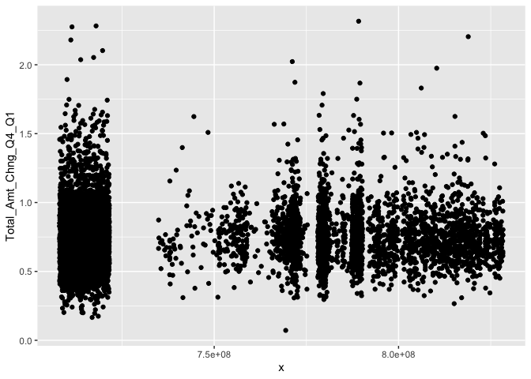

## Loading Packages


## Data PreProcessing

### Basic Setup

original data retrieved from Kaggle <br>
try to understand data

read dataset.. remove weird columns


```r
#read data
df <- read.csv("BankChurners.csv", stringsAsFactors = F)

#remove columns that contain "Naive"
df <- df %>%
  select(-contains('Naive'))

#check column names again
names(df)
```

```
##  [1] "CLIENTNUM"                "Attrition_Flag"          
##  [3] "Customer_Age"             "Gender"                  
##  [5] "Dependent_count"          "Education_Level"         
##  [7] "Marital_Status"           "Income_Category"         
##  [9] "Card_Category"            "Months_on_book"          
## [11] "Total_Relationship_Count" "Months_Inactive_12_mon"  
## [13] "Contacts_Count_12_mon"    "Credit_Limit"            
## [15] "Total_Revolving_Bal"      "Avg_Open_To_Buy"         
## [17] "Total_Amt_Chng_Q4_Q1"     "Total_Trans_Amt"         
## [19] "Total_Trans_Ct"           "Total_Ct_Chng_Q4_Q1"     
## [21] "Avg_Utilization_Ratio"
```

```r
summary_df <- describe(df)
summary_df
```

```
## df 
## 
##  21  Variables      10127  Observations
## --------------------------------------------------------------------------------
## CLIENTNUM 
##         n   missing  distinct      Info      Mean       Gmd       .05       .10 
##     10127         0     10127         1 739177606  37249488 709120390 710160513 
##       .25       .50       .75       .90       .95 
## 713036770 717926358 773143533 798512118 814212033 
## 
## lowest : 708082083 708083283 708084558 708085458 708086958
## highest: 828288333 828291858 828294933 828298908 828343083
## --------------------------------------------------------------------------------
## Attrition_Flag 
##        n  missing distinct 
##    10127        0        2 
##                                               
## Value      Attrited Customer Existing Customer
## Frequency               1627              8500
## Proportion             0.161             0.839
## --------------------------------------------------------------------------------
## Customer_Age 
##        n  missing distinct     Info     Mean      Gmd      .05      .10 
##    10127        0       45    0.999    46.33     9.09       33       36 
##      .25      .50      .75      .90      .95 
##       41       46       52       57       60 
## 
## lowest : 26 27 28 29 30, highest: 66 67 68 70 73
## --------------------------------------------------------------------------------
## Gender 
##        n  missing distinct 
##    10127        0        2 
##                       
## Value          F     M
## Frequency   5358  4769
## Proportion 0.529 0.471
## --------------------------------------------------------------------------------
## Dependent_count 
##        n  missing distinct     Info     Mean      Gmd 
##    10127        0        6    0.952    2.346    1.452 
## 
## lowest : 0 1 2 3 4, highest: 1 2 3 4 5
##                                               
## Value          0     1     2     3     4     5
## Frequency    904  1838  2655  2732  1574   424
## Proportion 0.089 0.181 0.262 0.270 0.155 0.042
## --------------------------------------------------------------------------------
## Education_Level 
##        n  missing distinct 
##    10127        0        7 
## 
## lowest : College       Doctorate     Graduate      High School   Post-Graduate
## highest: Graduate      High School   Post-Graduate Uneducated    Unknown      
##                                                                   
## Value            College     Doctorate      Graduate   High School
## Frequency           1013           451          3128          2013
## Proportion         0.100         0.045         0.309         0.199
##                                                     
## Value      Post-Graduate    Uneducated       Unknown
## Frequency            516          1487          1519
## Proportion         0.051         0.147         0.150
## --------------------------------------------------------------------------------
## Marital_Status 
##        n  missing distinct 
##    10127        0        4 
##                                               
## Value      Divorced  Married   Single  Unknown
## Frequency       748     4687     3943      749
## Proportion    0.074    0.463    0.389    0.074
## --------------------------------------------------------------------------------
## Income_Category 
##        n  missing distinct 
##    10127        0        6 
## 
## lowest : $120K +        $40K - $60K    $60K - $80K    $80K - $120K   Less than $40K
## highest: $40K - $60K    $60K - $80K    $80K - $120K   Less than $40K Unknown       
##                                                                       
## Value             $120K +    $40K - $60K    $60K - $80K   $80K - $120K
## Frequency             727           1790           1402           1535
## Proportion          0.072          0.177          0.138          0.152
##                                         
## Value      Less than $40K        Unknown
## Frequency            3561           1112
## Proportion          0.352          0.110
## --------------------------------------------------------------------------------
## Card_Category 
##        n  missing distinct 
##    10127        0        4 
##                                               
## Value          Blue     Gold Platinum   Silver
## Frequency      9436      116       20      555
## Proportion    0.932    0.011    0.002    0.055
## --------------------------------------------------------------------------------
## Months_on_book 
##        n  missing distinct     Info     Mean      Gmd      .05      .10 
##    10127        0       44    0.985    35.93    8.767       22       26 
##      .25      .50      .75      .90      .95 
##       31       36       40       46       50 
## 
## lowest : 13 14 15 16 17, highest: 52 53 54 55 56
## --------------------------------------------------------------------------------
## Total_Relationship_Count 
##        n  missing distinct     Info     Mean      Gmd 
##    10127        0        6    0.966    3.813    1.759 
## 
## lowest : 1 2 3 4 5, highest: 2 3 4 5 6
##                                               
## Value          1     2     3     4     5     6
## Frequency    910  1243  2305  1912  1891  1866
## Proportion 0.090 0.123 0.228 0.189 0.187 0.184
## --------------------------------------------------------------------------------
## Months_Inactive_12_mon 
##        n  missing distinct     Info     Mean      Gmd 
##    10127        0        7      0.9    2.341    1.065 
## 
## lowest : 0 1 2 3 4, highest: 2 3 4 5 6
##                                                     
## Value          0     1     2     3     4     5     6
## Frequency     29  2233  3282  3846   435   178   124
## Proportion 0.003 0.220 0.324 0.380 0.043 0.018 0.012
## --------------------------------------------------------------------------------
## Contacts_Count_12_mon 
##        n  missing distinct     Info     Mean      Gmd 
##    10127        0        7    0.925    2.455    1.204 
## 
## lowest : 0 1 2 3 4, highest: 2 3 4 5 6
##                                                     
## Value          0     1     2     3     4     5     6
## Frequency    399  1499  3227  3380  1392   176    54
## Proportion 0.039 0.148 0.319 0.334 0.137 0.017 0.005
## --------------------------------------------------------------------------------
## Credit_Limit 
##        n  missing distinct     Info     Mean      Gmd      .05      .10 
##    10127        0     6205        1     8632     8837     1439     1762 
##      .25      .50      .75      .90      .95 
##     2555     4549    11068    23400    34516 
## 
## lowest :  1438.3  1439.0  1440.0  1441.0  1442.0
## highest: 34198.0 34427.0 34458.0 34496.0 34516.0
## --------------------------------------------------------------------------------
## Total_Revolving_Bal 
##        n  missing distinct     Info     Mean      Gmd      .05      .10 
##    10127        0     1974    0.985     1163      927        0        0 
##      .25      .50      .75      .90      .95 
##      359     1276     1784     2228     2517 
## 
## lowest :    0  132  134  145  154, highest: 2511 2512 2513 2514 2517
## --------------------------------------------------------------------------------
## Avg_Open_To_Buy 
##        n  missing distinct     Info     Mean      Gmd      .05      .10 
##    10127        0     6813        1     7469     8848    480.3    683.0 
##      .25      .50      .75      .90      .95 
##   1324.5   3474.0   9859.0  21964.6  32183.4 
## 
## lowest :     3    10    14    15    24, highest: 34297 34300 34302 34362 34516
## --------------------------------------------------------------------------------
## Total_Amt_Chng_Q4_Q1 
##        n  missing distinct     Info     Mean      Gmd      .05      .10 
##    10127        0     1158        1   0.7599   0.2251   0.4630   0.5310 
##      .25      .50      .75      .90      .95 
##   0.6310   0.7360   0.8590   0.9974   1.1030 
## 
## lowest : 0.000 0.010 0.018 0.046 0.061, highest: 2.368 2.594 2.675 3.355 3.397
## --------------------------------------------------------------------------------
## Total_Trans_Amt 
##        n  missing distinct     Info     Mean      Gmd      .05      .10 
##    10127        0     5033        1     4404     3207     1283     1501 
##      .25      .50      .75      .90      .95 
##     2156     3899     4741     8212    14212 
## 
## lowest :   510   530   563   569   594, highest: 17628 17634 17744 17995 18484
## --------------------------------------------------------------------------------
## Total_Trans_Ct 
##        n  missing distinct     Info     Mean      Gmd      .05      .10 
##    10127        0      126        1    64.86     26.6       28       33 
##      .25      .50      .75      .90      .95 
##       45       67       81       92      105 
## 
## lowest :  10  11  12  13  14, highest: 131 132 134 138 139
## --------------------------------------------------------------------------------
## Total_Ct_Chng_Q4_Q1 
##        n  missing distinct     Info     Mean      Gmd      .05      .10 
##    10127        0      830        1   0.7122   0.2409    0.368    0.452 
##      .25      .50      .75      .90      .95 
##    0.582    0.702    0.818    0.950    1.069 
## 
## lowest : 0.000 0.028 0.029 0.038 0.053, highest: 3.000 3.250 3.500 3.571 3.714
## --------------------------------------------------------------------------------
## Avg_Utilization_Ratio 
##        n  missing distinct     Info     Mean      Gmd      .05      .10 
##    10127        0      964    0.985   0.2749   0.3039    0.000    0.000 
##      .25      .50      .75      .90      .95 
##    0.023    0.176    0.503    0.707    0.793 
## 
## lowest : 0.000 0.004 0.005 0.006 0.007, highest: 0.990 0.992 0.994 0.995 0.999
## --------------------------------------------------------------------------------
```

```r
#unlist(summary_df[[1]])[2:12]

# check the number of unique client number
length(unique(df[,"CLIENTNUM"])) # total rows are 10127, so there is no duplicates
```

```
## [1] 10127
```

```r
# Check for NA values in column
nrow(df[df$Avg_Utilization_Ratio == "NA",])
```

```
## [1] 0
```

```r
# need more of these!!!!!!!!!!
```

```r
cols <- colnames(df)
cols <- cols[-1]
par(mfrow=c(4,5))
for (i in cols){
    plot <- ggplot(df, aes_string(x = df$CLIENTNUM, y = i)) +
    geom_point()
    print(plot)
}
```

<!-- --><!-- --><!-- --><!-- --><!-- --><!-- --><!-- --><!-- --><!-- --><!-- --><!-- --><!-- --><!-- --><!-- --><!-- --><!-- --><!-- --><!-- --><!-- --><!-- -->

```r
# remove outlier
df1 <- df[!(df$Customer_Age %in% boxplot(df$Customer_Age)$out),]
df1 <- df[!(df$Total_Amt_Chng_Q4_Q1 %in% boxplot(df$Total_Amt_Chng_Q4_Q1)$out),]
df1 <- df[!(df$Total_Ct_Chng_Q4_Q1 %in% boxplot(df$Total_Ct_Chng_Q4_Q1)$out),]

#attach(df)
#par(mfrow=c(2,7))
#scatter1 <- plot(CLIENTNUM, Customer_Age)
#scatter2 <- plot(CLIENTNUM, Dependent_count)
#scatter3 <- plot(CLIENTNUM, Months_on_book)
#scatter4 <- plot(CLIENTNUM, Total_Relationship_Count)
#scatter5 <- plot(CLIENTNUM, Months_Inactive_12_mon)
#scatter6 <- plot(CLIENTNUM, Contacts_Count_12_mon)
#scatter7 <- plot(CLIENTNUM, Credit_Limit)
#scatter8 <- plot(CLIENTNUM, Total_Revolving_Bal)
#scatter9 <- plot(CLIENTNUM, Avg_Open_To_Buy)
#scatter10 <- plot(CLIENTNUM, Total_Amt_Chng_Q4_Q1)
#scatter11 <- plot(CLIENTNUM, Total_Trans_Amt)
#scatter12 <- plot(CLIENTNUM, Total_Trans_Ct)
#scatter13 <- plot(CLIENTNUM, Total_Ct_Chng_Q4_Q1)
#scatter14 <- plot(CLIENTNUM, Avg_Utilization_Ratio)
```

<!-- -->


```r
cols <- colnames(df1)
cols <- cols[-1]
par(mfrow=c(4,5))
for (i in cols){
    plot <- ggplot(df1, aes_string(x = df1$CLIENTNUM, y = i)) +
    geom_point()
    print(plot)
}
```

<!-- --><!-- --><!-- --><!-- --><!-- --><!-- --><!-- --><!-- --><!-- --><!-- --><!-- --><!-- --><!-- --><!-- --><!-- --><!-- --><!-- --><!-- --><!-- --><!-- -->

```r
#par(mfrow=c(2,7))
#attach(df1)
#scatter1 <- plot(CLIENTNUM, Customer_Age)
#scatter2 <- plot(CLIENTNUM, Dependent_count)
#scatter3 <- plot(CLIENTNUM, Months_on_book)
#scatter4 <- plot(CLIENTNUM, Total_Relationship_Count)
#scatter5 <- plot(CLIENTNUM, Months_Inactive_12_mon)
#scatter6 <- plot(CLIENTNUM, Contacts_Count_12_mon)
#scatter7 <- plot(CLIENTNUM, Credit_Limit)
#scatter8 <- plot(CLIENTNUM, Total_Revolving_Bal)
#scatter9 <- plot(CLIENTNUM, Avg_Open_To_Buy)
#scatter10 <- plot(CLIENTNUM, Total_Amt_Chng_Q4_Q1)
#scatter11 <- plot(CLIENTNUM, Total_Trans_Amt)
#scatter12 <- plot(CLIENTNUM, Total_Trans_Ct)
#scatter13 <- plot(CLIENTNUM, Total_Ct_Chng_Q4_Q1)
#scatter14 <- plot(CLIENTNUM, Avg_Utilization_Ratio)
```


### Binning
Next step would be 'Binning' continuous variables into specific groups.
need some transformation before analysis

#### Age
Categorize age into 6 groups

```r
min(df1$Customer_Age)
```

```
## [1] 26
```

```r
max(df1$Customer_Age)
```

```
## [1] 70
```

```r
age_labels <- c("20-29","30-39","40-49","50-59","60-69","70+")
df2 <- df1 %>%
  mutate(Age = cut(Customer_Age,
                   breaks = c(20,30,40,50,60,70,80), 
                   right = F, 
                   labels = age_labels)) 

#check the age binning by looking at randomly chosen data subset
age_check <- df2 %>%
  select(c(Customer_Age,Age)) %>%
  sample_n(10)

age_check
```

```
##    Customer_Age   Age
## 1            52 50-59
## 2            43 40-49
## 3            48 40-49
## 4            37 30-39
## 5            56 50-59
## 6            54 50-59
## 7            53 50-59
## 8            50 50-59
## 9            51 50-59
## 10           56 50-59
```

```r
#remove continuous age value column
df2 <- df2 %>%
  relocate(Age, .after = Customer_Age) %>%
  select(-Customer_Age)

df2[1:5,]
```

```
##   CLIENTNUM    Attrition_Flag   Age Gender Dependent_count Education_Level
## 1 713061558 Existing Customer 40-49      M               2        Graduate
## 2 810347208 Existing Customer 50-59      M               4         Unknown
## 3 818906208 Existing Customer 30-39      M               0     High School
## 4 719661558 Existing Customer 40-49      M               2        Graduate
## 5 708790833 Existing Customer 40-49      M               5      Uneducated
##   Marital_Status Income_Category Card_Category Months_on_book
## 1        Married     $40K - $60K          Blue             36
## 2        Married         $120K +          Gold             46
## 3        Unknown     $60K - $80K        Silver             27
## 4         Single    $80K - $120K          Blue             36
## 5        Unknown         $120K +          Blue             31
##   Total_Relationship_Count Months_Inactive_12_mon Contacts_Count_12_mon
## 1                        3                      1                     2
## 2                        6                      1                     3
## 3                        2                      2                     2
## 4                        6                      3                     3
## 5                        5                      3                     2
##   Credit_Limit Total_Revolving_Bal Avg_Open_To_Buy Total_Amt_Chng_Q4_Q1
## 1         4010                1247            2763                1.376
## 2        34516                2264           32252                1.975
## 3        29081                1396           27685                2.204
## 4        11656                1677            9979                1.524
## 5         6748                1467            5281                0.831
##   Total_Trans_Amt Total_Trans_Ct Total_Ct_Chng_Q4_Q1 Avg_Utilization_Ratio
## 1            1088             24               0.846                 0.311
## 2            1330             31               0.722                 0.066
## 3            1538             36               0.714                 0.048
## 4            1441             32               0.882                 0.144
## 5            1201             42               0.680                 0.217
```

#### Number of Dependents
Categorize number of dependent into 4 groups

```r
min(df2$Dependent_count)
```

```
## [1] 0
```

```r
max(df2$Dependent_count)
```

```
## [1] 5
```

```r
dependent_labels <- c("0","1-2","3-4","5+")
df2 <- df2 %>%
  mutate(Dependent_Count = cut(Dependent_count,
                               breaks = c(0,1,3,5,10), 
                               right = F, 
                               labels = dependent_labels)) 

#check the dependent count binning by looking at randomly chosen data subset
dependent_check <- df2 %>%
  select(c(Dependent_count,Dependent_Count)) %>%
  sample_n(10)

dependent_check
```

```
##    Dependent_count Dependent_Count
## 1                2             1-2
## 2                2             1-2
## 3                0               0
## 4                4             3-4
## 5                3             3-4
## 6                4             3-4
## 7                1             1-2
## 8                5              5+
## 9                3             3-4
## 10               4             3-4
```

```r
#remove continuous dependent count value column
df2 <- df2 %>%
  relocate(Dependent_Count, .after = Dependent_count) %>%
  select(-Dependent_count)
df2[1:5,]
```

```
##   CLIENTNUM    Attrition_Flag   Age Gender Dependent_Count Education_Level
## 1 713061558 Existing Customer 40-49      M             1-2        Graduate
## 2 810347208 Existing Customer 50-59      M             3-4         Unknown
## 3 818906208 Existing Customer 30-39      M               0     High School
## 4 719661558 Existing Customer 40-49      M             1-2        Graduate
## 5 708790833 Existing Customer 40-49      M              5+      Uneducated
##   Marital_Status Income_Category Card_Category Months_on_book
## 1        Married     $40K - $60K          Blue             36
## 2        Married         $120K +          Gold             46
## 3        Unknown     $60K - $80K        Silver             27
## 4         Single    $80K - $120K          Blue             36
## 5        Unknown         $120K +          Blue             31
##   Total_Relationship_Count Months_Inactive_12_mon Contacts_Count_12_mon
## 1                        3                      1                     2
## 2                        6                      1                     3
## 3                        2                      2                     2
## 4                        6                      3                     3
## 5                        5                      3                     2
##   Credit_Limit Total_Revolving_Bal Avg_Open_To_Buy Total_Amt_Chng_Q4_Q1
## 1         4010                1247            2763                1.376
## 2        34516                2264           32252                1.975
## 3        29081                1396           27685                2.204
## 4        11656                1677            9979                1.524
## 5         6748                1467            5281                0.831
##   Total_Trans_Amt Total_Trans_Ct Total_Ct_Chng_Q4_Q1 Avg_Utilization_Ratio
## 1            1088             24               0.846                 0.311
## 2            1330             31               0.722                 0.066
## 3            1538             36               0.714                 0.048
## 4            1441             32               0.882                 0.144
## 5            1201             42               0.680                 0.217
```

## Create Tables for Analysis

examine groups of people/etc.. by comparing quantitative values

```r
# Check for NA values in column
#nrow(df[df$Avg_Utilization_Ratio == "NA",])
```

#### Gender and Age
dlkfnalsdnflsnflansdlfnaflansflanlafnlanlnflnlna

```r
#group by biography info
#group by gender and age for utilization ratio comparison
summary <- df2 %>%
  group_by(Gender, Age) %>%
  summarise(mean_util_ratio = mean(Avg_Utilization_Ratio))
```

```
## `summarise()` regrouping output by 'Gender' (override with `.groups` argument)
```

```r
kable(summary)
```

<table>
 <thead>
  <tr>
   <th style="text-align:left;"> Gender </th>
   <th style="text-align:left;"> Age </th>
   <th style="text-align:right;"> mean_util_ratio </th>
  </tr>
 </thead>
<tbody>
  <tr>
   <td style="text-align:left;"> F </td>
   <td style="text-align:left;"> 20-29 </td>
   <td style="text-align:right;"> 0.3618587 </td>
  </tr>
  <tr>
   <td style="text-align:left;"> F </td>
   <td style="text-align:left;"> 30-39 </td>
   <td style="text-align:right;"> 0.3424089 </td>
  </tr>
  <tr>
   <td style="text-align:left;"> F </td>
   <td style="text-align:left;"> 40-49 </td>
   <td style="text-align:right;"> 0.3317936 </td>
  </tr>
  <tr>
   <td style="text-align:left;"> F </td>
   <td style="text-align:left;"> 50-59 </td>
   <td style="text-align:right;"> 0.3536289 </td>
  </tr>
  <tr>
   <td style="text-align:left;"> F </td>
   <td style="text-align:left;"> 60-69 </td>
   <td style="text-align:right;"> 0.3405152 </td>
  </tr>
  <tr>
   <td style="text-align:left;"> M </td>
   <td style="text-align:left;"> 20-29 </td>
   <td style="text-align:right;"> 0.2891939 </td>
  </tr>
  <tr>
   <td style="text-align:left;"> M </td>
   <td style="text-align:left;"> 30-39 </td>
   <td style="text-align:right;"> 0.2306788 </td>
  </tr>
  <tr>
   <td style="text-align:left;"> M </td>
   <td style="text-align:left;"> 40-49 </td>
   <td style="text-align:right;"> 0.1736448 </td>
  </tr>
  <tr>
   <td style="text-align:left;"> M </td>
   <td style="text-align:left;"> 50-59 </td>
   <td style="text-align:right;"> 0.1949627 </td>
  </tr>
  <tr>
   <td style="text-align:left;"> M </td>
   <td style="text-align:left;"> 60-69 </td>
   <td style="text-align:right;"> 0.2813291 </td>
  </tr>
  <tr>
   <td style="text-align:left;"> M </td>
   <td style="text-align:left;"> 70+ </td>
   <td style="text-align:right;"> 0.4600000 </td>
  </tr>
</tbody>
</table>

#### Marital status
dlkfnalsdnflsnflansdlfnaflansflanlafnlanlnflnlna

```r
#group by family info
#group by marital status for multiple comparisons
summary2 <- df2 %>%
  group_by(Marital_Status) %>%
  summarise(mean_inactive_months_count = mean(Months_Inactive_12_mon),
            mean_util_ratio = mean(Avg_Utilization_Ratio),
            mean_trans_count = mean(Total_Trans_Ct))
```

```
## `summarise()` ungrouping output (override with `.groups` argument)
```

```r
kable(summary2)
```

<table>
 <thead>
  <tr>
   <th style="text-align:left;"> Marital_Status </th>
   <th style="text-align:right;"> mean_inactive_months_count </th>
   <th style="text-align:right;"> mean_util_ratio </th>
   <th style="text-align:right;"> mean_trans_count </th>
  </tr>
 </thead>
<tbody>
  <tr>
   <td style="text-align:left;"> Divorced </td>
   <td style="text-align:right;"> 2.356354 </td>
   <td style="text-align:right;"> 0.2576823 </td>
   <td style="text-align:right;"> 67.92265 </td>
  </tr>
  <tr>
   <td style="text-align:left;"> Married </td>
   <td style="text-align:right;"> 2.331089 </td>
   <td style="text-align:right;"> 0.2882040 </td>
   <td style="text-align:right;"> 63.03816 </td>
  </tr>
  <tr>
   <td style="text-align:left;"> Single </td>
   <td style="text-align:right;"> 2.354031 </td>
   <td style="text-align:right;"> 0.2647613 </td>
   <td style="text-align:right;"> 68.52257 </td>
  </tr>
  <tr>
   <td style="text-align:left;"> Unknown </td>
   <td style="text-align:right;"> 2.321775 </td>
   <td style="text-align:right;"> 0.2576352 </td>
   <td style="text-align:right;"> 68.18585 </td>
  </tr>
</tbody>
</table>

```r
#married who has the highest utilization ratio are least likely to be inactive for 12 months
```

#### Dependents
dlkfnalsdnflsnflansdlfnaflansflanlafnlanlnflnlna

```r
#group by number of dependents
summary3 <- df2 %>%
  group_by(Dependent_Count) %>%
  summarise(mean_util_ratio = mean(Avg_Utilization_Ratio), 
            mean_trans_count = mean(Total_Trans_Ct),
            mean_revolving_balance = mean(Total_Revolving_Bal))
```

```
## `summarise()` ungrouping output (override with `.groups` argument)
```

```r
kable(summary3)
```

<table>
 <thead>
  <tr>
   <th style="text-align:left;"> Dependent_Count </th>
   <th style="text-align:right;"> mean_util_ratio </th>
   <th style="text-align:right;"> mean_trans_count </th>
   <th style="text-align:right;"> mean_revolving_balance </th>
  </tr>
 </thead>
<tbody>
  <tr>
   <td style="text-align:left;"> 0 </td>
   <td style="text-align:right;"> 0.2914751 </td>
   <td style="text-align:right;"> 62.78795 </td>
   <td style="text-align:right;"> 1133.487 </td>
  </tr>
  <tr>
   <td style="text-align:left;"> 1-2 </td>
   <td style="text-align:right;"> 0.2809137 </td>
   <td style="text-align:right;"> 65.95606 </td>
   <td style="text-align:right;"> 1169.151 </td>
  </tr>
  <tr>
   <td style="text-align:left;"> 3-4 </td>
   <td style="text-align:right;"> 0.2645555 </td>
   <td style="text-align:right;"> 66.14624 </td>
   <td style="text-align:right;"> 1151.157 </td>
  </tr>
  <tr>
   <td style="text-align:left;"> 5+ </td>
   <td style="text-align:right;"> 0.2699658 </td>
   <td style="text-align:right;"> 70.39853 </td>
   <td style="text-align:right;"> 1189.548 </td>
  </tr>
</tbody>
</table>

#### Card Class
dlkfnalsdnflsnflansdlfnaflansflanlafnlanlnflnlna

```r
#group by card info
#calculated revolving balance percentage for better comparison
summary4 <- df2 %>%
  group_by(Card_Category) %>%
  summarise(mean_util_ratio = mean(Avg_Utilization_Ratio),
            mean_credit_limit = mean(Credit_Limit), 
            mean_revolving_balance = mean(Total_Revolving_Bal),
            revolving_balance_perc = (mean_revolving_balance/mean_credit_limit)*100) %>%
    arrange(match(Card_Category, c("Blue","Silver","Platinum","Gold")))
```

```
## `summarise()` ungrouping output (override with `.groups` argument)
```

```r
kable(summary4)
```

<table>
 <thead>
  <tr>
   <th style="text-align:left;"> Card_Category </th>
   <th style="text-align:right;"> mean_util_ratio </th>
   <th style="text-align:right;"> mean_credit_limit </th>
   <th style="text-align:right;"> mean_revolving_balance </th>
   <th style="text-align:right;"> revolving_balance_perc </th>
  </tr>
 </thead>
<tbody>
  <tr>
   <td style="text-align:left;"> Blue </td>
   <td style="text-align:right;"> 0.2904983 </td>
   <td style="text-align:right;"> 7352.228 </td>
   <td style="text-align:right;"> 1153.649 </td>
   <td style="text-align:right;"> 15.691143 </td>
  </tr>
  <tr>
   <td style="text-align:left;"> Silver </td>
   <td style="text-align:right;"> 0.0571434 </td>
   <td style="text-align:right;"> 25272.415 </td>
   <td style="text-align:right;"> 1207.188 </td>
   <td style="text-align:right;"> 4.776702 </td>
  </tr>
  <tr>
   <td style="text-align:left;"> Platinum </td>
   <td style="text-align:right;"> 0.0436500 </td>
   <td style="text-align:right;"> 30283.450 </td>
   <td style="text-align:right;"> 1267.950 </td>
   <td style="text-align:right;"> 4.186940 </td>
  </tr>
  <tr>
   <td style="text-align:left;"> Gold </td>
   <td style="text-align:right;"> 0.0576786 </td>
   <td style="text-align:right;"> 28534.348 </td>
   <td style="text-align:right;"> 1358.750 </td>
   <td style="text-align:right;"> 4.761805 </td>
  </tr>
</tbody>
</table>

#### Education Level
dlkfnalsdnflsnflansdlfnaflansflanlafnlanlnflnlna

```r
#group by education level for comparison of credit limit and revolving balance
summary5 <- df2 %>%
  group_by(Education_Level) %>%
  summarise(mean_credit_limit = mean(Credit_Limit), mean_revolving_balance = mean(Total_Revolving_Bal)) %>%
  arrange(match(Education_Level, c("Doctorate","Post-Graduate","Graduate","College",
                                   "High School","Uneducated","Unknown")))
```

```
## `summarise()` ungrouping output (override with `.groups` argument)
```

```r
kable(summary5)
```

<table>
 <thead>
  <tr>
   <th style="text-align:left;"> Education_Level </th>
   <th style="text-align:right;"> mean_credit_limit </th>
   <th style="text-align:right;"> mean_revolving_balance </th>
  </tr>
 </thead>
<tbody>
  <tr>
   <td style="text-align:left;"> Doctorate </td>
   <td style="text-align:right;"> 8392.653 </td>
   <td style="text-align:right;"> 1084.402 </td>
  </tr>
  <tr>
   <td style="text-align:left;"> Post-Graduate </td>
   <td style="text-align:right;"> 8945.505 </td>
   <td style="text-align:right;"> 1192.671 </td>
  </tr>
  <tr>
   <td style="text-align:left;"> Graduate </td>
   <td style="text-align:right;"> 8592.193 </td>
   <td style="text-align:right;"> 1154.717 </td>
  </tr>
  <tr>
   <td style="text-align:left;"> College </td>
   <td style="text-align:right;"> 8640.953 </td>
   <td style="text-align:right;"> 1132.302 </td>
  </tr>
  <tr>
   <td style="text-align:left;"> High School </td>
   <td style="text-align:right;"> 8563.104 </td>
   <td style="text-align:right;"> 1192.357 </td>
  </tr>
  <tr>
   <td style="text-align:left;"> Uneducated </td>
   <td style="text-align:right;"> 8830.205 </td>
   <td style="text-align:right;"> 1154.027 </td>
  </tr>
  <tr>
   <td style="text-align:left;"> Unknown </td>
   <td style="text-align:right;"> 8568.678 </td>
   <td style="text-align:right;"> 1157.905 </td>
  </tr>
</tbody>
</table>

<br><br>


