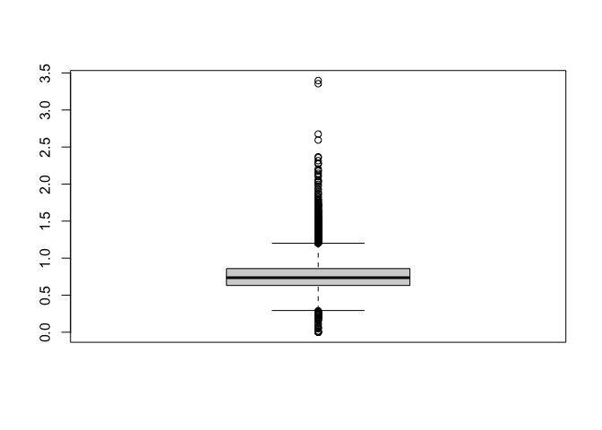
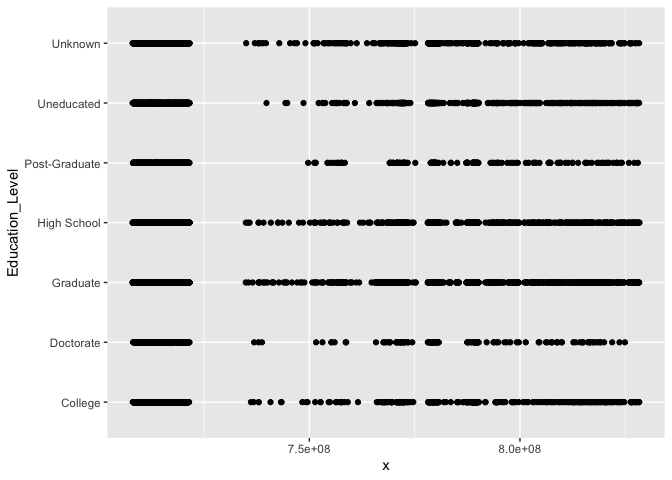

### Loading Packages


```r
knitr::opts_chunk$set(echo = TRUE)
#load required packages
library(tidyverse)
library(dplyr)
library(ggplot2)
library(Hmisc)
library(knitr)
library(kableExtra)
```

### Basic Data Description

For the purpose of this project, a dataset that consists of credit card customer information has been retrieved from Kaggle.


```r
df <- read.csv("BankChurners.csv", stringsAsFactors = F) #read data
length(df) # number of observations in original dataset
```

```
## [1] 23
```

```r
#remove columns that contain "Naive"
df <- df %>%
  select(-contains('Naive'))

length(df) #number of observations in new dataset
```

```
## [1] 21
```

```r
names(df) #check column names
```

```
##  [1] "CLIENTNUM"                "Attrition_Flag"          
##  [3] "Customer_Age"             "Gender"                  
##  [5] "Dependent_count"          "Education_Level"         
##  [7] "Marital_Status"           "Income_Category"         
##  [9] "Card_Category"            "Months_on_book"          
## [11] "Total_Relationship_Count" "Months_Inactive_12_mon"  
## [13] "Contacts_Count_12_mon"    "Credit_Limit"            
## [15] "Total_Revolving_Bal"      "Avg_Open_To_Buy"         
## [17] "Total_Amt_Chng_Q4_Q1"     "Total_Trans_Amt"         
## [19] "Total_Trans_Ct"           "Total_Ct_Chng_Q4_Q1"     
## [21] "Avg_Utilization_Ratio"
```

```r
summary(df) # summary statistics
```

```
##    CLIENTNUM         Attrition_Flag      Customer_Age      Gender         
##  Min.   :708082083   Length:10127       Min.   :26.00   Length:10127      
##  1st Qu.:713036770   Class :character   1st Qu.:41.00   Class :character  
##  Median :717926358   Mode  :character   Median :46.00   Mode  :character  
##  Mean   :739177606                      Mean   :46.33                     
##  3rd Qu.:773143533                      3rd Qu.:52.00                     
##  Max.   :828343083                      Max.   :73.00                     
##  Dependent_count Education_Level    Marital_Status     Income_Category   
##  Min.   :0.000   Length:10127       Length:10127       Length:10127      
##  1st Qu.:1.000   Class :character   Class :character   Class :character  
##  Median :2.000   Mode  :character   Mode  :character   Mode  :character  
##  Mean   :2.346                                                           
##  3rd Qu.:3.000                                                           
##  Max.   :5.000                                                           
##  Card_Category      Months_on_book  Total_Relationship_Count
##  Length:10127       Min.   :13.00   Min.   :1.000           
##  Class :character   1st Qu.:31.00   1st Qu.:3.000           
##  Mode  :character   Median :36.00   Median :4.000           
##                     Mean   :35.93   Mean   :3.813           
##                     3rd Qu.:40.00   3rd Qu.:5.000           
##                     Max.   :56.00   Max.   :6.000           
##  Months_Inactive_12_mon Contacts_Count_12_mon  Credit_Limit  
##  Min.   :0.000          Min.   :0.000         Min.   : 1438  
##  1st Qu.:2.000          1st Qu.:2.000         1st Qu.: 2555  
##  Median :2.000          Median :2.000         Median : 4549  
##  Mean   :2.341          Mean   :2.455         Mean   : 8632  
##  3rd Qu.:3.000          3rd Qu.:3.000         3rd Qu.:11068  
##  Max.   :6.000          Max.   :6.000         Max.   :34516  
##  Total_Revolving_Bal Avg_Open_To_Buy Total_Amt_Chng_Q4_Q1 Total_Trans_Amt
##  Min.   :   0        Min.   :    3   Min.   :0.0000       Min.   :  510  
##  1st Qu.: 359        1st Qu.: 1324   1st Qu.:0.6310       1st Qu.: 2156  
##  Median :1276        Median : 3474   Median :0.7360       Median : 3899  
##  Mean   :1163        Mean   : 7469   Mean   :0.7599       Mean   : 4404  
##  3rd Qu.:1784        3rd Qu.: 9859   3rd Qu.:0.8590       3rd Qu.: 4741  
##  Max.   :2517        Max.   :34516   Max.   :3.3970       Max.   :18484  
##  Total_Trans_Ct   Total_Ct_Chng_Q4_Q1 Avg_Utilization_Ratio
##  Min.   : 10.00   Min.   :0.0000      Min.   :0.0000       
##  1st Qu.: 45.00   1st Qu.:0.5820      1st Qu.:0.0230       
##  Median : 67.00   Median :0.7020      Median :0.1760       
##  Mean   : 64.86   Mean   :0.7122      Mean   :0.2749       
##  3rd Qu.: 81.00   3rd Qu.:0.8180      3rd Qu.:0.5030       
##  Max.   :139.00   Max.   :3.7140      Max.   :0.9990
```

```r
#check the number of unique client number
length(unique(df[,"CLIENTNUM"])) # total rows are 10127, so there is no duplicates in client number
```

```
## [1] 10127
```

```r
#check for the number of NA, missing values for each column
sapply(df, function(x) sum(is.na(x) | x == "")) # no such values
```

```
##                CLIENTNUM           Attrition_Flag             Customer_Age 
##                        0                        0                        0 
##                   Gender          Dependent_count          Education_Level 
##                        0                        0                        0 
##           Marital_Status          Income_Category            Card_Category 
##                        0                        0                        0 
##           Months_on_book Total_Relationship_Count   Months_Inactive_12_mon 
##                        0                        0                        0 
##    Contacts_Count_12_mon             Credit_Limit      Total_Revolving_Bal 
##                        0                        0                        0 
##          Avg_Open_To_Buy     Total_Amt_Chng_Q4_Q1          Total_Trans_Amt 
##                        0                        0                        0 
##           Total_Trans_Ct      Total_Ct_Chng_Q4_Q1    Avg_Utilization_Ratio 
##                        0                        0                        0
```

The original dataset had 10127 rows and 23 columns. As suggested from the author of dataset, the last two columns containing the word "Naive" has been removed from the dataset, resulting a dataset with 10127 rows and 21 columns. There was no duplicated values in 'CLIENTNUM' column. There was no NA or missing values in the data set that needs to be cleaned.

### Outlier Removal

This section will focus on removing outliers from the dataset to produce statistically significant results. Scatter plot for each column will be created to identify existing outliers.


```r
cols <- colnames(df) # column names
cols <- cols[-1] # exclude 'CLIENTNUM' column from outlier removal process
par(mfrow=c(4,5))
for (i in cols){
  plot <- ggplot(df, aes_string(x = df$CLIENTNUM, y = i)) + geom_point()
  print(plot)
}
```

<!-- --><!-- --><!-- --><!-- --><!-- --><!-- --><!-- --><!-- --><!-- --><!-- --><!-- --><!-- --><!-- --><!-- --><!-- --><!-- --><!-- --><!-- --><!-- --><!-- -->

Looking at the scatter plot of each column, I could observe some outlier data points on a few columns - 'Customer_Age', 'Tota_Amt_Chng_Q4_Q1', 'Total_Ct_Chng_Q4_Q1'.


```r
# identify and remove outliers using box plots
df1 <- df[!(df$Customer_Age %in% boxplot(df$Customer_Age)$out),]
```

<!-- -->

```r
df1 <- df[!(df$Total_Amt_Chng_Q4_Q1 %in% boxplot(df$Total_Amt_Chng_Q4_Q1)$out),]
```

<!-- -->

```r
df1 <- df[!(df$Total_Ct_Chng_Q4_Q1 %in% boxplot(df$Total_Ct_Chng_Q4_Q1)$out),]
```

<!-- -->


```r
cols <- colnames(df1) # column names
cols <- cols[-1] # exclude 'CLIENTNUM' column from outlier removal process
par(mfrow=c(4,5))
for (i in cols){
    plot <- ggplot(df1, aes_string(x = df1$CLIENTNUM, y = i)) +
    geom_point()
    print(plot)
}
```

<!-- --><!-- --><!-- --><!-- --><!-- --><!-- --><!-- --><!-- --><!-- --><!-- --><!-- --><!-- --><!-- --><!-- --><!-- --><!-- --><!-- --><!-- --><!-- --><!-- -->

```r
#par(mfrow=c(2,7))
#attach(df1)
#scatter1 <- plot(CLIENTNUM, Customer_Age)
#scatter2 <- plot(CLIENTNUM, Dependent_count)
#scatter3 <- plot(CLIENTNUM, Months_on_book)
#scatter4 <- plot(CLIENTNUM, Total_Relationship_Count)
#scatter5 <- plot(CLIENTNUM, Months_Inactive_12_mon)
#scatter6 <- plot(CLIENTNUM, Contacts_Count_12_mon)
#scatter7 <- plot(CLIENTNUM, Credit_Limit)
#scatter8 <- plot(CLIENTNUM, Total_Revolving_Bal)
#scatter9 <- plot(CLIENTNUM, Avg_Open_To_Buy)
#scatter10 <- plot(CLIENTNUM, Total_Amt_Chng_Q4_Q1)
#scatter11 <- plot(CLIENTNUM, Total_Trans_Amt)
#scatter12 <- plot(CLIENTNUM, Total_Trans_Ct)
#scatter13 <- plot(CLIENTNUM, Total_Ct_Chng_Q4_Q1)
#scatter14 <- plot(CLIENTNUM, Avg_Utilization_Ratio)
```


### Binning

Some of the columns in the dataset consists of continuous variables, and that will need some transformation before further analysis. The following section will show the process of binning continuous variables into specific groups.


#### Age

The original 'Customer_Age' column is made of continuous age variables ranging from 20 to 80. In this section, the variable will be categorized into a total of 6 groups.


```r
min(df1$Customer_Age) # minimum value of 'Customer_Age' column
```

```
## [1] 26
```

```r
max(df1$Customer_Age) # maximum value
```

```
## [1] 70
```

```r
age_labels <- c("20-29","30-39","40-49","50-59","60-69","70+") # define groups
df2 <- df1 %>% # break 'Customer_Age' column data into defined groups and store it as a new column
  mutate(Age = cut(Customer_Age,
                   breaks = c(20,30,40,50,60,70,80), 
                   right = F, 
                   labels = age_labels)) 

#check the age binning by looking at 10 randomly chosen data subset
age_check <- df2 %>%
  select(c(Customer_Age,Age)) %>%
  sample_n(10)

age_check # correctly done!
```

```
##    Customer_Age   Age
## 1            60 60-69
## 2            36 30-39
## 3            42 40-49
## 4            46 40-49
## 5            51 50-59
## 6            50 50-59
## 7            50 50-59
## 8            39 30-39
## 9            45 40-49
## 10           55 50-59
```

```r
#remove continuous age value column
df2 <- df2 %>%
  relocate(Age, .after = Customer_Age) %>%
  select(-Customer_Age)

df2[1:5,] # check
```

```
##   CLIENTNUM    Attrition_Flag   Age Gender Dependent_count Education_Level
## 1 713061558 Existing Customer 40-49      M               2        Graduate
## 2 810347208 Existing Customer 50-59      M               4         Unknown
## 3 818906208 Existing Customer 30-39      M               0     High School
## 4 719661558 Existing Customer 40-49      M               2        Graduate
## 5 708790833 Existing Customer 40-49      M               5      Uneducated
##   Marital_Status Income_Category Card_Category Months_on_book
## 1        Married     $40K - $60K          Blue             36
## 2        Married         $120K +          Gold             46
## 3        Unknown     $60K - $80K        Silver             27
## 4         Single    $80K - $120K          Blue             36
## 5        Unknown         $120K +          Blue             31
##   Total_Relationship_Count Months_Inactive_12_mon Contacts_Count_12_mon
## 1                        3                      1                     2
## 2                        6                      1                     3
## 3                        2                      2                     2
## 4                        6                      3                     3
## 5                        5                      3                     2
##   Credit_Limit Total_Revolving_Bal Avg_Open_To_Buy Total_Amt_Chng_Q4_Q1
## 1         4010                1247            2763                1.376
## 2        34516                2264           32252                1.975
## 3        29081                1396           27685                2.204
## 4        11656                1677            9979                1.524
## 5         6748                1467            5281                0.831
##   Total_Trans_Amt Total_Trans_Ct Total_Ct_Chng_Q4_Q1 Avg_Utilization_Ratio
## 1            1088             24               0.846                 0.311
## 2            1330             31               0.722                 0.066
## 3            1538             36               0.714                 0.048
## 4            1441             32               0.882                 0.144
## 5            1201             42               0.680                 0.217
```

#### Number of Dependents

This section will categorize the 'Dependent_count' column which consists of number of dependents data into 4 different groups. 

```r
min(df2$Dependent_count) # min value of 'Dependent_count' column
```

```
## [1] 0
```

```r
max(df2$Dependent_count) # max value
```

```
## [1] 5
```

```r
dependent_labels <- c("0","1-2","3-4","5+") # define binning groups
df2 <- df2 %>% # break the column into defined groups of data and store it as a new column
  mutate(Dependent_Count = cut(Dependent_count,
                               breaks = c(0,1,3,5,10), 
                               right = F, 
                               labels = dependent_labels)) 

#check the dependent count binning by looking at randomly chosen data subset
dependent_check <- df2 %>%
  select(c(Dependent_count,Dependent_Count)) %>%
  sample_n(10)

dependent_check
```

```
##    Dependent_count Dependent_Count
## 1                4             3-4
## 2                1             1-2
## 3                2             1-2
## 4                1             1-2
## 5                3             3-4
## 6                2             1-2
## 7                2             1-2
## 8                0               0
## 9                4             3-4
## 10               0               0
```

```r
df2 <- df2 %>% #remove continuous dependent count value column
  relocate(Dependent_Count, .after = Dependent_count) %>%
  select(-Dependent_count)
df2[1:5,] # check
```

```
##   CLIENTNUM    Attrition_Flag   Age Gender Dependent_Count Education_Level
## 1 713061558 Existing Customer 40-49      M             1-2        Graduate
## 2 810347208 Existing Customer 50-59      M             3-4         Unknown
## 3 818906208 Existing Customer 30-39      M               0     High School
## 4 719661558 Existing Customer 40-49      M             1-2        Graduate
## 5 708790833 Existing Customer 40-49      M              5+      Uneducated
##   Marital_Status Income_Category Card_Category Months_on_book
## 1        Married     $40K - $60K          Blue             36
## 2        Married         $120K +          Gold             46
## 3        Unknown     $60K - $80K        Silver             27
## 4         Single    $80K - $120K          Blue             36
## 5        Unknown         $120K +          Blue             31
##   Total_Relationship_Count Months_Inactive_12_mon Contacts_Count_12_mon
## 1                        3                      1                     2
## 2                        6                      1                     3
## 3                        2                      2                     2
## 4                        6                      3                     3
## 5                        5                      3                     2
##   Credit_Limit Total_Revolving_Bal Avg_Open_To_Buy Total_Amt_Chng_Q4_Q1
## 1         4010                1247            2763                1.376
## 2        34516                2264           32252                1.975
## 3        29081                1396           27685                2.204
## 4        11656                1677            9979                1.524
## 5         6748                1467            5281                0.831
##   Total_Trans_Amt Total_Trans_Ct Total_Ct_Chng_Q4_Q1 Avg_Utilization_Ratio
## 1            1088             24               0.846                 0.311
## 2            1330             31               0.722                 0.066
## 3            1538             36               0.714                 0.048
## 4            1441             32               0.882                 0.144
## 5            1201             42               0.680                 0.217
```

### Create Tables for Analysis

The following section will examine and compare quantitative values, and look for any meaningful insights from the data set.

#### Gender and Age

In this section, the dataset has been grouped by gender and age. I then calculated the mean utilization ratio for each group to compare the spending nature of different gender and age groups.


```r
#group by biography info - gender and age - for utilization ratio comparison
summary <- df2 %>%
  group_by(Gender, Age) %>%
  summarise(count = n(), # count the number of data for each group
            mean_util_ratio = mean(Avg_Utilization_Ratio)) # calculate mean utilization ratio for each group
```

```
## `summarise()` regrouping output by 'Gender' (override with `.groups` argument)
```

```r
kable(summary)
```

<table>
 <thead>
  <tr>
   <th style="text-align:left;"> Gender </th>
   <th style="text-align:left;"> Age </th>
   <th style="text-align:right;"> count </th>
   <th style="text-align:right;"> mean_util_ratio </th>
  </tr>
 </thead>
<tbody>
  <tr>
   <td style="text-align:left;"> F </td>
   <td style="text-align:left;"> 20-29 </td>
   <td style="text-align:right;"> 92 </td>
   <td style="text-align:right;"> 0.3618587 </td>
  </tr>
  <tr>
   <td style="text-align:left;"> F </td>
   <td style="text-align:left;"> 30-39 </td>
   <td style="text-align:right;"> 922 </td>
   <td style="text-align:right;"> 0.3424089 </td>
  </tr>
  <tr>
   <td style="text-align:left;"> F </td>
   <td style="text-align:left;"> 40-49 </td>
   <td style="text-align:right;"> 2335 </td>
   <td style="text-align:right;"> 0.3317936 </td>
  </tr>
  <tr>
   <td style="text-align:left;"> F </td>
   <td style="text-align:left;"> 50-59 </td>
   <td style="text-align:right;"> 1563 </td>
   <td style="text-align:right;"> 0.3536289 </td>
  </tr>
  <tr>
   <td style="text-align:left;"> F </td>
   <td style="text-align:left;"> 60-69 </td>
   <td style="text-align:right;"> 264 </td>
   <td style="text-align:right;"> 0.3405152 </td>
  </tr>
  <tr>
   <td style="text-align:left;"> M </td>
   <td style="text-align:left;"> 20-29 </td>
   <td style="text-align:right;"> 98 </td>
   <td style="text-align:right;"> 0.2891939 </td>
  </tr>
  <tr>
   <td style="text-align:left;"> M </td>
   <td style="text-align:left;"> 30-39 </td>
   <td style="text-align:right;"> 853 </td>
   <td style="text-align:right;"> 0.2306788 </td>
  </tr>
  <tr>
   <td style="text-align:left;"> M </td>
   <td style="text-align:left;"> 40-49 </td>
   <td style="text-align:right;"> 2058 </td>
   <td style="text-align:right;"> 0.1736448 </td>
  </tr>
  <tr>
   <td style="text-align:left;"> M </td>
   <td style="text-align:left;"> 50-59 </td>
   <td style="text-align:right;"> 1313 </td>
   <td style="text-align:right;"> 0.1949627 </td>
  </tr>
  <tr>
   <td style="text-align:left;"> M </td>
   <td style="text-align:left;"> 60-69 </td>
   <td style="text-align:right;"> 234 </td>
   <td style="text-align:right;"> 0.2813291 </td>
  </tr>
  <tr>
   <td style="text-align:left;"> M </td>
   <td style="text-align:left;"> 70+ </td>
   <td style="text-align:right;"> 1 </td>
   <td style="text-align:right;"> 0.4600000 </td>
  </tr>
</tbody>
</table>

The 70+ age male group had mean utilization ratio of 0.46 which is very high compared to the mean ratio of other customer groups that were in the range of 0.19-0.37. However, the group only had 1 number of observations. Also, since there is no 70+ female credit card customer in our data set, there is no group to compare the 70+ male group against. Therefore, 70+ male group will be excluded from comparison analysis.

Overall, male credit card customers exhibited lower credit utilization ratio compared to that of female credit card customers. Utilization ratio is the amount of money you've been using on credit divided by your credit limit - expressed as percentages. Therefore, the above table suggests that the female customers are more likely to use high amount of revolving credit compared with their credit limit. This may indicate that males are doing better job managing their credit, and that females are overspending more than males.

The credit card customers in their twenties exhibited the highest utilization ratio among all age groups. This was true for both male and female. Also, the customers in their forties exhibited the lowest utilization ratio among all. This may indicate that people in their forties in general are better at managing credit compared to other age groups, while people in their twenties are doing worst at it.
 
#### Marital status

In this section, the data set will be grouped by their marital status.


```r
#group by family info - marital status - for comparison
summary2 <- df2 %>%
  group_by(Marital_Status) %>%
  summarise(mean_inactive_12_months = mean(Months_Inactive_12_mon),
            mean_util_ratio = mean(Avg_Utilization_Ratio))
```

```
## `summarise()` ungrouping output (override with `.groups` argument)
```

```r
kable(summary2)
```

<table>
 <thead>
  <tr>
   <th style="text-align:left;"> Marital_Status </th>
   <th style="text-align:right;"> mean_inactive_12_months </th>
   <th style="text-align:right;"> mean_util_ratio </th>
  </tr>
 </thead>
<tbody>
  <tr>
   <td style="text-align:left;"> Divorced </td>
   <td style="text-align:right;"> 2.356354 </td>
   <td style="text-align:right;"> 0.2576823 </td>
  </tr>
  <tr>
   <td style="text-align:left;"> Married </td>
   <td style="text-align:right;"> 2.331089 </td>
   <td style="text-align:right;"> 0.2882040 </td>
  </tr>
  <tr>
   <td style="text-align:left;"> Single </td>
   <td style="text-align:right;"> 2.354031 </td>
   <td style="text-align:right;"> 0.2647613 </td>
  </tr>
  <tr>
   <td style="text-align:left;"> Unknown </td>
   <td style="text-align:right;"> 2.321775 </td>
   <td style="text-align:right;"> 0.2576352 </td>
  </tr>
</tbody>
</table>

The group with unknown marital status will be excluded from analysis due to their lack of information. The 'Months_Inactive_12_mon' column in the original dataset shows how likely is a person to stay inactive for 12 months on their credit card. Therefore, the 'mean_inactive_12_months' column in the table created above shows the same thing but for each group with different marital status. According to the table, the married exhibited lowest number of 2.331089 for 'mean_inactive_12_months' whereas the divorced exhibited the highest number of 2.356354. This suggests that the married are least likely to be inactive for 12 months. The married also had the highest credit utilization ratio, suggesting they tend to spend more compared to divorced or single credit card customers.

#### Dependents

This section will have the data set grouped by the number of dependents. 


```r
#group by number of dependents
summary3 <- df2 %>%
  group_by(Dependent_Count) %>%
  summarise(mean_revolving_balance = mean(Total_Revolving_Bal),
            mean_util_ratio = mean(Avg_Utilization_Ratio), 
            mean_trans_count = mean(Total_Trans_Ct))
```

```
## `summarise()` ungrouping output (override with `.groups` argument)
```

```r
kable(summary3)
```

<table>
 <thead>
  <tr>
   <th style="text-align:left;"> Dependent_Count </th>
   <th style="text-align:right;"> mean_revolving_balance </th>
   <th style="text-align:right;"> mean_util_ratio </th>
   <th style="text-align:right;"> mean_trans_count </th>
  </tr>
 </thead>
<tbody>
  <tr>
   <td style="text-align:left;"> 0 </td>
   <td style="text-align:right;"> 1133.487 </td>
   <td style="text-align:right;"> 0.2914751 </td>
   <td style="text-align:right;"> 62.78795 </td>
  </tr>
  <tr>
   <td style="text-align:left;"> 1-2 </td>
   <td style="text-align:right;"> 1169.151 </td>
   <td style="text-align:right;"> 0.2809137 </td>
   <td style="text-align:right;"> 65.95606 </td>
  </tr>
  <tr>
   <td style="text-align:left;"> 3-4 </td>
   <td style="text-align:right;"> 1151.157 </td>
   <td style="text-align:right;"> 0.2645555 </td>
   <td style="text-align:right;"> 66.14624 </td>
  </tr>
  <tr>
   <td style="text-align:left;"> 5+ </td>
   <td style="text-align:right;"> 1189.548 </td>
   <td style="text-align:right;"> 0.2699658 </td>
   <td style="text-align:right;"> 70.39853 </td>
  </tr>
</tbody>
</table>

The revolving balance is the amount of unpaid credit card spending at the end of billing cycle. The mean revolving balance increased in proportion to the number of dependents, although there was a slight decrease in revolving balance for the group with 3-4 dependents. This suggests that credit card customers with more number of dependents are more likely to have hard time paying off their credit card.

As opposed to the revolving balance, the credit utilization ratio was in inverse proportion to the number of dependents. Group of card customers with no dependents exhibited the highest utilization ratio. This indicates that people with no dependents spend credit card more compared to people with dependents. 

In summary, the credit card users with many dependents are having hard time paying off their credit card back, although they are better at managing credit card and keeping the spending low.

#### Card Class

The data set will be grouped by card categories in this section.


```r
#group by card info 
#calculated revolving balance percentage for better comparison
summary4 <- df2 %>%
  group_by(Card_Category) %>%
  summarise(mean_credit_limit = mean(Credit_Limit), # mean credit value for each card group
            mean_revolving_balance = mean(Total_Revolving_Bal), # mean revolving balance for each group
            # calculate unpaid credit balance (revolving balance) / total credit limit - in percentages
            revolving_balance_perc = (mean_revolving_balance/mean_credit_limit)*100,
            mean_util_ratio = mean(Avg_Utilization_Ratio)*100) %>% # mean utilization ratio in percentages
  arrange(match(Card_Category, c("Blue","Silver","Platinum","Gold"))) # in the order of least to most prestigious card type
```

```
## `summarise()` ungrouping output (override with `.groups` argument)
```

```r
kable(summary4)
```

<table>
 <thead>
  <tr>
   <th style="text-align:left;"> Card_Category </th>
   <th style="text-align:right;"> mean_credit_limit </th>
   <th style="text-align:right;"> mean_revolving_balance </th>
   <th style="text-align:right;"> revolving_balance_perc </th>
   <th style="text-align:right;"> mean_util_ratio </th>
  </tr>
 </thead>
<tbody>
  <tr>
   <td style="text-align:left;"> Blue </td>
   <td style="text-align:right;"> 7352.228 </td>
   <td style="text-align:right;"> 1153.649 </td>
   <td style="text-align:right;"> 15.691143 </td>
   <td style="text-align:right;"> 29.049834 </td>
  </tr>
  <tr>
   <td style="text-align:left;"> Silver </td>
   <td style="text-align:right;"> 25272.415 </td>
   <td style="text-align:right;"> 1207.188 </td>
   <td style="text-align:right;"> 4.776702 </td>
   <td style="text-align:right;"> 5.714339 </td>
  </tr>
  <tr>
   <td style="text-align:left;"> Platinum </td>
   <td style="text-align:right;"> 30283.450 </td>
   <td style="text-align:right;"> 1267.950 </td>
   <td style="text-align:right;"> 4.186940 </td>
   <td style="text-align:right;"> 4.365000 </td>
  </tr>
  <tr>
   <td style="text-align:left;"> Gold </td>
   <td style="text-align:right;"> 28534.348 </td>
   <td style="text-align:right;"> 1358.750 </td>
   <td style="text-align:right;"> 4.761805 </td>
   <td style="text-align:right;"> 5.767857 </td>
  </tr>
</tbody>
</table>

The utilization ratio shown in the 'mean_util_ratio' is the used amount divided by total credit limit. As opposed to that, the 'revolving_balance_perc' I calculated is the revolving balance divided by total credit limit. In short, the former shows the percentage amount of your credit card spending, whereas the latter shows how much you couldn't pay off your spending amount at the end of the billing cycle. 

Overall, the revolving balance/credit limit and the utilization ratio exhibited same patterns. They were both high for blue cards, and low for all other card types - but lowest for platinum. The utilization ratio was about 29% for blue card customers. However, the customers with silver, platinum, and gold cards have utilization ratio in the range of 4%-6%, as opposed to the 29% for blue card customers. This suggests that customers with blue cards, which is the least prestigious card type, tend to use the card a lot compared to customers with different card types, and the customers with other card types spend much less on their credit card. 

The revolving balance/credit limit was about 15% for blue card customers, which is about half of the utilization ratio. For other card type customers, the revolving balance/credit limit is only slightly lower than their utilization ratio. This suggests that blue card customers are doing better job managing their credit by paying off their debt on time.

#### Education Level

In this section, the data will be grouped by education level.


```r
#group by education level for comparison of credit limit and revolving balance
summary5 <- df2 %>%
  group_by(Education_Level) %>%
  summarise(mean_credit_limit = mean(Credit_Limit), mean_revolving_balance = mean(Total_Revolving_Bal)) %>%
  arrange(match(Education_Level, c("Doctorate","Post-Graduate","Graduate","College",
                                   "High School","Uneducated","Unknown")))
```

```
## `summarise()` ungrouping output (override with `.groups` argument)
```

```r
kable(summary5)
```

<table>
 <thead>
  <tr>
   <th style="text-align:left;"> Education_Level </th>
   <th style="text-align:right;"> mean_credit_limit </th>
   <th style="text-align:right;"> mean_revolving_balance </th>
  </tr>
 </thead>
<tbody>
  <tr>
   <td style="text-align:left;"> Doctorate </td>
   <td style="text-align:right;"> 8392.653 </td>
   <td style="text-align:right;"> 1084.402 </td>
  </tr>
  <tr>
   <td style="text-align:left;"> Post-Graduate </td>
   <td style="text-align:right;"> 8945.505 </td>
   <td style="text-align:right;"> 1192.671 </td>
  </tr>
  <tr>
   <td style="text-align:left;"> Graduate </td>
   <td style="text-align:right;"> 8592.193 </td>
   <td style="text-align:right;"> 1154.717 </td>
  </tr>
  <tr>
   <td style="text-align:left;"> College </td>
   <td style="text-align:right;"> 8640.953 </td>
   <td style="text-align:right;"> 1132.302 </td>
  </tr>
  <tr>
   <td style="text-align:left;"> High School </td>
   <td style="text-align:right;"> 8563.104 </td>
   <td style="text-align:right;"> 1192.357 </td>
  </tr>
  <tr>
   <td style="text-align:left;"> Uneducated </td>
   <td style="text-align:right;"> 8830.205 </td>
   <td style="text-align:right;"> 1154.027 </td>
  </tr>
  <tr>
   <td style="text-align:left;"> Unknown </td>
   <td style="text-align:right;"> 8568.678 </td>
   <td style="text-align:right;"> 1157.905 </td>
  </tr>
</tbody>
</table>

Surprisingly, there was no clear patterns in credit limits across different education level. Uneducated and post-graduate customers had higher credit limit than other groups of people. The amount of revolving balance was similar for all groups but doctorate level - customers with doctorate degrees exhibited lowest revolving balance. This suggests that they - with the highest education level - pays off their credit card debt the best.


