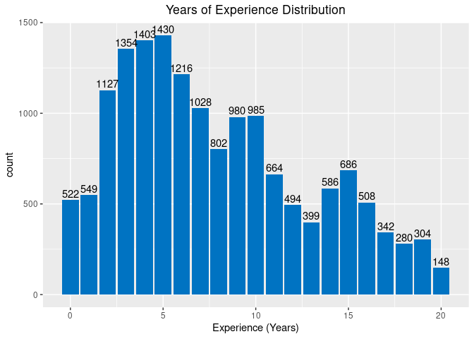
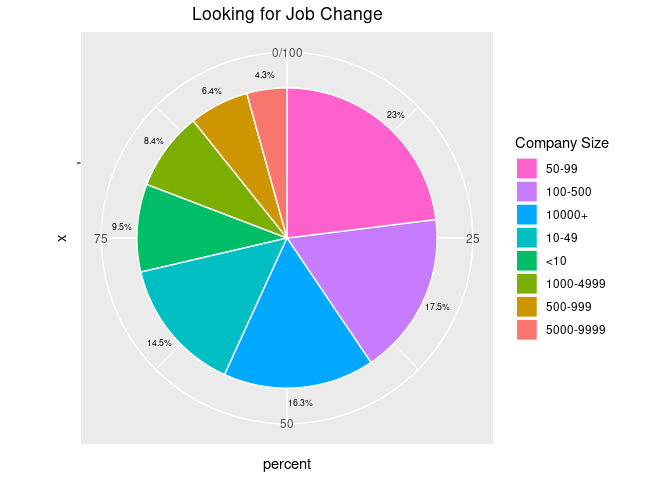

### Loading Packages


```r
knitr::opts_chunk$set(echo = TRUE, message = FALSE)
#load required packages
library(tidyverse)
library(dplyr)
library(ggplot2)
library(Hmisc)
library(scales)
```

### Basic Data Information

For the purpose of this project, I used a data scientist HR information data available on Kaggle.


```r
#read data
test <- read.csv("aug_test.csv", stringsAsFactors = F)
train <- read.csv("aug_train.csv", stringsAsFactors = F)

#column names
colnames(test)
```

```
##  [1] "enrollee_id"            "city"                   "city_development_index"
##  [4] "gender"                 "relevent_experience"    "enrolled_university"   
##  [7] "education_level"        "major_discipline"       "experience"            
## [10] "company_size"           "company_type"           "last_new_job"          
## [13] "training_hours"
```

```r
colnames(train)
```

```
##  [1] "enrollee_id"            "city"                   "city_development_index"
##  [4] "gender"                 "relevent_experience"    "enrolled_university"   
##  [7] "education_level"        "major_discipline"       "experience"            
## [10] "company_size"           "company_type"           "last_new_job"          
## [13] "training_hours"         "target"
```

```r
#summary statistics
summary_test <- describe(test)
summary_test
```

```
## test 
## 
##  13  Variables      2129  Observations
## --------------------------------------------------------------------------------
## enrollee_id 
##        n  missing distinct     Info     Mean      Gmd      .05      .10 
##     2129        0     2129        1    16862    11060     1653     3586 
##      .25      .50      .75      .90      .95 
##     8562    16816    25129    30376    31760 
## 
## lowest :     3    28    30    37    40, highest: 33300 33308 33316 33343 33353
## --------------------------------------------------------------------------------
## city 
##        n  missing distinct 
##     2129        0      108 
## 
## lowest : city_1   city_10  city_100 city_101 city_102
## highest: city_93  city_94  city_97  city_98  city_99 
## --------------------------------------------------------------------------------
## city_development_index 
##        n  missing distinct     Info     Mean      Gmd      .05      .10 
##     2129        0       81    0.975    0.825   0.1295    0.624    0.624 
##      .25      .50      .75      .90      .95 
##    0.698    0.903    0.920    0.926    0.926 
## 
## lowest : 0.448 0.479 0.487 0.493 0.512, highest: 0.924 0.925 0.926 0.939 0.949
## --------------------------------------------------------------------------------
## gender 
##        n  missing distinct 
##     1621      508        3 
##                                
## Value      Female   Male  Other
## Frequency     137   1460     24
## Proportion  0.085  0.901  0.015
## --------------------------------------------------------------------------------
## relevent_experience 
##        n  missing distinct 
##     2129        0        2 
##                                                           
## Value      Has relevent experience  No relevent experience
## Frequency                     1524                     605
## Proportion                   0.716                   0.284
## --------------------------------------------------------------------------------
## enrolled_university 
##        n  missing distinct 
##     2098       31        3 
##                                                              
## Value      Full time course    no_enrollment Part time course
## Frequency               435             1519              144
## Proportion            0.207            0.724            0.069
## --------------------------------------------------------------------------------
## education_level 
##        n  missing distinct 
##     2077       52        5 
## 
## lowest : Graduate       High School    Masters        Phd            Primary School
## highest: Graduate       High School    Masters        Phd            Primary School
##                                                                       
## Value            Graduate    High School        Masters            Phd
## Frequency            1269            222            496             54
## Proportion          0.611          0.107          0.239          0.026
##                          
## Value      Primary School
## Frequency              36
## Proportion          0.017
## --------------------------------------------------------------------------------
## major_discipline 
##        n  missing distinct 
##     1817      312        6 
## 
## lowest : Arts            Business Degree Humanities      No Major        Other          
## highest: Business Degree Humanities      No Major        Other           STEM           
##                                                                           
## Value                 Arts Business Degree      Humanities        No Major
## Frequency               17              37              80              22
## Proportion           0.009           0.020           0.044           0.012
##                                           
## Value                Other            STEM
## Frequency               40            1621
## Proportion           0.022           0.892
## --------------------------------------------------------------------------------
## experience 
##        n  missing distinct 
##     2124        5       22 
## 
## lowest : <1  >20 1   10  11 , highest: 5   6   7   8   9  
## --------------------------------------------------------------------------------
## company_size 
##        n  missing distinct 
##     1507      622        8 
## 
## lowest : <10       10/49     100-500   1000-4999 10000+   
## highest: 1000-4999 10000+    50-99     500-999   5000-9999
##                                                                       
## Value            <10     10/49   100-500 1000-4999    10000+     50-99
## Frequency        163       172       318       143       217       338
## Proportion     0.108     0.114     0.211     0.095     0.144     0.224
##                               
## Value        500-999 5000-9999
## Frequency         88        68
## Proportion     0.058     0.045
## --------------------------------------------------------------------------------
## company_type 
##        n  missing distinct 
##     1495      634        6 
## 
## lowest : Early Stage Startup Funded Startup      NGO                 Other               Public Sector      
## highest: Funded Startup      NGO                 Other               Public Sector       Pvt Ltd            
##                                                                       
## Value      Early Stage Startup      Funded Startup                 NGO
## Frequency                   65                  97                  53
## Proportion               0.043               0.065               0.035
##                                                                       
## Value                    Other       Public Sector             Pvt Ltd
## Frequency                   12                 127                1141
## Proportion               0.008               0.085               0.763
## --------------------------------------------------------------------------------
## last_new_job 
##        n  missing distinct 
##     2089       40        6 
## 
## lowest : >4    1     2     3     4    , highest: 1     2     3     4     never
##                                               
## Value         >4     1     2     3     4 never
## Frequency    353   884   342   133   119   258
## Proportion 0.169 0.423 0.164 0.064 0.057 0.124
## --------------------------------------------------------------------------------
## training_hours 
##        n  missing distinct     Info     Mean      Gmd      .05      .10 
##     2129        0      223        1    64.98    60.15        7       11 
##      .25      .50      .75      .90      .95 
##       23       47       86      144      192 
## 
## lowest :   1   2   3   4   5, highest: 324 328 330 332 334
## --------------------------------------------------------------------------------
```

```r
summary_train <- describe(train)
summary_train
```

```
## train 
## 
##  14  Variables      19158  Observations
## --------------------------------------------------------------------------------
## enrollee_id 
##        n  missing distinct     Info     Mean      Gmd      .05      .10 
##    19158        0    19158        1    16875    11104     1783     3535 
##      .25      .50      .75      .90      .95 
##     8554    16982    25170    30142    31782 
## 
## lowest :     1     2     4     5     7, highest: 33375 33376 33377 33379 33380
## --------------------------------------------------------------------------------
## city 
##        n  missing distinct 
##    19158        0      123 
## 
## lowest : city_1   city_10  city_100 city_101 city_102
## highest: city_93  city_94  city_97  city_98  city_99 
## --------------------------------------------------------------------------------
## city_development_index 
##        n  missing distinct     Info     Mean      Gmd      .05      .10 
##    19158        0       93    0.976   0.8288   0.1264    0.624    0.624 
##      .25      .50      .75      .90      .95 
##    0.740    0.903    0.920    0.925    0.926 
## 
## lowest : 0.448 0.479 0.487 0.493 0.512, highest: 0.924 0.925 0.926 0.939 0.949
## --------------------------------------------------------------------------------
## gender 
##        n  missing distinct 
##    14650     4508        3 
##                                
## Value      Female   Male  Other
## Frequency    1238  13221    191
## Proportion  0.085  0.902  0.013
## --------------------------------------------------------------------------------
## relevent_experience 
##        n  missing distinct 
##    19158        0        2 
##                                                           
## Value      Has relevent experience  No relevent experience
## Frequency                    13792                    5366
## Proportion                    0.72                    0.28
## --------------------------------------------------------------------------------
## enrolled_university 
##        n  missing distinct 
##    18772      386        3 
##                                                              
## Value      Full time course    no_enrollment Part time course
## Frequency              3757            13817             1198
## Proportion            0.200            0.736            0.064
## --------------------------------------------------------------------------------
## education_level 
##        n  missing distinct 
##    18698      460        5 
## 
## lowest : Graduate       High School    Masters        Phd            Primary School
## highest: Graduate       High School    Masters        Phd            Primary School
##                                                                       
## Value            Graduate    High School        Masters            Phd
## Frequency           11598           2017           4361            414
## Proportion          0.620          0.108          0.233          0.022
##                          
## Value      Primary School
## Frequency             308
## Proportion          0.016
## --------------------------------------------------------------------------------
## major_discipline 
##        n  missing distinct 
##    16345     2813        6 
## 
## lowest : Arts            Business Degree Humanities      No Major        Other          
## highest: Business Degree Humanities      No Major        Other           STEM           
##                                                                           
## Value                 Arts Business Degree      Humanities        No Major
## Frequency              253             327             669             223
## Proportion           0.015           0.020           0.041           0.014
##                                           
## Value                Other            STEM
## Frequency              381           14492
## Proportion           0.023           0.887
## --------------------------------------------------------------------------------
## experience 
##        n  missing distinct 
##    19093       65       22 
## 
## lowest : <1  >20 1   10  11 , highest: 5   6   7   8   9  
## --------------------------------------------------------------------------------
## company_size 
##        n  missing distinct 
##    13220     5938        8 
## 
## lowest : <10       10/49     100-500   1000-4999 10000+   
## highest: 1000-4999 10000+    50-99     500-999   5000-9999
##                                                                       
## Value            <10     10/49   100-500 1000-4999    10000+     50-99
## Frequency       1308      1471      2571      1328      2019      3083
## Proportion     0.099     0.111     0.194     0.100     0.153     0.233
##                               
## Value        500-999 5000-9999
## Frequency        877       563
## Proportion     0.066     0.043
## --------------------------------------------------------------------------------
## company_type 
##        n  missing distinct 
##    13018     6140        6 
## 
## lowest : Early Stage Startup Funded Startup      NGO                 Other               Public Sector      
## highest: Funded Startup      NGO                 Other               Public Sector       Pvt Ltd            
##                                                                       
## Value      Early Stage Startup      Funded Startup                 NGO
## Frequency                  603                1001                 521
## Proportion               0.046               0.077               0.040
##                                                                       
## Value                    Other       Public Sector             Pvt Ltd
## Frequency                  121                 955                9817
## Proportion               0.009               0.073               0.754
## --------------------------------------------------------------------------------
## last_new_job 
##        n  missing distinct 
##    18735      423        6 
## 
## lowest : >4    1     2     3     4    , highest: 1     2     3     4     never
##                                               
## Value         >4     1     2     3     4 never
## Frequency   3290  8040  2900  1024  1029  2452
## Proportion 0.176 0.429 0.155 0.055 0.055 0.131
## --------------------------------------------------------------------------------
## training_hours 
##        n  missing distinct     Info     Mean      Gmd      .05      .10 
##    19158        0      241        1    65.37    60.39        7       11 
##      .25      .50      .75      .90      .95 
##       23       47       88      146      188 
## 
## lowest :   1   2   3   4   5, highest: 328 330 332 334 336
## --------------------------------------------------------------------------------
## target 
##        n  missing distinct     Info      Sum     Mean      Gmd 
##    19158        0        2    0.562     4777   0.2493   0.3744 
## 
## --------------------------------------------------------------------------------
```

```r
#check for duplicate enrollee id
#data has no duplicates if number of unique value = number of observations
length(unique(test[,"enrollee_id"])) # no duplicates
```

```
## [1] 2129
```

```r
length(unique(train[,"enrollee_id"])) # no duplicates
```

```
## [1] 19158
```

```r
#number of NA, 0, missing values for each column
sapply(test, function(x) sum(is.na(x) | x == 0 | x == ""))
```

```
##            enrollee_id                   city city_development_index 
##                      0                      0                      0 
##                 gender    relevent_experience    enrolled_university 
##                    508                      0                     31 
##        education_level       major_discipline             experience 
##                     52                    312                      5 
##           company_size           company_type           last_new_job 
##                    622                    634                     40 
##         training_hours 
##                      0
```

```r
sapply(train, function(x) sum(is.na(x) | x == 0 | x == ""))
```

```
##            enrollee_id                   city city_development_index 
##                      0                      0                      0 
##                 gender    relevent_experience    enrolled_university 
##                   4508                      0                    386 
##        education_level       major_discipline             experience 
##                    460                   2813                     65 
##           company_size           company_type           last_new_job 
##                   5938                   6140                    423 
##         training_hours                 target 
##                      0                  14381
```

The dataset is comprised of two datasets - test and train. Test data had 2129 rows and 13 columns. Train data had 19158 rows and 14 columns. I checked if there were any duplicated enrollee id value in both datasets by looking at the number of unique values in 'enrollee_id' column. The unique value count matched the number of observations in each dataset, and this indicates that there are no duplicate enrollee id in the entire dataset. Next, I looked for NA,0,and blank values in both datasets to have an idea of how and what to pre-process. 

### Basic Data Visualization 

The graphs and charts in this section will give you an idea about how the data looks like in general. It will yet give any comparison analysis based on data scientists' current job search status.

#### Gender Composition of Data Scientists

For the creation of gender composition pie chart, the missing values in 'gender' column has been removed prior to the visualization.


```r
sex <- train %>% # create a dataframe called sex
  filter(!(gender == "")) %>% # remove blank values from 'gender' column
  group_by(gender) %>% # group by gender
  summarise(percent = n()/nrow(.) * 100) # calculate gender ratios

# create pie chart for gender
pie <- ggplot(sex, aes(x = "", y = percent, fill = reorder(gender,percent))) +
  geom_bar(width = 1, stat = "identity", color = "white") +
  geom_text(aes(x = 1.58, label = paste0(round(percent,1),"%")),
            position = position_stack(vjust = .5), size = 2.3) +
  coord_polar("y", start = 0) +
  labs(fill = "Gender", title = "Gender Composition") +
  theme(plot.title = element_text(hjust = 0.5)) # center title
  guides(fill = guide_legend(reverse = TRUE)) # reverse order of legend
```

```
## $fill
## $title
## list()
## attr(,"class")
## [1] "waiver"
## 
## $title.position
## NULL
## 
## $title.theme
## NULL
## 
## $title.hjust
## NULL
## 
## $title.vjust
## NULL
## 
## $label
## [1] TRUE
## 
## $label.position
## NULL
## 
## $label.theme
## NULL
## 
## $label.hjust
## NULL
## 
## $label.vjust
## NULL
## 
## $keywidth
## NULL
## 
## $keyheight
## NULL
## 
## $direction
## NULL
## 
## $override.aes
## named list()
## 
## $nrow
## NULL
## 
## $ncol
## NULL
## 
## $byrow
## [1] FALSE
## 
## $reverse
## [1] TRUE
## 
## $order
## [1] 0
## 
## $available_aes
## [1] "any"
## 
## $name
## [1] "legend"
## 
## attr(,"class")
## [1] "guide"  "legend"
## 
## attr(,"class")
## [1] "guides"
```

```r
pie
```

<!-- -->

The resulting pie chart shows that the majority of data scientists in this dataset - about 90% - identified themselves as male. While this may come down to the male-dominance nature of STEM related job, this also may be an indication of potential data bias.


#### Major Composition

Same pre-processing methodogologies has been applied to 'major_discipline' column.


```r
# pie chart for major discipline
major <- train %>%
  filter(!(major_discipline == "")) %>% # remove blank values from 'major_discipline'
  group_by(major_discipline) %>%
  summarise(percent = n()/nrow(.) * 100)

pie <- ggplot(major, aes(x = "", y = percent, fill = reorder(major_discipline, percent))) +
  # pies in order of largest percentage to smallest percentage
  geom_bar(width = 1, stat = "identity", color = "white") +
  geom_text(aes(x = 1.58, label = paste0(round(percent,1),"%")),
            position = position_stack(vjust = .5), size = 1.85) + # percentage labels
  coord_polar("y", start = 0) +
  labs(fill = "Major Discipline", title = "Major Composition") +
  theme(plot.title = element_text(hjust = 0.5))  + # center title
  guides(fill = guide_legend(reverse = TRUE))
pie
```

<!-- -->

The pie chart indicates the majority of data scientists have STEM background.

#### Education Level 

This section will study common average education level of data scientists. Note that 'Graduate' value in 'education_level' stands for 4-year college graduates.


```r
# pie chart for education level
education <- train %>%
  filter(!(education_level == "")) %>% # remove blank values
  group_by(education_level) %>%
  summarise(percent = n()/nrow(.) * 100)

pie <- ggplot(education, aes(x = "", y = percent, fill = reorder(education_level,percent))) +
  # pies in order of largest percentage to smallest percentage
  geom_bar(width = 1, stat = "identity", color = "white") +
  geom_text(aes(x = 1.6, label = paste0(round(percent,1),"%")),
            position = position_stack(vjust = .5), size = 2.3) +
  coord_polar("y", start = 0) +
  labs(fill = "Education Level", title = "Education Level of Data Scientists") +
  theme(plot.title = element_text(hjust = 0.5))  + # center title
  guides(fill = guide_legend(reverse = TRUE)) # reverse order of legend
pie
```

<!-- -->

It is shown that more than half of candidates have become data scientists with bachelor's degree. Master's degree was the second common education level among data scientists.

#### Years of Experience Distribution

In order to create years of experience distribution graph, I first need to remove character variables such as '>20' and '<1' from 'experience' column and only keep numeric variables. So, after removing blank values from the column, I eliminated rows with '>20' values. For <1' values, I replaced them with '0' based on an assumption that <1 years of experience is almost identical to 0 years of experience.


```r
exp <- train %>%
  filter(!(experience == "")) %>% # remove missing values from 'experience' column
  filter(!experience == ">20") %>% # remove >20 years of experience
  mutate(experience = ifelse(experience == "<1", "0",experience)) %>% # treat <1 experience as 0 experience
  mutate(experience = as.numeric(experience)) %>% # convert to numeric variable
  group_by(experience) %>%
  summarise(count = n()) # count for each 'years of experience'

# create a bar graph for years of experience distribution
bar <- ggplot(exp, aes(x = experience, y = count)) +
  geom_bar(fill = "#0073C2FF", stat = "identity") +
  geom_text(aes(label = count), vjust = -0.3) + # count labels at the top of each bar
  labs(x = "Experience (Years)", title = "Years of Experience Distribution") +
  theme(plot.title = element_text(hjust = 0.5)) # center title
bar
```

<!-- -->

The distribution graph shows peaks around 5, 10, and 15 years of experience. This suggests that data scientists tend to leave their current company and look for a company change at five-year intervals.

#### Distribution of Training Hours by Company Type 

In this section, I will look at how the amount of training hours for data scientists differs in various type of companies.


```r
density <- train %>%
  filter(!company_type == "") %>% # remove missing values from 'company_type'
  filter(!training_hours == "") # remove missing values from 'training_hours"

# create a density plot of training hour distribution by company type
plot <- ggplot(density, aes(x = training_hours)) +
  geom_density(aes(color = company_type)) +
  labs(title = "Training Hour Distribution by Company Type") +
  theme(plot.title = element_text(hjust = 0.5)) # center title
plot
```

<!-- -->

In general, the density plot of training distribution showed similar trends in all types of companies. At the point where the training hours peaked in all company types, the Private limited companies had the highest density.

### Visualization for Comparison (Looking for Company Change vs Those who are not)

The following sections will compare a group of data scientists who are looking for company change to those who are not. I will find out which data scientists are more likely to leave their current company, and what factors lead to such decisions.

The 'target' column in the dataset 0 – Not looking for job change, 1 – Looking for a job change


#### Company Size

This section will study whether the size of a company affects data scientists' decision to leave their company or not. Is there any relationship between company size and willingness to leave company? Are data scientists more likely to be willing to change company if they are working for small company?


```r
#my_order <- c('<10','10/49','50-99','100-500','500-999','1000-4999','5000-9999','10000+')

#size <- train %>%
#  filter(!(company_size == "")) %>%
#  group_by(company_size) %>%
#  summarise(count = n()) %>%
#  arrange(match(company_size, my_order))

#bar <- ggplot(size, aes(x = company_size, y = count)) +
#  geom_bar(fill = "#0073C2FF", stat = "identity") +
#  geom_text(aes(label = count), vjust = -0.3)
#bar

#-------
# unique values in 'company_size' column
unique(train[c("company_size")])
```

```
##    company_size
## 1              
## 2         50-99
## 8           <10
## 10       10000+
## 12    5000-9999
## 13    1000-4999
## 16        10/49
## 21      100-500
## 27      500-999
```

```r
size <- train %>%
  filter(!company_size == "") %>%
  mutate(company_size = ifelse(company_size == "10/49", "10-49",company_size)) 

# unique values in 'company_size' column
unique(size[c("company_size")]) # missing value removed and 10/49 converted to 10-49
```

```
##    company_size
## 1         50-99
## 4           <10
## 6        10000+
## 7     5000-9999
## 8     1000-4999
## 9         10-49
## 13      100-500
## 17      500-999
```

```r
# looking for job change (target=1)
size1 <- size %>%
  filter(target == "1") %>% # filter data for people looking for job change
  group_by(company_size) %>%
  summarise(percent = n()/nrow(.) * 100)

pie <- ggplot(size1, aes(x = "", y = percent, fill = reorder(company_size,percent))) +
  # from largest percentage to smallest percentage
  geom_bar(width = 1, stat = "identity", color = "white") +
  geom_text(aes(x = 1.6, label = paste0(round(percent,1),"%")),
            position = position_stack(vjust = .5), size = 2.3) +
  coord_polar("y", start = 0) +
  labs(fill = "Company Size", title = "Looking for Job Change") +
  theme(plot.title = element_text(hjust = 0.5)) + # center title
  guides(fill = guide_legend(reverse = TRUE)) # reverse order of legend
pie
```

<!-- -->

```r
# not looking for job change (target=0)
size2 <- size %>%
  filter(target == "0") %>% # filter data for people not looking for job change
  filter(!company_size == "") %>% # remove missing values
  group_by(company_size) %>%
  summarise(percent = n()/nrow(.) * 100) # calculate percentage

pie <- ggplot(size2, aes(x = "", y = percent, fill = reorder(company_size,percent))) +
  geom_bar(width = 1, stat = "identity", color = "white") +
  geom_text(aes(x = 1.6, label = paste0(round(percent,1),"%")),
            position = position_stack(vjust = .5), size = 2.3) +
  coord_polar("y", start = 0) +
  labs(fill = "Company Size", title = "Not Looking for Job Change") +
  theme(plot.title = element_text(hjust = 0.5)) + # center title
  guides(fill = guide_legend(reverse = TRUE)) # reverse order of legend
pie
```

<!-- -->


#### Company Type

This section will study whether the type of a company matters to a data scientist's company decision or not. 


```r
#total number
company <- train %>%
  filter(!company_type == "") %>%
  group_by(company_type) %>%
  summarise(count = n())

freq <- ggplot(company, aes(fct_rev(fct_reorder(company_type, count)),count)) +
  geom_bar(fill = "#0073C2FF", stat = "identity") +
  geom_text(aes(label = count), vjust = -0.3) +
  labs(x = "Company Type", title = "Companies data scientists work for") +
  theme(plot.title = element_text(hjust = 0.5)) # center title
freq
```

<!-- -->

```r
#looking for job change (target=1)
change <- train %>%
  filter(target == "1") %>%
  filter(!company_type == "") %>%
  group_by(company_type) %>%
  summarise(count = n(), percent = n()/nrow(.) * 100)

freq <- ggplot(change, aes(fct_rev(fct_reorder(company_type, count)),count)) +
  geom_bar(fill = "#0073C2FF", stat = "identity") +
  geom_text(aes(label = paste0(count," (", paste0(round(percent,1),"%"),")"), vjust = -0.3)) +
  labs(x = "Company Type", title = "Looking for Job Change") +
  theme(plot.title = element_text(hjust = 0.5)) # center title
freq
```

<!-- -->

```r
#not looking for job change (target=0)
nochange <- train %>%
  filter(target == "0") %>%
  filter(!company_type == "") %>%
  group_by(company_type) %>%
  summarise(count = n(), percent = n()/nrow(.) * 100)

freq <- ggplot(nochange, aes(fct_rev(fct_reorder(company_type, count)),count)) +
  geom_bar(fill = "#0073C2FF", stat = "identity") +
  geom_text(aes(label = paste0(count," (", paste0(round(percent,1),"%"),")"), vjust = -0.3)) +
  labs(x = "Company Type", title = "Not Looking for Job Change") +
  theme(plot.title = element_text(hjust = 0.5)) # center title
freq
```

<!-- -->

Since the private limited companies take a huge portion in our dataset, it was not very surprising that the above graphs showed that the majority of both groups of data scientists - those who are looking for company change and those who are not - were currently working for private companies. It was interesting to see many data scientists willing to continue working for startups given that the company was well funded. The number of data scientists who are not looking for company change in funded startups were twice as much as those in early stage startups. This indicates that the funding status of a company is one of the important factors to consider for a data scientist.

#### Training Hours Distribution by groups of people

In this section, I will study for a relationship between number of training bours and willingness to change company. Any missing values will be removed from 'company_type' and 'training_hours' columns.


```r
density <- train %>%
  filter(!company_type == "") %>% # remove missing values
  filter(!training_hours == "") %>% # remove missing values
  mutate(target = ifelse(target == "0", "Not Looking for Job Change","Looking for Job Change"))

plot <- ggplot(density, aes(x = training_hours)) +
  geom_density(aes(color = target)) +
  labs(title = "Training Hour Distribution") +
  theme(plot.title = element_text(hjust = 0.5)) # center title
plot
```

<!-- -->

ACcording to the density plot above, there was not much differences between two groups of data scientists. It is likely that the number of training hours does not affect data scientists' decision to look for another company to work for.

#### Years of Experience

This section will examine the differences in the number of years of experiences between two groups of data scientists, and look for any existing relationships. Blank values will be removed from 'experience' column. Also, years of experience that exceed 20 years and those that are less than 1 year will be removed from the column for simplicity.


```r
density <- train %>%
  filter(!experience == "") %>% # remove missing values
  filter(!experience == ">20") %>% # remove >20 experience
  filter(!experience == "<1") %>% # remove <1 experience
  mutate(experience = as.numeric(experience)) %>% # convert to numeric variables
  mutate(target = ifelse(target == "0", "Not Looking for Job Change","Looking for Job Change"))

plot <- ggplot(density, aes(x = experience)) +
  geom_density(aes(color = target)) +
  labs(x = "Experience (years)", y = "Density", fill = "Group") +
  labs(title = "Years of Experience Distribution") +
  theme(plot.title = element_text(hjust = 0.5)) # center title
plot
```

<!-- -->

The density plot above shows that those who are looking for job (company) change tend to have less years of experience. This may be because the employees usually look for better companies in their early career.


