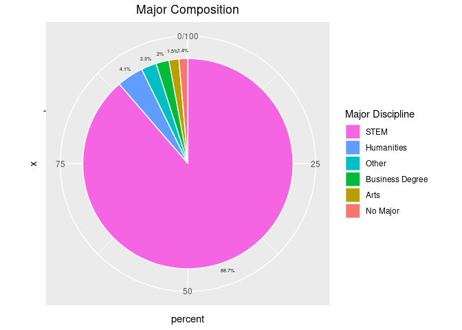
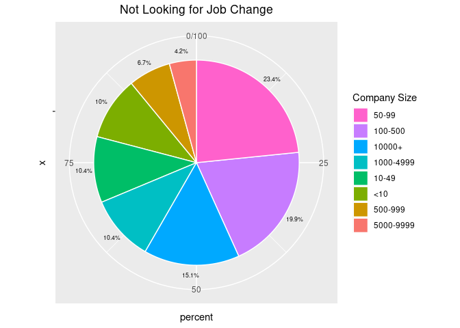

## Data PreProcessing

### Basic Setup


```r
#read data
test <- read.csv("aug_test.csv", stringsAsFactors = F)
train <- read.csv("aug_train.csv", stringsAsFactors = F)

colnames(test)
```

```
##  [1] "enrollee_id"            "city"                   "city_development_index"
##  [4] "gender"                 "relevent_experience"    "enrolled_university"   
##  [7] "education_level"        "major_discipline"       "experience"            
## [10] "company_size"           "company_type"           "last_new_job"          
## [13] "training_hours"
```

```r
colnames(train)
```

```
##  [1] "enrollee_id"            "city"                   "city_development_index"
##  [4] "gender"                 "relevent_experience"    "enrolled_university"   
##  [7] "education_level"        "major_discipline"       "experience"            
## [10] "company_size"           "company_type"           "last_new_job"          
## [13] "training_hours"         "target"
```

```r
summary_test <- describe(test)
summary_test
```

```
## test 
## 
##  13  Variables      2129  Observations
## --------------------------------------------------------------------------------
## enrollee_id 
##        n  missing distinct     Info     Mean      Gmd      .05      .10 
##     2129        0     2129        1    16862    11060     1653     3586 
##      .25      .50      .75      .90      .95 
##     8562    16816    25129    30376    31760 
## 
## lowest :     3    28    30    37    40, highest: 33300 33308 33316 33343 33353
## --------------------------------------------------------------------------------
## city 
##        n  missing distinct 
##     2129        0      108 
## 
## lowest : city_1   city_10  city_100 city_101 city_102
## highest: city_93  city_94  city_97  city_98  city_99 
## --------------------------------------------------------------------------------
## city_development_index 
##        n  missing distinct     Info     Mean      Gmd      .05      .10 
##     2129        0       81    0.975    0.825   0.1295    0.624    0.624 
##      .25      .50      .75      .90      .95 
##    0.698    0.903    0.920    0.926    0.926 
## 
## lowest : 0.448 0.479 0.487 0.493 0.512, highest: 0.924 0.925 0.926 0.939 0.949
## --------------------------------------------------------------------------------
## gender 
##        n  missing distinct 
##     1621      508        3 
##                                
## Value      Female   Male  Other
## Frequency     137   1460     24
## Proportion  0.085  0.901  0.015
## --------------------------------------------------------------------------------
## relevent_experience 
##        n  missing distinct 
##     2129        0        2 
##                                                           
## Value      Has relevent experience  No relevent experience
## Frequency                     1524                     605
## Proportion                   0.716                   0.284
## --------------------------------------------------------------------------------
## enrolled_university 
##        n  missing distinct 
##     2098       31        3 
##                                                              
## Value      Full time course    no_enrollment Part time course
## Frequency               435             1519              144
## Proportion            0.207            0.724            0.069
## --------------------------------------------------------------------------------
## education_level 
##        n  missing distinct 
##     2077       52        5 
## 
## lowest : Graduate       High School    Masters        Phd            Primary School
## highest: Graduate       High School    Masters        Phd            Primary School
##                                                                       
## Value            Graduate    High School        Masters            Phd
## Frequency            1269            222            496             54
## Proportion          0.611          0.107          0.239          0.026
##                          
## Value      Primary School
## Frequency              36
## Proportion          0.017
## --------------------------------------------------------------------------------
## major_discipline 
##        n  missing distinct 
##     1817      312        6 
## 
## lowest : Arts            Business Degree Humanities      No Major        Other          
## highest: Business Degree Humanities      No Major        Other           STEM           
##                                                                           
## Value                 Arts Business Degree      Humanities        No Major
## Frequency               17              37              80              22
## Proportion           0.009           0.020           0.044           0.012
##                                           
## Value                Other            STEM
## Frequency               40            1621
## Proportion           0.022           0.892
## --------------------------------------------------------------------------------
## experience 
##        n  missing distinct 
##     2124        5       22 
## 
## lowest : <1  >20 1   10  11 , highest: 5   6   7   8   9  
## --------------------------------------------------------------------------------
## company_size 
##        n  missing distinct 
##     1507      622        8 
## 
## lowest : <10       10/49     100-500   1000-4999 10000+   
## highest: 1000-4999 10000+    50-99     500-999   5000-9999
##                                                                       
## Value            <10     10/49   100-500 1000-4999    10000+     50-99
## Frequency        163       172       318       143       217       338
## Proportion     0.108     0.114     0.211     0.095     0.144     0.224
##                               
## Value        500-999 5000-9999
## Frequency         88        68
## Proportion     0.058     0.045
## --------------------------------------------------------------------------------
## company_type 
##        n  missing distinct 
##     1495      634        6 
## 
## lowest : Early Stage Startup Funded Startup      NGO                 Other               Public Sector      
## highest: Funded Startup      NGO                 Other               Public Sector       Pvt Ltd            
##                                                                       
## Value      Early Stage Startup      Funded Startup                 NGO
## Frequency                   65                  97                  53
## Proportion               0.043               0.065               0.035
##                                                                       
## Value                    Other       Public Sector             Pvt Ltd
## Frequency                   12                 127                1141
## Proportion               0.008               0.085               0.763
## --------------------------------------------------------------------------------
## last_new_job 
##        n  missing distinct 
##     2089       40        6 
## 
## lowest : >4    1     2     3     4    , highest: 1     2     3     4     never
##                                               
## Value         >4     1     2     3     4 never
## Frequency    353   884   342   133   119   258
## Proportion 0.169 0.423 0.164 0.064 0.057 0.124
## --------------------------------------------------------------------------------
## training_hours 
##        n  missing distinct     Info     Mean      Gmd      .05      .10 
##     2129        0      223        1    64.98    60.15        7       11 
##      .25      .50      .75      .90      .95 
##       23       47       86      144      192 
## 
## lowest :   1   2   3   4   5, highest: 324 328 330 332 334
## --------------------------------------------------------------------------------
```

```r
summary_train <- describe(train)
summary_train
```

```
## train 
## 
##  14  Variables      19158  Observations
## --------------------------------------------------------------------------------
## enrollee_id 
##        n  missing distinct     Info     Mean      Gmd      .05      .10 
##    19158        0    19158        1    16875    11104     1783     3535 
##      .25      .50      .75      .90      .95 
##     8554    16982    25170    30142    31782 
## 
## lowest :     1     2     4     5     7, highest: 33375 33376 33377 33379 33380
## --------------------------------------------------------------------------------
## city 
##        n  missing distinct 
##    19158        0      123 
## 
## lowest : city_1   city_10  city_100 city_101 city_102
## highest: city_93  city_94  city_97  city_98  city_99 
## --------------------------------------------------------------------------------
## city_development_index 
##        n  missing distinct     Info     Mean      Gmd      .05      .10 
##    19158        0       93    0.976   0.8288   0.1264    0.624    0.624 
##      .25      .50      .75      .90      .95 
##    0.740    0.903    0.920    0.925    0.926 
## 
## lowest : 0.448 0.479 0.487 0.493 0.512, highest: 0.924 0.925 0.926 0.939 0.949
## --------------------------------------------------------------------------------
## gender 
##        n  missing distinct 
##    14650     4508        3 
##                                
## Value      Female   Male  Other
## Frequency    1238  13221    191
## Proportion  0.085  0.902  0.013
## --------------------------------------------------------------------------------
## relevent_experience 
##        n  missing distinct 
##    19158        0        2 
##                                                           
## Value      Has relevent experience  No relevent experience
## Frequency                    13792                    5366
## Proportion                    0.72                    0.28
## --------------------------------------------------------------------------------
## enrolled_university 
##        n  missing distinct 
##    18772      386        3 
##                                                              
## Value      Full time course    no_enrollment Part time course
## Frequency              3757            13817             1198
## Proportion            0.200            0.736            0.064
## --------------------------------------------------------------------------------
## education_level 
##        n  missing distinct 
##    18698      460        5 
## 
## lowest : Graduate       High School    Masters        Phd            Primary School
## highest: Graduate       High School    Masters        Phd            Primary School
##                                                                       
## Value            Graduate    High School        Masters            Phd
## Frequency           11598           2017           4361            414
## Proportion          0.620          0.108          0.233          0.022
##                          
## Value      Primary School
## Frequency             308
## Proportion          0.016
## --------------------------------------------------------------------------------
## major_discipline 
##        n  missing distinct 
##    16345     2813        6 
## 
## lowest : Arts            Business Degree Humanities      No Major        Other          
## highest: Business Degree Humanities      No Major        Other           STEM           
##                                                                           
## Value                 Arts Business Degree      Humanities        No Major
## Frequency              253             327             669             223
## Proportion           0.015           0.020           0.041           0.014
##                                           
## Value                Other            STEM
## Frequency              381           14492
## Proportion           0.023           0.887
## --------------------------------------------------------------------------------
## experience 
##        n  missing distinct 
##    19093       65       22 
## 
## lowest : <1  >20 1   10  11 , highest: 5   6   7   8   9  
## --------------------------------------------------------------------------------
## company_size 
##        n  missing distinct 
##    13220     5938        8 
## 
## lowest : <10       10/49     100-500   1000-4999 10000+   
## highest: 1000-4999 10000+    50-99     500-999   5000-9999
##                                                                       
## Value            <10     10/49   100-500 1000-4999    10000+     50-99
## Frequency       1308      1471      2571      1328      2019      3083
## Proportion     0.099     0.111     0.194     0.100     0.153     0.233
##                               
## Value        500-999 5000-9999
## Frequency        877       563
## Proportion     0.066     0.043
## --------------------------------------------------------------------------------
## company_type 
##        n  missing distinct 
##    13018     6140        6 
## 
## lowest : Early Stage Startup Funded Startup      NGO                 Other               Public Sector      
## highest: Funded Startup      NGO                 Other               Public Sector       Pvt Ltd            
##                                                                       
## Value      Early Stage Startup      Funded Startup                 NGO
## Frequency                  603                1001                 521
## Proportion               0.046               0.077               0.040
##                                                                       
## Value                    Other       Public Sector             Pvt Ltd
## Frequency                  121                 955                9817
## Proportion               0.009               0.073               0.754
## --------------------------------------------------------------------------------
## last_new_job 
##        n  missing distinct 
##    18735      423        6 
## 
## lowest : >4    1     2     3     4    , highest: 1     2     3     4     never
##                                               
## Value         >4     1     2     3     4 never
## Frequency   3290  8040  2900  1024  1029  2452
## Proportion 0.176 0.429 0.155 0.055 0.055 0.131
## --------------------------------------------------------------------------------
## training_hours 
##        n  missing distinct     Info     Mean      Gmd      .05      .10 
##    19158        0      241        1    65.37    60.39        7       11 
##      .25      .50      .75      .90      .95 
##       23       47       88      146      188 
## 
## lowest :   1   2   3   4   5, highest: 328 330 332 334 336
## --------------------------------------------------------------------------------
## target 
##        n  missing distinct     Info      Sum     Mean      Gmd 
##    19158        0        2    0.562     4777   0.2493   0.3744 
## 
## --------------------------------------------------------------------------------
```

```r
length(unique(test[,"enrollee_id"])) # no duplicates
```

```
## [1] 2129
```

```r
length(unique(train[,"enrollee_id"])) # no duplicates
```

```
## [1] 19158
```

```r
sapply(test, function(x) sum(is.na(x) | x == 0 | x == ""))
```

```
##            enrollee_id                   city city_development_index 
##                      0                      0                      0 
##                 gender    relevent_experience    enrolled_university 
##                    508                      0                     31 
##        education_level       major_discipline             experience 
##                     52                    312                      5 
##           company_size           company_type           last_new_job 
##                    622                    634                     40 
##         training_hours 
##                      0
```

```r
sapply(train, function(x) sum(is.na(x) | x == 0 | x == ""))
```

```
##            enrollee_id                   city city_development_index 
##                      0                      0                      0 
##                 gender    relevent_experience    enrolled_university 
##                   4508                      0                    386 
##        education_level       major_discipline             experience 
##                    460                   2813                     65 
##           company_size           company_type           last_new_job 
##                   5938                   6140                    423 
##         training_hours                 target 
##                      0                  14381
```

```r
#test1 <- test1[!(test1$Customer_Age %in% boxplot(df$Customer_Age)$out),]
```

### Visualization 

#### Gender

```r
# pie chart for gender
sex <- train %>%
  filter(!(gender == "")) %>% # remove blank values from 'gender'
  group_by(gender) %>%
  summarise(percent = n()/nrow(.) * 100)
```

```
## `summarise()` ungrouping output (override with `.groups` argument)
```

```r
pie <- ggplot(sex, aes(x = "", y = percent, fill = reorder(gender,percent))) +
  geom_bar(width = 1, stat = "identity", color = "white") +
  geom_text(aes(x = 1.58, label = paste0(round(percent,1),"%")),
            position = position_stack(vjust = .5), size = 2.3) +
  coord_polar("y", start = 0) +
  labs(fill = "Gender") +
  guides(fill = guide_legend(reverse = TRUE)) # reverse order of legend
pie
```

<!-- -->
여자보다 남자 비율이 월등히 높음.
실제를 반영한 것일 수도 있지만 그냥 데이터가 imbalanced한 것일 수도 있음을
생각해야함

#### Major

```r
# pie chart for major discipline
major <- train %>%
  filter(!(major_discipline == "")) %>% # remove blank values from 'major_discipline'
  group_by(major_discipline) %>%
  summarise(percent = n()/nrow(.) * 100)
```

```
## `summarise()` ungrouping output (override with `.groups` argument)
```

```r
pie <- ggplot(major, aes(x = "", y = percent, fill = reorder(major_discipline, percent))) +
  geom_bar(width = 1, stat = "identity", color = "white") +
  geom_text(aes(x = 1.58, label = paste0(round(percent,1),"%")),
            position = position_stack(vjust = .5), size = 1.85) +
  coord_polar("y", start = 0) +
  labs(fill = "Major Discipline") +
  guides(fill = guide_legend(reverse = TRUE)) # reverse order of legend
pie
```

<!-- -->

#### Education Level 

```r
# pie chart for education level
education <- train %>%
  filter(!(education_level == "")) %>% # remove blank values from 'major_discipline'
  group_by(education_level) %>%
  summarise(percent = n()/nrow(.) * 100)
```

```
## `summarise()` ungrouping output (override with `.groups` argument)
```

```r
pie <- ggplot(education, aes(x = "", y = percent, fill = reorder(education_level,percent))) +
  geom_bar(width = 1, stat = "identity", color = "white") +
  geom_text(aes(x = 1.6, label = paste0(round(percent,1),"%")),
            position = position_stack(vjust = .5), size = 2.3) +
  coord_polar("y", start = 0) +
  labs(fill = "Education Level") +
  guides(fill = guide_legend(reverse = TRUE)) # reverse order of legend
pie
```

<!-- -->

```r
#pie <- ggplot(major, aes(x = "", y = percent, fill = major_discipline)) +
#  geom_bar(width = 1, stat = "identity", color = "white") +
#  scale_y_continuous(breaks = round(cumsum(rev(major$percent)), 1)) +
#  geom_text(aes(label = paste(round(percent,1),"%")),position = position_stack(vjust = .5)) +
#  coord_polar("y", start = 0)
#pie
```

#### Experience

```r
#my_order <- c('<1','1','2','3','4','5','6','7','8','9','10','11','12','13','14','15',
#           '16','17','18','19','20','>20')

#exp <- train %>%
#  filter(!(experience == "")) %>%
#  #mutate(experience = ifelse(experience == "<1", "0",experience)) %>%
#  #mutate(experience = as.numeric(experience)) %>%
#  group_by(experience) %>%
#  summarise(count = n()) %>%
#  arrange(match(experience, my_order))

exp <- train %>%
  filter(!(experience == "")) %>%
  filter(!experience == ">20") %>% # remove >20 experience
  #filter(!experience == "<1") %>% # remove <1 experience
  mutate(experience = ifelse(experience == "<1", "0",experience)) %>% # treat <1 experience as 0 experience
  mutate(experience = as.numeric(experience)) %>%
  group_by(experience) %>%
  summarise(count = n())
```

```
## `summarise()` ungrouping output (override with `.groups` argument)
```

```r
bar <- ggplot(exp, aes(x = experience, y = count)) +
  geom_bar(fill = "#0073C2FF", stat = "identity") +
  geom_text(aes(label = count), vjust = -0.3)
bar
```

<!-- -->

#### Company Size

```r
my_order <- c('<10','10/49','50-99','100-500','500-999','1000-4999','5000-9999','10000+')

size <- train %>%
  filter(!(company_size == "")) %>%
  group_by(company_size) %>%
  summarise(count = n()) %>%
  arrange(match(company_size, my_order))
```

```
## `summarise()` ungrouping output (override with `.groups` argument)
```

```r
bar <- ggplot(size, aes(x = company_size, y = count)) +
  geom_bar(fill = "#0073C2FF", stat = "identity") +
  geom_text(aes(label = count), vjust = -0.3)
bar
```

<!-- -->

```r
#-------
my_order <- c('<10','10/49','50-99','100-500','500-999','1000-4999','5000-9999','10000+')

#not looking for job change (target=0)
size <- train %>%
  filter(target == "0") %>%
  filter(!company_size == "") %>%
  group_by(company_size) %>%
  summarise(percent = n()/nrow(.) * 100)
```

```
## `summarise()` ungrouping output (override with `.groups` argument)
```

```r
pie <- ggplot(size, aes(x = "", y = percent, fill = reorder(company_size,percent))) +
  geom_bar(width = 1, stat = "identity", color = "white") +
  geom_text(aes(x = 1.6, label = paste0(round(percent,1),"%")),
            position = position_stack(vjust = .5), size = 2.3) +
  coord_polar("y", start = 0) +
  labs(fill = "Company Sizel") +
  guides(fill = guide_legend(reverse = TRUE)) # reverse order of legend
pie
```

<!-- -->

```r
# looking for job change (target=1)
size <- train %>%
  filter(target == "1") %>%
  filter(!company_size == "") %>%
  group_by(company_size) %>%
  summarise(percent = n()/nrow(.) * 100)
```

```
## `summarise()` ungrouping output (override with `.groups` argument)
```

```r
pie <- ggplot(size, aes(x = "", y = percent, fill = reorder(company_size,percent))) +
  geom_bar(width = 1, stat = "identity", color = "white") +
  geom_text(aes(x = 1.6, label = paste0(round(percent,1),"%")),
            position = position_stack(vjust = .5), size = 2.3) +
  coord_polar("y", start = 0) +
  labs(fill = "Company Sizel") +
  guides(fill = guide_legend(reverse = TRUE)) # reverse order of legend
pie
```

<!-- -->


#### Company Type

```r
#total number
company <- train %>%
  filter(!company_type == "") %>%
  group_by(company_type) %>%
  summarise(count = n())
```

```
## `summarise()` ungrouping output (override with `.groups` argument)
```

```r
freq <- ggplot(company, aes(fct_rev(fct_reorder(company_type, count)),count)) +
  geom_bar(fill = "#0073C2FF", stat = "identity") +
  geom_text(aes(label = count), vjust = -0.3) +
  labs(x = "Company Type")
freq
```

<!-- -->

```r
#not looking for job change (target=0)
nochange <- train %>%
  filter(target == "0") %>%
  filter(!company_type == "") %>%
  group_by(company_type) %>%
  summarise(count = n(), percent = n()/nrow(.) * 100)
```

```
## `summarise()` ungrouping output (override with `.groups` argument)
```

```r
freq <- ggplot(nochange, aes(fct_rev(fct_reorder(company_type, count)),count)) +
  geom_bar(fill = "#0073C2FF", stat = "identity") +
  geom_text(aes(label = paste0(count," (", paste0(round(percent,1),"%"),")"), vjust = -0.3)) +
  labs(x = "Company Type", title = "Not Looking for Job Change")
freq
```

<!-- -->

```r
#looking for job change (target=1)
change <- train %>%
  filter(target == "1") %>%
  filter(!company_type == "") %>%
  group_by(company_type) %>%
  summarise(count = n(), percent = n()/nrow(.) * 100)
```

```
## `summarise()` ungrouping output (override with `.groups` argument)
```

```r
freq <- ggplot(change, aes(fct_rev(fct_reorder(company_type, count)),count)) +
  geom_bar(fill = "#0073C2FF", stat = "identity") +
  geom_text(aes(label = paste0(count," (", paste0(round(percent,1),"%"),")"), vjust = -0.3)) +
  labs(x = "Company Type", title = "Looking for Job Change")
freq
```

<!-- -->


```r
density <- train %>%
  filter(!company_type == "") %>%
  filter(!training_hours == "")

plot <- ggplot(density, aes(x = training_hours)) +
  geom_density(aes(color = company_type))
plot
```

<!-- -->

```r
#-------
density <- train %>%
  filter(!company_type == "") %>%
  filter(!training_hours == "") %>%
  mutate(target = ifelse(target == "0", "Not Looking for Job Change","Looking for Job Change"))

plot <- ggplot(density, aes(x = training_hours)) +
  geom_density(aes(color = target))
plot
```

<!-- -->

```r
#-------
#looking for/not looking for
density <- train %>%
  filter(!experience == "") %>%
  filter(!experience == ">20") %>%
  filter(!experience == "<1") %>%
  mutate(experience = as.numeric(experience)) %>%
  mutate(target = ifelse(target == "0", "Not Looking for Job Change","Looking for Job Change"))

plot <- ggplot(density, aes(x = experience)) +
  geom_density(aes(color = target))
plot
```

<!-- -->


