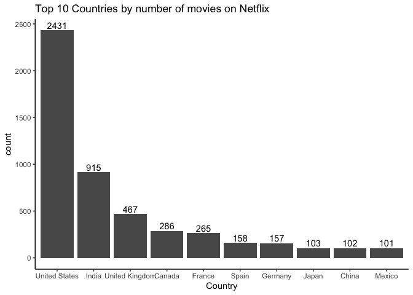

## Loading Packages


```r
df <- read.csv("netflix_titles.csv", stringsAsFactors = F)

summary(df)
```

```
##    show_id              type              title             director        
##  Length:7787        Length:7787        Length:7787        Length:7787       
##  Class :character   Class :character   Class :character   Class :character  
##  Mode  :character   Mode  :character   Mode  :character   Mode  :character  
##                                                                             
##                                                                             
##                                                                             
##      cast             country           date_added         release_year 
##  Length:7787        Length:7787        Length:7787        Min.   :1925  
##  Class :character   Class :character   Class :character   1st Qu.:2013  
##  Mode  :character   Mode  :character   Mode  :character   Median :2017  
##                                                           Mean   :2014  
##                                                           3rd Qu.:2018  
##                                                           Max.   :2021  
##     rating            duration          listed_in         description       
##  Length:7787        Length:7787        Length:7787        Length:7787       
##  Class :character   Class :character   Class :character   Class :character  
##  Mode  :character   Mode  :character   Mode  :character   Mode  :character  
##                                                                             
##                                                                             
## 
```

```r
length(df$release_year)
```

```
## [1] 7787
```

```r
length(unique(df[,"director"])) # 4050
```

```
## [1] 4050
```

```r
sapply(df, function(x) sum(is.na(x) | x == 0 | x == ""))
```

```
##      show_id         type        title     director         cast      country 
##            0            0            0         2389          718          507 
##   date_added release_year       rating     duration    listed_in  description 
##           10            0            7            0            0            0
```

```r
sapply(df, function(x) sum(is.na(x))) # no NA
```

```
##      show_id         type        title     director         cast      country 
##            0            0            0            0            0            0 
##   date_added release_year       rating     duration    listed_in  description 
##            0            0            0            0            0            0
```

```r
sapply(df, function(x) sum(x == 0)) # no 0 values
```

```
##      show_id         type        title     director         cast      country 
##            0            0            0            0            0            0 
##   date_added release_year       rating     duration    listed_in  description 
##            0            0            0            0            0            0
```

```r
sapply(df, function(x) sum(x == ""))
```

```
##      show_id         type        title     director         cast      country 
##            0            0            0         2389          718          507 
##   date_added release_year       rating     duration    listed_in  description 
##           10            0            7            0            0            0
```


```r
# convert date to year from date_added column
df$date_added <- sub(".*(\\d+{4}).*$", "\\1", df$date_added)

# number of movies and TV shows added to Netflix by year
year <- df %>%
  filter(!(date_added == "")) %>%
  group_by(date_added) %>%
  summarise(count = n())

bar <- ggplot(year, aes(x = date_added, y = count, fill = date_added)) +
  geom_bar(stat = "identity") +
  geom_text(aes(label = count), vjust = -0.3)
bar
```

<!-- -->

```r
# Netflix trends - movie vs TV shows
group <- df %>%
  filter(!(date_added == "")) %>%
  group_by(type, date_added) %>%
  summarise(count = n())

bar <- ggplot(group, aes(x = date_added, y = count, fill = type)) +
  geom_bar(stat = "identity", position = "dodge")
bar
```

<!-- -->


```r
type <- df %>%
  group_by(type) %>%
  summarise(count = n())

#all plots created afterwards will have title at center
#theme_update(plot.title = element_text(hjust = 0.5)) 

bar <- ggplot(type, aes(x = type, y = count, fill = type)) +
  geom_bar(stat = "identity") +
  geom_text(aes(label = count), vjust = -0.3) +
  labs(title = "Netflix contents by type") +
  theme(plot.title = element_text(hjust = 0.5)) # center title
bar
```

<!-- -->

```r
movie <- df[(df$type == "Movie"),]
tv <- df[(df$type == "TV Show"),]
```

```r
# movie
unique(movie$country) # some movies/TV shows has listed several countries as contributors/origin
head(movie$country, 50)

# split comma separated country names
a <- unlist(strsplit(movie$country, ", "))
unique(a)

# remove comma
a <- gsub(",","", a)
unique(a)

# store the list as data frame
movie_country <- data.frame(country = a)
unique(movie_country$country)

movie_country <- movie_country %>%
  group_by(country) %>%
  summarise(count = n())

# top 10 countries by number of movies added to Netflix
bar <- movie_country %>%
  arrange(desc(count)) %>%
  slice(1:10) %>%
  ggplot(., aes(x=reorder(country,-count), y = count)) +
  geom_bar(stat='identity') + 
  theme_classic() +
  labs(x = "Country")
bar
```

<!-- -->

```r
# world map
spdf <- joinCountryData2Map(movie_country, joinCode="NAME", nameJoinColumn="country")
mapParams <- mapCountryData(spdf,
               nameColumnToPlot="count",
               catMethod=c(0,1,3,5,10,50,100,300,500,1000,2500),
               mapTitle = "Number of Movies added to Netflix",
               addLegend = FALSE)
do.call(addMapLegend, c(mapParams, legendLabels="all", legendWidth=0.5))
```

<!-- -->

```r
#labelCountries()
```


