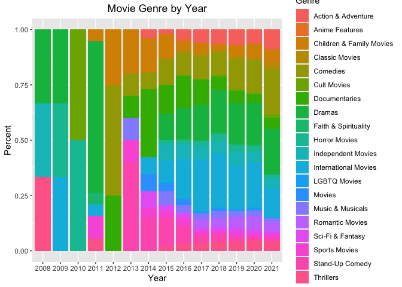

### Loading Packages


```r
knitr::opts_chunk$set(echo = TRUE, message = FALSE)
#load required packages
library(tidyverse)
library(dplyr)
library(ggplot2)
library(rworldmap)
```

### Basic Data Information


```r
df <- read.csv("netflix_titles.csv", stringsAsFactors = F) # read data

summary(df) # summary statistics
```

```
##    show_id              type              title             director        
##  Length:7787        Length:7787        Length:7787        Length:7787       
##  Class :character   Class :character   Class :character   Class :character  
##  Mode  :character   Mode  :character   Mode  :character   Mode  :character  
##                                                                             
##                                                                             
##                                                                             
##      cast             country           date_added         release_year 
##  Length:7787        Length:7787        Length:7787        Min.   :1925  
##  Class :character   Class :character   Class :character   1st Qu.:2013  
##  Mode  :character   Mode  :character   Mode  :character   Median :2017  
##                                                           Mean   :2014  
##                                                           3rd Qu.:2018  
##                                                           Max.   :2021  
##     rating            duration          listed_in         description       
##  Length:7787        Length:7787        Length:7787        Length:7787       
##  Class :character   Class :character   Class :character   Class :character  
##  Mode  :character   Mode  :character   Mode  :character   Mode  :character  
##                                                                             
##                                                                             
## 
```

```r
length(df$release_year) # number of observations
```

```
## [1] 7787
```

```r
length(unique(df[,"director"])) # number of unique values - it has duplicates
```

```
## [1] 4050
```

```r
sapply(df, function(x) sum(is.na(x) | x == 0 | x == "")) # number of NA, 0, and blank values
```

```
##      show_id         type        title     director         cast      country 
##            0            0            0         2389          718          507 
##   date_added release_year       rating     duration    listed_in  description 
##           10            0            7            0            0            0
```

```r
sapply(df, function(x) sum(is.na(x))) # no NA
```

```
##      show_id         type        title     director         cast      country 
##            0            0            0            0            0            0 
##   date_added release_year       rating     duration    listed_in  description 
##            0            0            0            0            0            0
```

```r
sapply(df, function(x) sum(x == 0)) # no 0 values
```

```
##      show_id         type        title     director         cast      country 
##            0            0            0            0            0            0 
##   date_added release_year       rating     duration    listed_in  description 
##            0            0            0            0            0            0
```

```r
sapply(df, function(x) sum(x == "")) # every null values are blank values
```

```
##      show_id         type        title     director         cast      country 
##            0            0            0         2389          718          507 
##   date_added release_year       rating     duration    listed_in  description 
##           10            0            7            0            0            0
```

### Visualization

#### Netflix trends by year


```r
# To investigate yearly trends, I need to eliminate Month and Day data from 'date_added' column
head(df$date_added,5) # this column is originally in 'Month Day, Year' format
```

```
## [1] "August 14, 2020"   "December 23, 2016" "December 20, 2018"
## [4] "November 16, 2017" "January 1, 2020"
```

```r
class(df$date_added) # column class: character
```

```
## [1] "character"
```

```r
df$date_added <- sub(".*(\\d+{4}).*$", "\\1", df$date_added) # convert date to year
head(df$date_added,5) # this column now only has year data
```

```
## [1] "2020" "2016" "2018" "2017" "2020"
```

```r
# total number of movies and TV shows added to Netflix by year
year <- df %>%
  filter(!(date_added == "")) %>% # remove missing values
  group_by(date_added) %>%
  summarise(count = n()) # number of movies and TV shows by year added to Netflix
year
```

```
## # A tibble: 14 x 2
##    date_added count
##    <chr>      <int>
##  1 2008           2
##  2 2009           2
##  3 2010           1
##  4 2011          13
##  5 2012           3
##  6 2013          11
##  7 2014          25
##  8 2015          88
##  9 2016         443
## 10 2017        1225
## 11 2018        1685
## 12 2019        2153
## 13 2020        2009
## 14 2021         117
```

```r
# draw a bar plot for number of contents added to Netflix by year
bar <- ggplot(year, aes(x = date_added, y = count, fill = date_added)) +
  geom_bar(stat = "identity") +
  geom_text(aes(label = count), vjust = -0.3)
bar
```

<!-- -->

```r
# Netflix trends - movie vs TV shows
group <- df %>%
  filter(!(date_added == "")) %>%
  group_by(type, date_added) %>% # group by content type and year added
  summarise(count = n())
group
```

```
## # A tibble: 24 x 3
## # Groups:   type [2]
##    type  date_added count
##    <chr> <chr>      <int>
##  1 Movie 2008           1
##  2 Movie 2009           2
##  3 Movie 2010           1
##  4 Movie 2011          13
##  5 Movie 2012           3
##  6 Movie 2013           6
##  7 Movie 2014          19
##  8 Movie 2015          58
##  9 Movie 2016         258
## 10 Movie 2017         864
## # … with 14 more rows
```

```r
# create bar plot for number of contents added by year by content type
bar <- ggplot(group, aes(x = date_added, y = count, fill = type)) +
  geom_bar(stat = "identity", position = "dodge")
bar
```

<!-- -->

After years of adding more contents each year, Netflix finally added less number of contents to its platform in 2020. Number of movies added to Netflix has dropped in 2020, whereas number of TV shows added has continued to increase.

#### Movie vs TV show


```r
# create data frame for number of contents by type
type <- df %>%
  group_by(type) %>%
  summarise(count = n())
type
```

```
## # A tibble: 2 x 2
##   type    count
##   <chr>   <int>
## 1 Movie    5377
## 2 TV Show  2410
```

```r
#all plots created afterwards will have title at center
#theme_update(plot.title = element_text(hjust = 0.5)) 

# create bar plot for Netflix contents by type
bar <- ggplot(type, aes(x = type, y = count, fill = type)) +
  geom_bar(stat = "identity") +
  geom_text(aes(label = count), vjust = -0.3) +
  labs(title = "Netflix contents by type") + # add title
  theme(plot.title = element_text(hjust = 0.5)) # center title
bar
```

<!-- -->

```r
# create data frames each for movies and TV shows for further analysis
movie <- df[(df$type == "Movie"),]
tv <- df[(df$type == "TV Show"),]
```
Number of movies on Netflix is more than double the number of TV shows.


#### Netflix Movie Analysis

#### Top 10 Countries by number of movies on Netflix

1) Bar plot

```r
# basic information about movies on Netflix
length(unique(movie$country)) # country column has many duplicates
```

```
## [1] 591
```

```r
head(movie$country, 50) # some movies has listed multiple countries separated by comma
```

```
##  [1] "Mexico"                         "Singapore"                     
##  [3] "United States"                  "United States"                 
##  [5] "Egypt"                          "United States"                 
##  [7] "India"                          "India"                         
##  [9] "United States"                  "Thailand"                      
## [11] "United States"                  "Nigeria"                       
## [13] "Norway, Iceland, United States" "India"                         
## [15] "United Kingdom"                 "India"                         
## [17] "India"                          "India"                         
## [19] "India"                          "United States"                 
## [21] "South Korea"                    "Italy"                         
## [23] "Canada"                         "Indonesia"                     
## [25] "Indonesia"                      "United States"                 
## [27] "Canada"                         "United States"                 
## [29] "Romania"                        "Romania"                       
## [31] "Spain"                          "Turkey"                        
## [33] "Iceland"                        "Turkey"                        
## [35] "Nigeria"                        "United States"                 
## [37] "United States"                  "United States"                 
## [39] "South Africa, Nigeria"          "France"                        
## [41] "United States, South Africa"    "Spain"                         
## [43] "Portugal, Spain"                "United States"                 
## [45] "United States"                  "Indonesia"                     
## [47] "India"                          "United States"                 
## [49] "United States"                  "United States"
```

```r
# split comma separated country names
country <- unlist(strsplit(movie$country, ", ")) # spliy country names at comma
unique(country) # some country names has comma at the end
```

```
##   [1] "Mexico"               "Singapore"            "United States"       
##   [4] "Egypt"                "India"                "Thailand"            
##   [7] "Nigeria"              "Norway"               "Iceland"             
##  [10] "United Kingdom"       "South Korea"          "Italy"               
##  [13] "Canada"               "Indonesia"            "Romania"             
##  [16] "Spain"                "Turkey"               "South Africa"        
##  [19] "France"               "Portugal"             "Hong Kong"           
##  [22] "China"                "Germany"              "Argentina"           
##  [25] "Serbia"               "Denmark"              "Poland"              
##  [28] "Japan"                "Kenya"                "New Zealand"         
##  [31] "Pakistan"             "Australia"            "Taiwan"              
##  [34] "Netherlands"          "Philippines"          "United Arab Emirates"
##  [37] "Brazil"               "Iran"                 "Belgium"             
##  [40] "Israel"               "Uruguay"              "Bulgaria"            
##  [43] "Chile"                "Colombia"             "Algeria"             
##  [46] "Soviet Union"         "Sweden"               "Malaysia"            
##  [49] "Ireland"              "Luxembourg"           "Austria"             
##  [52] "Peru"                 "Senegal"              "Switzerland"         
##  [55] "Ghana"                "Saudi Arabia"         "Armenia"             
##  [58] "Jordan"               "Mongolia"             "Namibia"             
##  [61] "Finland"              "Lebanon"              "Qatar"               
##  [64] "Vietnam"              "Russia"               "Malta"               
##  [67] "Kuwait"               "Czech Republic"       "Bahamas"             
##  [70] "Sri Lanka"            "Cayman Islands"       "Bangladesh"          
##  [73] "United States,"       "Zimbabwe"             "Hungary"             
##  [76] "Latvia"               "Liechtenstein"        "Venezuela"           
##  [79] "Morocco"              "Cambodia"             "Albania"             
##  [82] "Nicaragua"            "Greece"               "Cambodia,"           
##  [85] "Croatia"              "Guatemala"            "West Germany"        
##  [88] "Poland,"              "Slovenia"             "Dominican Republic"  
##  [91] "Nepal"                "Samoa"                "Bermuda"             
##  [94] "Ecuador"              "Georgia"              "Botswana"            
##  [97] "Iraq"                 "Vatican City"         "Angola"              
## [100] "Jamaica"              "Kazakhstan"           "Malawi"              
## [103] "Slovakia"             "Lithuania"            "Afghanistan"         
## [106] "Paraguay"             "Somalia"              "Sudan"               
## [109] "Panama"               "United Kingdom,"      "Uganda"              
## [112] "East Germany"         "Ukraine"              "Montenegro"
```

```r
# remove leftover commas from country names
country <- gsub(",","", country)
unique(country)
```

```
##   [1] "Mexico"               "Singapore"            "United States"       
##   [4] "Egypt"                "India"                "Thailand"            
##   [7] "Nigeria"              "Norway"               "Iceland"             
##  [10] "United Kingdom"       "South Korea"          "Italy"               
##  [13] "Canada"               "Indonesia"            "Romania"             
##  [16] "Spain"                "Turkey"               "South Africa"        
##  [19] "France"               "Portugal"             "Hong Kong"           
##  [22] "China"                "Germany"              "Argentina"           
##  [25] "Serbia"               "Denmark"              "Poland"              
##  [28] "Japan"                "Kenya"                "New Zealand"         
##  [31] "Pakistan"             "Australia"            "Taiwan"              
##  [34] "Netherlands"          "Philippines"          "United Arab Emirates"
##  [37] "Brazil"               "Iran"                 "Belgium"             
##  [40] "Israel"               "Uruguay"              "Bulgaria"            
##  [43] "Chile"                "Colombia"             "Algeria"             
##  [46] "Soviet Union"         "Sweden"               "Malaysia"            
##  [49] "Ireland"              "Luxembourg"           "Austria"             
##  [52] "Peru"                 "Senegal"              "Switzerland"         
##  [55] "Ghana"                "Saudi Arabia"         "Armenia"             
##  [58] "Jordan"               "Mongolia"             "Namibia"             
##  [61] "Finland"              "Lebanon"              "Qatar"               
##  [64] "Vietnam"              "Russia"               "Malta"               
##  [67] "Kuwait"               "Czech Republic"       "Bahamas"             
##  [70] "Sri Lanka"            "Cayman Islands"       "Bangladesh"          
##  [73] "Zimbabwe"             "Hungary"              "Latvia"              
##  [76] "Liechtenstein"        "Venezuela"            "Morocco"             
##  [79] "Cambodia"             "Albania"              "Nicaragua"           
##  [82] "Greece"               "Croatia"              "Guatemala"           
##  [85] "West Germany"         "Slovenia"             "Dominican Republic"  
##  [88] "Nepal"                "Samoa"                "Bermuda"             
##  [91] "Ecuador"              "Georgia"              "Botswana"            
##  [94] "Iraq"                 "Vatican City"         "Angola"              
##  [97] "Jamaica"              "Kazakhstan"           "Malawi"              
## [100] "Slovakia"             "Lithuania"            "Afghanistan"         
## [103] "Paraguay"             "Somalia"              "Sudan"               
## [106] "Panama"               "Uganda"               "East Germany"        
## [109] "Ukraine"              "Montenegro"
```

```r
# store the list as data frame
movie_country <- data.frame(country = country)
unique(movie_country$country) # it now has clean country names
```

```
##   [1] "Mexico"               "Singapore"            "United States"       
##   [4] "Egypt"                "India"                "Thailand"            
##   [7] "Nigeria"              "Norway"               "Iceland"             
##  [10] "United Kingdom"       "South Korea"          "Italy"               
##  [13] "Canada"               "Indonesia"            "Romania"             
##  [16] "Spain"                "Turkey"               "South Africa"        
##  [19] "France"               "Portugal"             "Hong Kong"           
##  [22] "China"                "Germany"              "Argentina"           
##  [25] "Serbia"               "Denmark"              "Poland"              
##  [28] "Japan"                "Kenya"                "New Zealand"         
##  [31] "Pakistan"             "Australia"            "Taiwan"              
##  [34] "Netherlands"          "Philippines"          "United Arab Emirates"
##  [37] "Brazil"               "Iran"                 "Belgium"             
##  [40] "Israel"               "Uruguay"              "Bulgaria"            
##  [43] "Chile"                "Colombia"             "Algeria"             
##  [46] "Soviet Union"         "Sweden"               "Malaysia"            
##  [49] "Ireland"              "Luxembourg"           "Austria"             
##  [52] "Peru"                 "Senegal"              "Switzerland"         
##  [55] "Ghana"                "Saudi Arabia"         "Armenia"             
##  [58] "Jordan"               "Mongolia"             "Namibia"             
##  [61] "Finland"              "Lebanon"              "Qatar"               
##  [64] "Vietnam"              "Russia"               "Malta"               
##  [67] "Kuwait"               "Czech Republic"       "Bahamas"             
##  [70] "Sri Lanka"            "Cayman Islands"       "Bangladesh"          
##  [73] "Zimbabwe"             "Hungary"              "Latvia"              
##  [76] "Liechtenstein"        "Venezuela"            "Morocco"             
##  [79] "Cambodia"             "Albania"              "Nicaragua"           
##  [82] "Greece"               "Croatia"              "Guatemala"           
##  [85] "West Germany"         "Slovenia"             "Dominican Republic"  
##  [88] "Nepal"                "Samoa"                "Bermuda"             
##  [91] "Ecuador"              "Georgia"              "Botswana"            
##  [94] "Iraq"                 "Vatican City"         "Angola"              
##  [97] "Jamaica"              "Kazakhstan"           "Malawi"              
## [100] "Slovakia"             "Lithuania"            "Afghanistan"         
## [103] "Paraguay"             "Somalia"              "Sudan"               
## [106] "Panama"               "Uganda"               "East Germany"        
## [109] "Ukraine"              "Montenegro"
```

```r
# count country names appearing in the original dataset
movie_country <- movie_country %>%
  group_by(country) %>%
  summarise(count = n())
head(movie_country,10)
```

```
## # A tibble: 10 x 2
##    country     count
##    <chr>       <int>
##  1 Afghanistan     1
##  2 Albania         1
##  3 Algeria         2
##  4 Angola          1
##  5 Argentina      64
##  6 Armenia         1
##  7 Australia      84
##  8 Austria        10
##  9 Bahamas         1
## 10 Bangladesh      3
```

```r
# top 10 countries by number of movies added to Netflix
bar <- movie_country %>%
  arrange(desc(count)) %>% # most to least
  slice(1:10) %>% # top 10 countries
  ggplot(., aes(x=reorder(country,-count), y = count)) + # bar plot most to least
  geom_bar(stat='identity') + 
  theme_classic() +
  labs(x = "Country") +
  geom_text(aes(label = count), vjust = -0.3) # add count labels
bar
```

<!-- -->

United States has the most number of movies on Netflix.

2) World Map

```r
spdf <- joinCountryData2Map(movie_country, joinCode="NAME", nameJoinColumn="country")
mapParams <- mapCountryData(spdf,
               nameColumnToPlot="count",
               catMethod=c(0,1,3,5,10,50,100,300,500,1000,2500),
               mapTitle = "Number of Movies added to Netflix",
               addLegend = FALSE)
do.call(addMapLegend, c(mapParams, legendLabels="all", legendWidth=0.5))
```

<!-- -->

```r
#labelCountries()
```

Continent-wise, Americas - North and South America - exhibits high number of Netflix movies overall.

#### Netflix movie genre trends by year
 장르 ('listed in' column) 별로 몇년도에 넷플에 애드 됐는지? (release year아니고 넷플 애드된 해)
 몇년도에 어떤 장르가 제일 많이 애드됐는지


```r
head(movie$listed_in,10) # each movie has multiple genres separated by commas
```

```
##  [1] "Dramas, International Movies"                            
##  [2] "Horror Movies, International Movies"                     
##  [3] "Action & Adventure, Independent Movies, Sci-Fi & Fantasy"
##  [4] "Dramas"                                                  
##  [5] "Horror Movies, International Movies"                     
##  [6] "Dramas"                                                  
##  [7] "Horror Movies, International Movies"                     
##  [8] "Horror Movies, International Movies, Thrillers"          
##  [9] "Dramas, Thrillers"                                       
## [10] "Documentaries, International Movies, Sports Movies"
```

```r
movie_genre <- movie %>% 
  mutate(listed_in = strsplit(as.character(listed_in), ", ")) %>% 
  unnest(listed_in) %>%
  select("title","date_added","listed_in")
movie_genre
```

```
## # A tibble: 11,546 x 3
##    title date_added listed_in           
##    <chr> <chr>      <chr>               
##  1 7:19  2016       Dramas              
##  2 7:19  2016       International Movies
##  3 23:59 2018       Horror Movies       
##  4 23:59 2018       International Movies
##  5 9     2017       Action & Adventure  
##  6 9     2017       Independent Movies  
##  7 9     2017       Sci-Fi & Fantasy    
##  8 21    2020       Dramas              
##  9 122   2020       Horror Movies       
## 10 122   2020       International Movies
## # … with 11,536 more rows
```

```r
unique(movie_genre$listed_in) # all Netflix genre
```

```
##  [1] "Dramas"                   "International Movies"    
##  [3] "Horror Movies"            "Action & Adventure"      
##  [5] "Independent Movies"       "Sci-Fi & Fantasy"        
##  [7] "Thrillers"                "Documentaries"           
##  [9] "Sports Movies"            "Comedies"                
## [11] "Romantic Movies"          "Movies"                  
## [13] "Music & Musicals"         "LGBTQ Movies"            
## [15] "Faith & Spirituality"     "Children & Family Movies"
## [17] "Classic Movies"           "Cult Movies"             
## [19] "Stand-Up Comedy"          "Anime Features"
```

```r
movie_genre <- movie_genre %>%
  group_by(date_added, listed_in) %>%
  summarise(count = n())
movie_genre
```

```
## # A tibble: 165 x 3
## # Groups:   date_added [14]
##    date_added listed_in                count
##    <chr>      <chr>                    <int>
##  1 2008       Dramas                       1
##  2 2008       Independent Movies           1
##  3 2008       Thrillers                    1
##  4 2009       Dramas                       1
##  5 2009       Horror Movies                1
##  6 2009       International Movies         1
##  7 2010       Cult Movies                  1
##  8 2010       Horror Movies                1
##  9 2011       Children & Family Movies     1
## 10 2011       Dramas                      13
## # … with 155 more rows
```

```r
# stacked bar chart
bar <- ggplot(movie_genre, aes(fill=listed_in, y=count, x=date_added)) + 
    geom_bar(position="stack", stat="identity")
bar
```

<!-- -->

```r
# percent stacked bar chart
bar <- ggplot(movie_genre, aes(fill=listed_in, y=count, x=date_added)) + 
    geom_bar(position="fill", stat="identity")
bar
```

<!-- -->

마지막 percent stacked barchart를 보면 해가 지날수록 장르가 더 다양해 지는 걸 볼 수 있었음
2014년을 기점으로 international과 LGBTQ movie의 비중이 대폭 늘어남
전체적으로 시간이 지날 수록 영화의 다양성에 집중하고자 하는 양상이 드러남

#### Netflix genre trends by country

```r
genre_country <- movie %>% 
  mutate(listed_in = strsplit(as.character(listed_in), ", ")) %>% 
  unnest(listed_in) %>%
  mutate(country = strsplit(as.character(country), ", ")) %>% 
  unnest(country) %>%
  select("title","country","date_added","listed_in")
genre_country
```

```
## # A tibble: 14,342 x 4
##    title country       date_added listed_in           
##    <chr> <chr>         <chr>      <chr>               
##  1 7:19  Mexico        2016       Dramas              
##  2 7:19  Mexico        2016       International Movies
##  3 23:59 Singapore     2018       Horror Movies       
##  4 23:59 Singapore     2018       International Movies
##  5 9     United States 2017       Action & Adventure  
##  6 9     United States 2017       Independent Movies  
##  7 9     United States 2017       Sci-Fi & Fantasy    
##  8 21    United States 2020       Dramas              
##  9 122   Egypt         2020       Horror Movies       
## 10 122   Egypt         2020       International Movies
## # … with 14,332 more rows
```

```r
unique(genre_country$country) # some country names have commas
```

```
##   [1] "Mexico"               "Singapore"            "United States"       
##   [4] "Egypt"                "India"                "Thailand"            
##   [7] "Nigeria"              "Norway"               "Iceland"             
##  [10] "United Kingdom"       "South Korea"          "Italy"               
##  [13] "Canada"               "Indonesia"            "Romania"             
##  [16] "Spain"                "Turkey"               "South Africa"        
##  [19] "France"               "Portugal"             "Hong Kong"           
##  [22] "China"                "Germany"              "Argentina"           
##  [25] "Serbia"               "Denmark"              "Poland"              
##  [28] "Japan"                "Kenya"                "New Zealand"         
##  [31] "Pakistan"             "Australia"            "Taiwan"              
##  [34] "Netherlands"          "Philippines"          "United Arab Emirates"
##  [37] "Brazil"               "Iran"                 "Belgium"             
##  [40] "Israel"               "Uruguay"              "Bulgaria"            
##  [43] "Chile"                "Colombia"             "Algeria"             
##  [46] "Soviet Union"         "Sweden"               "Malaysia"            
##  [49] "Ireland"              "Luxembourg"           "Austria"             
##  [52] "Peru"                 "Senegal"              "Switzerland"         
##  [55] "Ghana"                "Saudi Arabia"         "Armenia"             
##  [58] "Jordan"               "Mongolia"             "Namibia"             
##  [61] "Finland"              "Lebanon"              "Qatar"               
##  [64] "Vietnam"              "Russia"               "Malta"               
##  [67] "Kuwait"               "Czech Republic"       "Bahamas"             
##  [70] "Sri Lanka"            "Cayman Islands"       "Bangladesh"          
##  [73] "United States,"       "Zimbabwe"             "Hungary"             
##  [76] "Latvia"               "Liechtenstein"        "Venezuela"           
##  [79] "Morocco"              "Cambodia"             "Albania"             
##  [82] "Nicaragua"            "Greece"               "Cambodia,"           
##  [85] "Croatia"              "Guatemala"            "West Germany"        
##  [88] "Poland,"              "Slovenia"             "Dominican Republic"  
##  [91] "Nepal"                "Samoa"                "Bermuda"             
##  [94] "Ecuador"              "Georgia"              "Botswana"            
##  [97] "Iraq"                 "Vatican City"         "Angola"              
## [100] "Jamaica"              "Kazakhstan"           "Malawi"              
## [103] "Slovakia"             "Lithuania"            "Afghanistan"         
## [106] "Paraguay"             "Somalia"              "Sudan"               
## [109] "Panama"               "United Kingdom,"      "Uganda"              
## [112] "East Germany"         "Ukraine"              "Montenegro"
```

```r
length(unique(genre_country$country))
```

```
## [1] 114
```

```r
unique(genre_country$listed_in) # clean
```

```
##  [1] "Dramas"                   "International Movies"    
##  [3] "Horror Movies"            "Action & Adventure"      
##  [5] "Independent Movies"       "Sci-Fi & Fantasy"        
##  [7] "Thrillers"                "Documentaries"           
##  [9] "Sports Movies"            "Comedies"                
## [11] "Romantic Movies"          "Movies"                  
## [13] "Music & Musicals"         "LGBTQ Movies"            
## [15] "Faith & Spirituality"     "Children & Family Movies"
## [17] "Classic Movies"           "Cult Movies"             
## [19] "Stand-Up Comedy"          "Anime Features"
```

```r
genre_country <- genre_country %>%
  mutate(country = gsub(",","",country))
genre_country
```

```
## # A tibble: 14,342 x 4
##    title country       date_added listed_in           
##    <chr> <chr>         <chr>      <chr>               
##  1 7:19  Mexico        2016       Dramas              
##  2 7:19  Mexico        2016       International Movies
##  3 23:59 Singapore     2018       Horror Movies       
##  4 23:59 Singapore     2018       International Movies
##  5 9     United States 2017       Action & Adventure  
##  6 9     United States 2017       Independent Movies  
##  7 9     United States 2017       Sci-Fi & Fantasy    
##  8 21    United States 2020       Dramas              
##  9 122   Egypt         2020       Horror Movies       
## 10 122   Egypt         2020       International Movies
## # … with 14,332 more rows
```

```r
unique(genre_country$country) # commas removed from country names
```

```
##   [1] "Mexico"               "Singapore"            "United States"       
##   [4] "Egypt"                "India"                "Thailand"            
##   [7] "Nigeria"              "Norway"               "Iceland"             
##  [10] "United Kingdom"       "South Korea"          "Italy"               
##  [13] "Canada"               "Indonesia"            "Romania"             
##  [16] "Spain"                "Turkey"               "South Africa"        
##  [19] "France"               "Portugal"             "Hong Kong"           
##  [22] "China"                "Germany"              "Argentina"           
##  [25] "Serbia"               "Denmark"              "Poland"              
##  [28] "Japan"                "Kenya"                "New Zealand"         
##  [31] "Pakistan"             "Australia"            "Taiwan"              
##  [34] "Netherlands"          "Philippines"          "United Arab Emirates"
##  [37] "Brazil"               "Iran"                 "Belgium"             
##  [40] "Israel"               "Uruguay"              "Bulgaria"            
##  [43] "Chile"                "Colombia"             "Algeria"             
##  [46] "Soviet Union"         "Sweden"               "Malaysia"            
##  [49] "Ireland"              "Luxembourg"           "Austria"             
##  [52] "Peru"                 "Senegal"              "Switzerland"         
##  [55] "Ghana"                "Saudi Arabia"         "Armenia"             
##  [58] "Jordan"               "Mongolia"             "Namibia"             
##  [61] "Finland"              "Lebanon"              "Qatar"               
##  [64] "Vietnam"              "Russia"               "Malta"               
##  [67] "Kuwait"               "Czech Republic"       "Bahamas"             
##  [70] "Sri Lanka"            "Cayman Islands"       "Bangladesh"          
##  [73] "Zimbabwe"             "Hungary"              "Latvia"              
##  [76] "Liechtenstein"        "Venezuela"            "Morocco"             
##  [79] "Cambodia"             "Albania"              "Nicaragua"           
##  [82] "Greece"               "Croatia"              "Guatemala"           
##  [85] "West Germany"         "Slovenia"             "Dominican Republic"  
##  [88] "Nepal"                "Samoa"                "Bermuda"             
##  [91] "Ecuador"              "Georgia"              "Botswana"            
##  [94] "Iraq"                 "Vatican City"         "Angola"              
##  [97] "Jamaica"              "Kazakhstan"           "Malawi"              
## [100] "Slovakia"             "Lithuania"            "Afghanistan"         
## [103] "Paraguay"             "Somalia"              "Sudan"               
## [106] "Panama"               "Uganda"               "East Germany"        
## [109] "Ukraine"              "Montenegro"
```

```r
length(unique(genre_country$country))
```

```
## [1] 110
```

```r
#모든 나라의 장르 비율
#탑 몇나라만 뽑을수없나??? number of movies의 탑5 나라이름 골라넣었음
genre_country <- genre_country %>%
  filter(country == "United States" |
           country == "India"| 
           country == "United Kingdom"| 
           country == "Canada"| 
           country == "France") %>%
  group_by(country, listed_in) %>%
  summarise(count = n())

# percent stacked bar chart
bar <- ggplot(genre_country, aes(fill=listed_in, y=count, x=country)) + 
    geom_bar(position="stack", stat="identity")
bar
```

<!-- -->

```r
# 각 나라 별 도넛 차트 for genre
# https://homepage.divms.uiowa.edu/~luke/classes/STAT4580/catone.html
pie <- ggplot(genre_country) +
  geom_col(aes(x = 1, y = count, fill = listed_in), position = "fill") +
  coord_polar(theta = "y") +
  labs(title = "Movie Genres", fill = "Genre") +
  facet_wrap(~ country) +
  theme_bw() +
  theme(axis.title = element_blank(), # remove axis and grid lines
        axis.text = element_blank(),
        axis.ticks = element_blank(),
        panel.grid.major = element_blank(),
        panel.grid.minor = element_blank(),
        panel.border = element_blank())

pie <- pie + xlim(0, 1.5)
pie
```

<!-- -->

```r
# 미국 한 나라의 장르 비율
#도넛차트로 하고싶은뎅
#genre_usa <- genre_country %>%
#  filter(country == "United States") %>%
#  arrange(desc(count))

# donut chart 만들기
#bar <- ggplot(genre_usa, aes(fill=listed_in, y=count, x=country)) +
#  geom_bar(position="dodge", stat="identity") +
#  lab
#bar
```

Very small portion of American movies are categorized as international movies.
