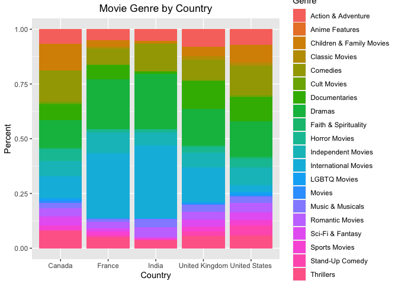

### Loading Packages


```r
knitr::opts_chunk$set(echo = TRUE, message = FALSE)
#load required packages
library(tidyverse)
library(dplyr)
library(ggplot2)
library(plotly)
library(rworldmap)
```

### Data Description

For the purpose of this project, a Netflix dataset sourced from Kaggle has been used.


```r
df <- read.csv("netflix_titles.csv", stringsAsFactors = F) # read data

summary(df) # summary statistics
```

```
##    show_id              type              title             director        
##  Length:7787        Length:7787        Length:7787        Length:7787       
##  Class :character   Class :character   Class :character   Class :character  
##  Mode  :character   Mode  :character   Mode  :character   Mode  :character  
##                                                                             
##                                                                             
##                                                                             
##      cast             country           date_added         release_year 
##  Length:7787        Length:7787        Length:7787        Min.   :1925  
##  Class :character   Class :character   Class :character   1st Qu.:2013  
##  Mode  :character   Mode  :character   Mode  :character   Median :2017  
##                                                           Mean   :2014  
##                                                           3rd Qu.:2018  
##                                                           Max.   :2021  
##     rating            duration          listed_in         description       
##  Length:7787        Length:7787        Length:7787        Length:7787       
##  Class :character   Class :character   Class :character   Class :character  
##  Mode  :character   Mode  :character   Mode  :character   Mode  :character  
##                                                                             
##                                                                             
## 
```

```r
length(df$release_year) # number of observations
```

```
## [1] 7787
```

```r
UniqueValue = function (x) {length(unique(x))} # shows number of unique values in each column
apply(df, 2, UniqueValue) # number of unique values in each column
```

```
##      show_id         type        title     director         cast      country 
##         7787            2         7787         4050         6832          682 
##   date_added release_year       rating     duration    listed_in  description 
##         1566           73           15          216          492         7769
```

```r
sapply(df, function(x) sum(x == "")) # number of missing values
```

```
##      show_id         type        title     director         cast      country 
##            0            0            0         2389          718          507 
##   date_added release_year       rating     duration    listed_in  description 
##           10            0            7            0            0            0
```

The original dataset consists of 7787 rows and 12 columns. All columns excluding 'show_id' and 'title' had unique values less than 7787, which is the total number of rows of this Netflix dataset. This indicates presence of duplicates in those columns. Also, many blank - "" - values has been found in 'director','cast','country','date_added', and 'rating' columns.

Cleaning all misleading values at once will lead to major data loss. In order to prevent data biases, pre-processing for this dataset will be done to a minimum. Cleaning will only be done on columns in use.

### Visualization

In this section, only relevant columns will be pre-processed, then be used for creating visualizations. Pre-processing methodologies will be discussed under each analysis topic. 


#### Netflix trends by year

This section will investigate the Netflix trend in their contents addition by year - regardless of contents release date. Note that a movie released in 2017 can be added on Netflix in 2020. How many movies and TV shows they add to their platform each year? Does Netflix treat movies and TV shows differently?

The 'date_added' column was originally in 'month day, year' format as character type. Therefore, it has been converted to numeric 'year' for yearly trend analysis. Missing values in 'date_added' also has been removed for the purpose of this analysis.


```r
# To investigate yearly trends, I need to eliminate Month and Day data from 'date_added' column
head(df$date_added,5) # this column is originally in 'Month Day, Year' format
```

```
## [1] "August 14, 2020"   "December 23, 2016" "December 20, 2018"
## [4] "November 16, 2017" "January 1, 2020"
```

```r
class(df$date_added) # column class: character
```

```
## [1] "character"
```

```r
df$date_added <- sub(".*(\\d+{4}).*$", "\\1", df$date_added) # convert date to year
head(df$date_added,5) # this column now only has year data
```

```
## [1] "2020" "2016" "2018" "2017" "2020"
```

```r
# total number of movies and TV shows added to Netflix by year
year <- df %>%
  filter(!(date_added == "")) %>% # remove missing values
  group_by(date_added) %>%
  summarise(count = n()) # number of movies and TV shows by year added to Netflix
year
```

```
## # A tibble: 14 x 2
##    date_added count
##    <chr>      <int>
##  1 2008           2
##  2 2009           2
##  3 2010           1
##  4 2011          13
##  5 2012           3
##  6 2013          11
##  7 2014          25
##  8 2015          88
##  9 2016         443
## 10 2017        1225
## 11 2018        1685
## 12 2019        2153
## 13 2020        2009
## 14 2021         117
```

```r
# draw a bar plot for number of contents added to Netflix by year
bar <- ggplot(year, aes(x = date_added, y = count, fill = date_added)) +
  geom_bar(stat = "identity") +
  geom_text(aes(label = count), vjust = -0.3) +
  labs(x = "Year", fill = "Year", title = "Number of Contents added to Netflix by Year") + 
  theme(plot.title = element_text(hjust = 0.5)) # center title
bar
```

<!-- -->

```r
# Netflix trends - movie vs TV shows
group <- df %>%
  filter(!(date_added == "")) %>%
  group_by(type, date_added) %>% # group by content type and year added
  summarise(count = n())
group
```

```
## # A tibble: 24 x 3
## # Groups:   type [2]
##    type  date_added count
##    <chr> <chr>      <int>
##  1 Movie 2008           1
##  2 Movie 2009           2
##  3 Movie 2010           1
##  4 Movie 2011          13
##  5 Movie 2012           3
##  6 Movie 2013           6
##  7 Movie 2014          19
##  8 Movie 2015          58
##  9 Movie 2016         258
## 10 Movie 2017         864
## # … with 14 more rows
```

```r
# create bar plot for number of contents added by year by content type
bar <- ggplot(group, aes(x = date_added, y = count, fill = type)) +
  geom_bar(stat = "identity", position = "dodge") +
  labs(title = "Netflix Trends by Year", x = "Year", "Type") + 
  theme(plot.title = element_text(hjust = 0.5)) # center title
bar
```

<!-- -->

First bar plot shows the total number of movies and TV shows added on Netflix by year. After years of adding more contents each year, Netflix finally added less number of contents to its platform in 2020.

Second chart compares its trend in movies to that of TV shows. Although the number of movies added to Netflix outnumbers that of TV shows on Netflix, it started to show a decrease in 2020, whereas number of TV shows added has continued to increase. This may be an indication of Netflix focusing more on TV shows.


#### Movie vs TV show

This section will show total number of movies and TV shows on Netflix.


```r
# create data frame for number of contents by type
type <- df %>%
  group_by(type) %>%
  summarise(count = n())
type
```

```
## # A tibble: 2 x 2
##   type    count
##   <chr>   <int>
## 1 Movie    5377
## 2 TV Show  2410
```

```r
#all plots created afterwards will have title at center
#theme_update(plot.title = element_text(hjust = 0.5)) 

# create bar plot for Netflix contents by type
bar <- ggplot(type, aes(x = type, y = count, fill = type)) +
  geom_bar(stat = "identity") +
  geom_text(aes(label = count), vjust = -0.3) +
  labs(title = "Netflix contents by type", x = "Type", fill = "Type") + # add title
  theme(plot.title = element_text(hjust = 0.5)) # center title
bar
```

<!-- -->

```r
# create data frames each for movies and TV shows for further analysis
movie <- df[(df$type == "Movie"),]
tv <- df[(df$type == "TV Show"),]
```

As shown in the chart above, the number of movies on Netflix is more than double the number of TV shows.

For further analysis on each content type, the dataset has been split down into two separate datasets based on the 'type' column.


#### Netflix Movie Analysis

The remaining of this project will examine movies on Netflix. The dataset 'movie' that has been created above will be used.


#### Top 10 Countries by number of movies on Netflix

In order to identify top 10 countries by number of movies, the 'country' column has been pre-processed. Originally, there were some movies that has listed multiple countries as their origin - for example, the movie '100 meters' had 'Portugal, Spain' in its 'country' column. This created too many unique values for 'country' column. Therefore, I split the country name value whenever there was a comma in between them, and removed the comma and unnecessary blank spaces. At the end, I was able to retrieve clean list of country names.

1) Bar plot

```r
# basic information about movies on Netflix
length(unique(movie$country)) # country column has many duplicates
```

```
## [1] 591
```

```r
head(movie$country, 50) # some movies has listed multiple countries separated by comma
```

```
##  [1] "Mexico"                         "Singapore"                     
##  [3] "United States"                  "United States"                 
##  [5] "Egypt"                          "United States"                 
##  [7] "India"                          "India"                         
##  [9] "United States"                  "Thailand"                      
## [11] "United States"                  "Nigeria"                       
## [13] "Norway, Iceland, United States" "India"                         
## [15] "United Kingdom"                 "India"                         
## [17] "India"                          "India"                         
## [19] "India"                          "United States"                 
## [21] "South Korea"                    "Italy"                         
## [23] "Canada"                         "Indonesia"                     
## [25] "Indonesia"                      "United States"                 
## [27] "Canada"                         "United States"                 
## [29] "Romania"                        "Romania"                       
## [31] "Spain"                          "Turkey"                        
## [33] "Iceland"                        "Turkey"                        
## [35] "Nigeria"                        "United States"                 
## [37] "United States"                  "United States"                 
## [39] "South Africa, Nigeria"          "France"                        
## [41] "United States, South Africa"    "Spain"                         
## [43] "Portugal, Spain"                "United States"                 
## [45] "United States"                  "Indonesia"                     
## [47] "India"                          "United States"                 
## [49] "United States"                  "United States"
```

```r
# split comma separated country names
country <- unlist(strsplit(movie$country, ", ")) # split country names at comma
unique(country) # some country names has comma at the end
```

```
##   [1] "Mexico"               "Singapore"            "United States"       
##   [4] "Egypt"                "India"                "Thailand"            
##   [7] "Nigeria"              "Norway"               "Iceland"             
##  [10] "United Kingdom"       "South Korea"          "Italy"               
##  [13] "Canada"               "Indonesia"            "Romania"             
##  [16] "Spain"                "Turkey"               "South Africa"        
##  [19] "France"               "Portugal"             "Hong Kong"           
##  [22] "China"                "Germany"              "Argentina"           
##  [25] "Serbia"               "Denmark"              "Poland"              
##  [28] "Japan"                "Kenya"                "New Zealand"         
##  [31] "Pakistan"             "Australia"            "Taiwan"              
##  [34] "Netherlands"          "Philippines"          "United Arab Emirates"
##  [37] "Brazil"               "Iran"                 "Belgium"             
##  [40] "Israel"               "Uruguay"              "Bulgaria"            
##  [43] "Chile"                "Colombia"             "Algeria"             
##  [46] "Soviet Union"         "Sweden"               "Malaysia"            
##  [49] "Ireland"              "Luxembourg"           "Austria"             
##  [52] "Peru"                 "Senegal"              "Switzerland"         
##  [55] "Ghana"                "Saudi Arabia"         "Armenia"             
##  [58] "Jordan"               "Mongolia"             "Namibia"             
##  [61] "Finland"              "Lebanon"              "Qatar"               
##  [64] "Vietnam"              "Russia"               "Malta"               
##  [67] "Kuwait"               "Czech Republic"       "Bahamas"             
##  [70] "Sri Lanka"            "Cayman Islands"       "Bangladesh"          
##  [73] "United States,"       "Zimbabwe"             "Hungary"             
##  [76] "Latvia"               "Liechtenstein"        "Venezuela"           
##  [79] "Morocco"              "Cambodia"             "Albania"             
##  [82] "Nicaragua"            "Greece"               "Cambodia,"           
##  [85] "Croatia"              "Guatemala"            "West Germany"        
##  [88] "Poland,"              "Slovenia"             "Dominican Republic"  
##  [91] "Nepal"                "Samoa"                "Bermuda"             
##  [94] "Ecuador"              "Georgia"              "Botswana"            
##  [97] "Iraq"                 "Vatican City"         "Angola"              
## [100] "Jamaica"              "Kazakhstan"           "Malawi"              
## [103] "Slovakia"             "Lithuania"            "Afghanistan"         
## [106] "Paraguay"             "Somalia"              "Sudan"               
## [109] "Panama"               "United Kingdom,"      "Uganda"              
## [112] "East Germany"         "Ukraine"              "Montenegro"
```

```r
# remove leftover commas from country names
country <- gsub(",","", country)
unique(country)
```

```
##   [1] "Mexico"               "Singapore"            "United States"       
##   [4] "Egypt"                "India"                "Thailand"            
##   [7] "Nigeria"              "Norway"               "Iceland"             
##  [10] "United Kingdom"       "South Korea"          "Italy"               
##  [13] "Canada"               "Indonesia"            "Romania"             
##  [16] "Spain"                "Turkey"               "South Africa"        
##  [19] "France"               "Portugal"             "Hong Kong"           
##  [22] "China"                "Germany"              "Argentina"           
##  [25] "Serbia"               "Denmark"              "Poland"              
##  [28] "Japan"                "Kenya"                "New Zealand"         
##  [31] "Pakistan"             "Australia"            "Taiwan"              
##  [34] "Netherlands"          "Philippines"          "United Arab Emirates"
##  [37] "Brazil"               "Iran"                 "Belgium"             
##  [40] "Israel"               "Uruguay"              "Bulgaria"            
##  [43] "Chile"                "Colombia"             "Algeria"             
##  [46] "Soviet Union"         "Sweden"               "Malaysia"            
##  [49] "Ireland"              "Luxembourg"           "Austria"             
##  [52] "Peru"                 "Senegal"              "Switzerland"         
##  [55] "Ghana"                "Saudi Arabia"         "Armenia"             
##  [58] "Jordan"               "Mongolia"             "Namibia"             
##  [61] "Finland"              "Lebanon"              "Qatar"               
##  [64] "Vietnam"              "Russia"               "Malta"               
##  [67] "Kuwait"               "Czech Republic"       "Bahamas"             
##  [70] "Sri Lanka"            "Cayman Islands"       "Bangladesh"          
##  [73] "Zimbabwe"             "Hungary"              "Latvia"              
##  [76] "Liechtenstein"        "Venezuela"            "Morocco"             
##  [79] "Cambodia"             "Albania"              "Nicaragua"           
##  [82] "Greece"               "Croatia"              "Guatemala"           
##  [85] "West Germany"         "Slovenia"             "Dominican Republic"  
##  [88] "Nepal"                "Samoa"                "Bermuda"             
##  [91] "Ecuador"              "Georgia"              "Botswana"            
##  [94] "Iraq"                 "Vatican City"         "Angola"              
##  [97] "Jamaica"              "Kazakhstan"           "Malawi"              
## [100] "Slovakia"             "Lithuania"            "Afghanistan"         
## [103] "Paraguay"             "Somalia"              "Sudan"               
## [106] "Panama"               "Uganda"               "East Germany"        
## [109] "Ukraine"              "Montenegro"
```

```r
# store the list as data frame
movie_country <- data.frame(country = country)
unique(movie_country$country) # it now has clean country names
```

```
##   [1] "Mexico"               "Singapore"            "United States"       
##   [4] "Egypt"                "India"                "Thailand"            
##   [7] "Nigeria"              "Norway"               "Iceland"             
##  [10] "United Kingdom"       "South Korea"          "Italy"               
##  [13] "Canada"               "Indonesia"            "Romania"             
##  [16] "Spain"                "Turkey"               "South Africa"        
##  [19] "France"               "Portugal"             "Hong Kong"           
##  [22] "China"                "Germany"              "Argentina"           
##  [25] "Serbia"               "Denmark"              "Poland"              
##  [28] "Japan"                "Kenya"                "New Zealand"         
##  [31] "Pakistan"             "Australia"            "Taiwan"              
##  [34] "Netherlands"          "Philippines"          "United Arab Emirates"
##  [37] "Brazil"               "Iran"                 "Belgium"             
##  [40] "Israel"               "Uruguay"              "Bulgaria"            
##  [43] "Chile"                "Colombia"             "Algeria"             
##  [46] "Soviet Union"         "Sweden"               "Malaysia"            
##  [49] "Ireland"              "Luxembourg"           "Austria"             
##  [52] "Peru"                 "Senegal"              "Switzerland"         
##  [55] "Ghana"                "Saudi Arabia"         "Armenia"             
##  [58] "Jordan"               "Mongolia"             "Namibia"             
##  [61] "Finland"              "Lebanon"              "Qatar"               
##  [64] "Vietnam"              "Russia"               "Malta"               
##  [67] "Kuwait"               "Czech Republic"       "Bahamas"             
##  [70] "Sri Lanka"            "Cayman Islands"       "Bangladesh"          
##  [73] "Zimbabwe"             "Hungary"              "Latvia"              
##  [76] "Liechtenstein"        "Venezuela"            "Morocco"             
##  [79] "Cambodia"             "Albania"              "Nicaragua"           
##  [82] "Greece"               "Croatia"              "Guatemala"           
##  [85] "West Germany"         "Slovenia"             "Dominican Republic"  
##  [88] "Nepal"                "Samoa"                "Bermuda"             
##  [91] "Ecuador"              "Georgia"              "Botswana"            
##  [94] "Iraq"                 "Vatican City"         "Angola"              
##  [97] "Jamaica"              "Kazakhstan"           "Malawi"              
## [100] "Slovakia"             "Lithuania"            "Afghanistan"         
## [103] "Paraguay"             "Somalia"              "Sudan"               
## [106] "Panama"               "Uganda"               "East Germany"        
## [109] "Ukraine"              "Montenegro"
```

```r
# count country names appearing in the original dataset
movie_country <- movie_country %>%
  group_by(country) %>%
  summarise(count = n())
head(movie_country,10)
```

```
## # A tibble: 10 x 2
##    country     count
##    <chr>       <int>
##  1 Afghanistan     1
##  2 Albania         1
##  3 Algeria         2
##  4 Angola          1
##  5 Argentina      64
##  6 Armenia         1
##  7 Australia      84
##  8 Austria        10
##  9 Bahamas         1
## 10 Bangladesh      3
```

```r
# top 10 countries by number of movies added to Netflix
bar <- movie_country %>%
  arrange(desc(count)) %>% # most to least
  slice(1:10) %>% # top 10 countries
  ggplot(., aes(x=reorder(country,-count), y = count)) + # bar plot most to least
  geom_bar(stat='identity') + 
  theme_classic() +
  labs(x = "Country", title = "Top 10 Countries by number of movies on Netflix") +
  geom_text(aes(label = count), vjust = -0.3) # add count labels

bar
```

<!-- -->

Above chart shows top 10 countries by number of movies on Netflix. According to this chart, the United States had the most number of movies on Netflix.

2) World Map

```r
spdf <- joinCountryData2Map(movie_country, joinCode="NAME", nameJoinColumn="country")
mapParams <- mapCountryData(spdf,
               nameColumnToPlot="count",
               catMethod=c(0,1,3,5,10,50,100,300,500,1000,2500),
               mapTitle = "Number of Movies added to Netflix",
               addLegend = FALSE)
do.call(addMapLegend, c(mapParams, legendLabels="all", legendWidth=0.5))
```

<!-- -->

A world map has been created to visualize Netflix's global trend. Continent-wise, Americas - North and South America - exhibits high number of Netflix movies overall. Africa showed the least number of movies on Netflix.


#### Number of movies by Year

This section will study Netflix's preference for country of origin for movies. This will be done by creating a line graph for number of movies from 5 countries by year. Note that it uses movies' date added on Netflix for the time variable. This study has no relation to the amount of movie production done in each country.


```r
genre_country <- movie %>% 
  mutate(listed_in = strsplit(as.character(listed_in), ", ")) %>% # separate genre by commas
  unnest(listed_in) %>%
  mutate(country = strsplit(as.character(country), ", ")) %>% # separate country name by commas
  unnest(country) %>%
  select("title","country","date_added","listed_in")
genre_country
```

```
## # A tibble: 14,342 x 4
##    title country       date_added listed_in           
##    <chr> <chr>         <chr>      <chr>               
##  1 7:19  Mexico        2016       Dramas              
##  2 7:19  Mexico        2016       International Movies
##  3 23:59 Singapore     2018       Horror Movies       
##  4 23:59 Singapore     2018       International Movies
##  5 9     United States 2017       Action & Adventure  
##  6 9     United States 2017       Independent Movies  
##  7 9     United States 2017       Sci-Fi & Fantasy    
##  8 21    United States 2020       Dramas              
##  9 122   Egypt         2020       Horror Movies       
## 10 122   Egypt         2020       International Movies
## # … with 14,332 more rows
```

```r
unique(genre_country$country) # some country names still have commas
```

```
##   [1] "Mexico"               "Singapore"            "United States"       
##   [4] "Egypt"                "India"                "Thailand"            
##   [7] "Nigeria"              "Norway"               "Iceland"             
##  [10] "United Kingdom"       "South Korea"          "Italy"               
##  [13] "Canada"               "Indonesia"            "Romania"             
##  [16] "Spain"                "Turkey"               "South Africa"        
##  [19] "France"               "Portugal"             "Hong Kong"           
##  [22] "China"                "Germany"              "Argentina"           
##  [25] "Serbia"               "Denmark"              "Poland"              
##  [28] "Japan"                "Kenya"                "New Zealand"         
##  [31] "Pakistan"             "Australia"            "Taiwan"              
##  [34] "Netherlands"          "Philippines"          "United Arab Emirates"
##  [37] "Brazil"               "Iran"                 "Belgium"             
##  [40] "Israel"               "Uruguay"              "Bulgaria"            
##  [43] "Chile"                "Colombia"             "Algeria"             
##  [46] "Soviet Union"         "Sweden"               "Malaysia"            
##  [49] "Ireland"              "Luxembourg"           "Austria"             
##  [52] "Peru"                 "Senegal"              "Switzerland"         
##  [55] "Ghana"                "Saudi Arabia"         "Armenia"             
##  [58] "Jordan"               "Mongolia"             "Namibia"             
##  [61] "Finland"              "Lebanon"              "Qatar"               
##  [64] "Vietnam"              "Russia"               "Malta"               
##  [67] "Kuwait"               "Czech Republic"       "Bahamas"             
##  [70] "Sri Lanka"            "Cayman Islands"       "Bangladesh"          
##  [73] "United States,"       "Zimbabwe"             "Hungary"             
##  [76] "Latvia"               "Liechtenstein"        "Venezuela"           
##  [79] "Morocco"              "Cambodia"             "Albania"             
##  [82] "Nicaragua"            "Greece"               "Cambodia,"           
##  [85] "Croatia"              "Guatemala"            "West Germany"        
##  [88] "Poland,"              "Slovenia"             "Dominican Republic"  
##  [91] "Nepal"                "Samoa"                "Bermuda"             
##  [94] "Ecuador"              "Georgia"              "Botswana"            
##  [97] "Iraq"                 "Vatican City"         "Angola"              
## [100] "Jamaica"              "Kazakhstan"           "Malawi"              
## [103] "Slovakia"             "Lithuania"            "Afghanistan"         
## [106] "Paraguay"             "Somalia"              "Sudan"               
## [109] "Panama"               "United Kingdom,"      "Uganda"              
## [112] "East Germany"         "Ukraine"              "Montenegro"
```

```r
length(unique(genre_country$country)) # number of unique country names
```

```
## [1] 114
```

```r
unique(genre_country$listed_in) # clean; no leftover commas to be deleted
```

```
##  [1] "Dramas"                   "International Movies"    
##  [3] "Horror Movies"            "Action & Adventure"      
##  [5] "Independent Movies"       "Sci-Fi & Fantasy"        
##  [7] "Thrillers"                "Documentaries"           
##  [9] "Sports Movies"            "Comedies"                
## [11] "Romantic Movies"          "Movies"                  
## [13] "Music & Musicals"         "LGBTQ Movies"            
## [15] "Faith & Spirituality"     "Children & Family Movies"
## [17] "Classic Movies"           "Cult Movies"             
## [19] "Stand-Up Comedy"          "Anime Features"
```

```r
genre_country <- genre_country %>%
  mutate(country = gsub(",","",country)) # remove commas by replacing them with space
genre_country
```

```
## # A tibble: 14,342 x 4
##    title country       date_added listed_in           
##    <chr> <chr>         <chr>      <chr>               
##  1 7:19  Mexico        2016       Dramas              
##  2 7:19  Mexico        2016       International Movies
##  3 23:59 Singapore     2018       Horror Movies       
##  4 23:59 Singapore     2018       International Movies
##  5 9     United States 2017       Action & Adventure  
##  6 9     United States 2017       Independent Movies  
##  7 9     United States 2017       Sci-Fi & Fantasy    
##  8 21    United States 2020       Dramas              
##  9 122   Egypt         2020       Horror Movies       
## 10 122   Egypt         2020       International Movies
## # … with 14,332 more rows
```

```r
unique(genre_country$country) # commas removed from country names
```

```
##   [1] "Mexico"               "Singapore"            "United States"       
##   [4] "Egypt"                "India"                "Thailand"            
##   [7] "Nigeria"              "Norway"               "Iceland"             
##  [10] "United Kingdom"       "South Korea"          "Italy"               
##  [13] "Canada"               "Indonesia"            "Romania"             
##  [16] "Spain"                "Turkey"               "South Africa"        
##  [19] "France"               "Portugal"             "Hong Kong"           
##  [22] "China"                "Germany"              "Argentina"           
##  [25] "Serbia"               "Denmark"              "Poland"              
##  [28] "Japan"                "Kenya"                "New Zealand"         
##  [31] "Pakistan"             "Australia"            "Taiwan"              
##  [34] "Netherlands"          "Philippines"          "United Arab Emirates"
##  [37] "Brazil"               "Iran"                 "Belgium"             
##  [40] "Israel"               "Uruguay"              "Bulgaria"            
##  [43] "Chile"                "Colombia"             "Algeria"             
##  [46] "Soviet Union"         "Sweden"               "Malaysia"            
##  [49] "Ireland"              "Luxembourg"           "Austria"             
##  [52] "Peru"                 "Senegal"              "Switzerland"         
##  [55] "Ghana"                "Saudi Arabia"         "Armenia"             
##  [58] "Jordan"               "Mongolia"             "Namibia"             
##  [61] "Finland"              "Lebanon"              "Qatar"               
##  [64] "Vietnam"              "Russia"               "Malta"               
##  [67] "Kuwait"               "Czech Republic"       "Bahamas"             
##  [70] "Sri Lanka"            "Cayman Islands"       "Bangladesh"          
##  [73] "Zimbabwe"             "Hungary"              "Latvia"              
##  [76] "Liechtenstein"        "Venezuela"            "Morocco"             
##  [79] "Cambodia"             "Albania"              "Nicaragua"           
##  [82] "Greece"               "Croatia"              "Guatemala"           
##  [85] "West Germany"         "Slovenia"             "Dominican Republic"  
##  [88] "Nepal"                "Samoa"                "Bermuda"             
##  [91] "Ecuador"              "Georgia"              "Botswana"            
##  [94] "Iraq"                 "Vatican City"         "Angola"              
##  [97] "Jamaica"              "Kazakhstan"           "Malawi"              
## [100] "Slovakia"             "Lithuania"            "Afghanistan"         
## [103] "Paraguay"             "Somalia"              "Sudan"               
## [106] "Panama"               "Uganda"               "East Germany"        
## [109] "Ukraine"              "Montenegro"
```

```r
length(unique(genre_country$country))
```

```
## [1] 110
```

```r
movie_year <- genre_country %>%
#  mutate(date_added = as.numeric(date_added)) %>%
  filter(country == "United States" |
           country == "India"| 
           country == "United Kingdom"| 
           country == "Canada"| 
           country == "France") %>%
  group_by(country, date_added) %>%
  summarise(count = n())
movie_year
```

```
## # A tibble: 45 x 3
## # Groups:   country [5]
##    country date_added count
##    <chr>   <chr>      <int>
##  1 Canada  2013           1
##  2 Canada  2014           2
##  3 Canada  2015           5
##  4 Canada  2016          28
##  5 Canada  2017         116
##  6 Canada  2018         125
##  7 Canada  2019         125
##  8 Canada  2020         149
##  9 Canada  2021          10
## 10 France  2011           2
## # … with 35 more rows
```

```r
#bar <- ggplot(genre_5_country, aes(fill=listed_in, y=count, x=country)) + 
#    geom_bar(position="fill", stat="identity")
#bar

chart <- ggplot(movie_year, aes(x = date_added, y = count, group = country, color = country)) +
  geom_line() +
  labs(x = "Year", y = "Count", fill = "Country", title = "Number of movies by Year in Top 5 Countries") +
  theme(plot.title = element_text(hjust = 0.5)) # center title
chart <- ggplotly(chart)
chart
```

<!--html_preserve--><div id="htmlwidget-9db0de751b1986c65270" style="width:672px;height:480px;" class="plotly html-widget"></div>
<script type="application/json" data-for="htmlwidget-9db0de751b1986c65270">{"x":{"data":[{"x":[6,7,8,9,10,11,12,13,14],"y":[1,2,5,28,116,125,125,149,10],"text":["date_added: 2013<br />count:    1<br />country: Canada<br />country: Canada","date_added: 2014<br />count:    2<br />country: Canada<br />country: Canada","date_added: 2015<br />count:    5<br />country: Canada<br />country: Canada","date_added: 2016<br />count:   28<br />country: Canada<br />country: Canada","date_added: 2017<br />count:  116<br />country: Canada<br />country: Canada","date_added: 2018<br />count:  125<br />country: Canada<br />country: Canada","date_added: 2019<br />count:  125<br />country: Canada<br />country: Canada","date_added: 2020<br />count:  149<br />country: Canada<br />country: Canada","date_added: 2021<br />count:   10<br />country: Canada<br />country: Canada"],"type":"scatter","mode":"lines","line":{"width":1.88976377952756,"color":"rgba(248,118,109,1)","dash":"solid"},"hoveron":"points","name":"Canada","legendgroup":"Canada","showlegend":true,"xaxis":"x","yaxis":"y","hoverinfo":"text","frame":null},{"x":[4,8,9,10,11,12,13,14],"y":[2,12,41,119,122,151,179,18],"text":["date_added: 2011<br />count:    2<br />country: France<br />country: France","date_added: 2015<br />count:   12<br />country: France<br />country: France","date_added: 2016<br />count:   41<br />country: France<br />country: France","date_added: 2017<br />count:  119<br />country: France<br />country: France","date_added: 2018<br />count:  122<br />country: France<br />country: France","date_added: 2019<br />count:  151<br />country: France<br />country: France","date_added: 2020<br />count:  179<br />country: France<br />country: France","date_added: 2021<br />count:   18<br />country: France<br />country: France"],"type":"scatter","mode":"lines","line":{"width":1.88976377952756,"color":"rgba(163,165,0,1)","dash":"solid"},"hoveron":"points","name":"France","legendgroup":"France","showlegend":true,"xaxis":"x","yaxis":"y","hoverinfo":"text","frame":null},{"x":[9,10,11,12,13,14],"y":[35,398,909,622,484,31],"text":["date_added: 2016<br />count:   35<br />country: India<br />country: India","date_added: 2017<br />count:  398<br />country: India<br />country: India","date_added: 2018<br />count:  909<br />country: India<br />country: India","date_added: 2019<br />count:  622<br />country: India<br />country: India","date_added: 2020<br />count:  484<br />country: India<br />country: India","date_added: 2021<br />count:   31<br />country: India<br />country: India"],"type":"scatter","mode":"lines","line":{"width":1.88976377952756,"color":"rgba(0,191,125,1)","dash":"solid"},"hoveron":"points","name":"India","legendgroup":"India","showlegend":true,"xaxis":"x","yaxis":"y","hoverinfo":"text","frame":null},{"x":[7,8,9,10,11,12,13,14],"y":[6,7,53,155,213,269,217,10],"text":["date_added: 2014<br />count:    6<br />country: United Kingdom<br />country: United Kingdom","date_added: 2015<br />count:    7<br />country: United Kingdom<br />country: United Kingdom","date_added: 2016<br />count:   53<br />country: United Kingdom<br />country: United Kingdom","date_added: 2017<br />count:  155<br />country: United Kingdom<br />country: United Kingdom","date_added: 2018<br />count:  213<br />country: United Kingdom<br />country: United Kingdom","date_added: 2019<br />count:  269<br />country: United Kingdom<br />country: United Kingdom","date_added: 2020<br />count:  217<br />country: United Kingdom<br />country: United Kingdom","date_added: 2021<br />count:   10<br />country: United Kingdom<br />country: United Kingdom"],"type":"scatter","mode":"lines","line":{"width":1.88976377952756,"color":"rgba(0,176,246,1)","dash":"solid"},"hoveron":"points","name":"United Kingdom","legendgroup":"United Kingdom","showlegend":true,"xaxis":"x","yaxis":"y","hoverinfo":"text","frame":null},{"x":[1,2,3,4,5,6,7,8,9,10,11,12,13,14],"y":[3,1,2,17,4,9,24,69,223,616,837,1340,1141,109],"text":["date_added: 2008<br />count:    3<br />country: United States<br />country: United States","date_added: 2009<br />count:    1<br />country: United States<br />country: United States","date_added: 2010<br />count:    2<br />country: United States<br />country: United States","date_added: 2011<br />count:   17<br />country: United States<br />country: United States","date_added: 2012<br />count:    4<br />country: United States<br />country: United States","date_added: 2013<br />count:    9<br />country: United States<br />country: United States","date_added: 2014<br />count:   24<br />country: United States<br />country: United States","date_added: 2015<br />count:   69<br />country: United States<br />country: United States","date_added: 2016<br />count:  223<br />country: United States<br />country: United States","date_added: 2017<br />count:  616<br />country: United States<br />country: United States","date_added: 2018<br />count:  837<br />country: United States<br />country: United States","date_added: 2019<br />count: 1340<br />country: United States<br />country: United States","date_added: 2020<br />count: 1141<br />country: United States<br />country: United States","date_added: 2021<br />count:  109<br />country: United States<br />country: United States"],"type":"scatter","mode":"lines","line":{"width":1.88976377952756,"color":"rgba(231,107,243,1)","dash":"solid"},"hoveron":"points","name":"United States","legendgroup":"United States","showlegend":true,"xaxis":"x","yaxis":"y","hoverinfo":"text","frame":null}],"layout":{"margin":{"t":43.7625570776256,"r":7.30593607305936,"b":40.1826484018265,"l":48.9497716894977},"plot_bgcolor":"rgba(235,235,235,1)","paper_bgcolor":"rgba(255,255,255,1)","font":{"color":"rgba(0,0,0,1)","family":"","size":14.6118721461187},"title":{"text":"Number of movies by Year in Top 5 Countries","font":{"color":"rgba(0,0,0,1)","family":"","size":17.5342465753425},"x":0.5,"xref":"paper"},"xaxis":{"domain":[0,1],"automargin":true,"type":"linear","autorange":false,"range":[0.4,14.6],"tickmode":"array","ticktext":["2008","2009","2010","2011","2012","2013","2014","2015","2016","2017","2018","2019","2020","2021"],"tickvals":[1,2,3,4,5,6,7,8,9,10,11,12,13,14],"categoryorder":"array","categoryarray":["2008","2009","2010","2011","2012","2013","2014","2015","2016","2017","2018","2019","2020","2021"],"nticks":null,"ticks":"outside","tickcolor":"rgba(51,51,51,1)","ticklen":3.65296803652968,"tickwidth":0.66417600664176,"showticklabels":true,"tickfont":{"color":"rgba(77,77,77,1)","family":"","size":11.689497716895},"tickangle":-0,"showline":false,"linecolor":null,"linewidth":0,"showgrid":true,"gridcolor":"rgba(255,255,255,1)","gridwidth":0.66417600664176,"zeroline":false,"anchor":"y","title":{"text":"Year","font":{"color":"rgba(0,0,0,1)","family":"","size":14.6118721461187}},"hoverformat":".2f"},"yaxis":{"domain":[0,1],"automargin":true,"type":"linear","autorange":false,"range":[-65.95,1406.95],"tickmode":"array","ticktext":["0","500","1000"],"tickvals":[0,500,1000],"categoryorder":"array","categoryarray":["0","500","1000"],"nticks":null,"ticks":"outside","tickcolor":"rgba(51,51,51,1)","ticklen":3.65296803652968,"tickwidth":0.66417600664176,"showticklabels":true,"tickfont":{"color":"rgba(77,77,77,1)","family":"","size":11.689497716895},"tickangle":-0,"showline":false,"linecolor":null,"linewidth":0,"showgrid":true,"gridcolor":"rgba(255,255,255,1)","gridwidth":0.66417600664176,"zeroline":false,"anchor":"x","title":{"text":"Count","font":{"color":"rgba(0,0,0,1)","family":"","size":14.6118721461187}},"hoverformat":".2f"},"shapes":[{"type":"rect","fillcolor":null,"line":{"color":null,"width":0,"linetype":[]},"yref":"paper","xref":"paper","x0":0,"x1":1,"y0":0,"y1":1}],"showlegend":true,"legend":{"bgcolor":"rgba(255,255,255,1)","bordercolor":"transparent","borderwidth":1.88976377952756,"font":{"color":"rgba(0,0,0,1)","family":"","size":11.689497716895},"y":0.913385826771654},"annotations":[{"text":"country","x":1.02,"y":1,"showarrow":false,"ax":0,"ay":0,"font":{"color":"rgba(0,0,0,1)","family":"","size":14.6118721461187},"xref":"paper","yref":"paper","textangle":-0,"xanchor":"left","yanchor":"bottom","legendTitle":true}],"hovermode":"closest","barmode":"relative"},"config":{"doubleClick":"reset","showSendToCloud":false},"source":"A","attrs":{"ed13a0f518c":{"x":{},"y":{},"colour":{},"type":"scatter"}},"cur_data":"ed13a0f518c","visdat":{"ed13a0f518c":["function (y) ","x"]},"highlight":{"on":"plotly_click","persistent":false,"dynamic":false,"selectize":false,"opacityDim":0.2,"selected":{"opacity":1},"debounce":0},"shinyEvents":["plotly_hover","plotly_click","plotly_selected","plotly_relayout","plotly_brushed","plotly_brushing","plotly_clickannotation","plotly_doubleclick","plotly_deselect","plotly_afterplot","plotly_sunburstclick"],"base_url":"https://plot.ly"},"evals":[],"jsHooks":[]}</script><!--/html_preserve-->


The line graph above shows the number of movies added on Netflix by year for 5 different countries. The country legends on the right enables select and deselect - you can only look at the countries you want. While the number of movies from all 5 countries are on a downturn recently, the graph suggests that Netflix has been adding less number of Indian movies on their platform since 2018, as opposed to 2019 for American and British film and 2020 for French and Canadian film.


#### Netflix movie genre trends by year

This section will research Netflix movie genre trends by examining which genre has been the most popular in which year. I will use 'listed in' column for genre and 'date_added' for date of movies added on Netflix.

Similar pre-processing methodology for 'country' column will be used for 'listed in' column. The genre values in 'listed in' column will be split down at commas. After cleaning, there was a total of 20 genre.

I will create 2 bar charts - an interactive stacked bar chart for comparison of changes of one genre over time and a static percentage stacked bar chart


```r
head(movie$listed_in,10) # each movie has multiple genres separated by commas
```

```
##  [1] "Dramas, International Movies"                            
##  [2] "Horror Movies, International Movies"                     
##  [3] "Action & Adventure, Independent Movies, Sci-Fi & Fantasy"
##  [4] "Dramas"                                                  
##  [5] "Horror Movies, International Movies"                     
##  [6] "Dramas"                                                  
##  [7] "Horror Movies, International Movies"                     
##  [8] "Horror Movies, International Movies, Thrillers"          
##  [9] "Dramas, Thrillers"                                       
## [10] "Documentaries, International Movies, Sports Movies"
```

```r
movie_genre <- movie %>% 
  mutate(listed_in = strsplit(as.character(listed_in), ", ")) %>% # split genre column by comma
  unnest(listed_in) %>%
  select("title","date_added","listed_in")
movie_genre
```

```
## # A tibble: 11,546 x 3
##    title date_added listed_in           
##    <chr> <chr>      <chr>               
##  1 7:19  2016       Dramas              
##  2 7:19  2016       International Movies
##  3 23:59 2018       Horror Movies       
##  4 23:59 2018       International Movies
##  5 9     2017       Action & Adventure  
##  6 9     2017       Independent Movies  
##  7 9     2017       Sci-Fi & Fantasy    
##  8 21    2020       Dramas              
##  9 122   2020       Horror Movies       
## 10 122   2020       International Movies
## # … with 11,536 more rows
```

```r
unique(movie_genre$listed_in) # all Netflix genre
```

```
##  [1] "Dramas"                   "International Movies"    
##  [3] "Horror Movies"            "Action & Adventure"      
##  [5] "Independent Movies"       "Sci-Fi & Fantasy"        
##  [7] "Thrillers"                "Documentaries"           
##  [9] "Sports Movies"            "Comedies"                
## [11] "Romantic Movies"          "Movies"                  
## [13] "Music & Musicals"         "LGBTQ Movies"            
## [15] "Faith & Spirituality"     "Children & Family Movies"
## [17] "Classic Movies"           "Cult Movies"             
## [19] "Stand-Up Comedy"          "Anime Features"
```

```r
length(unique(movie_genre$listed_in)) # total of 20 genre
```

```
## [1] 20
```

```r
movie_genre <- movie_genre %>%
  group_by(date_added, listed_in) %>%
  summarise(count = n()) # count number of genres by year
movie_genre
```

```
## # A tibble: 165 x 3
## # Groups:   date_added [14]
##    date_added listed_in                count
##    <chr>      <chr>                    <int>
##  1 2008       Dramas                       1
##  2 2008       Independent Movies           1
##  3 2008       Thrillers                    1
##  4 2009       Dramas                       1
##  5 2009       Horror Movies                1
##  6 2009       International Movies         1
##  7 2010       Cult Movies                  1
##  8 2010       Horror Movies                1
##  9 2011       Children & Family Movies     1
## 10 2011       Dramas                      13
## # … with 155 more rows
```

```r
# interactive stacked bar chart
bar <- ggplot(movie_genre, aes(fill=listed_in, y=count, x=date_added)) + 
  geom_bar(position="stack", stat="identity") +
  labs (x = "Year", fill = "Genre", title = "Movie Genre by Year") +
  theme(plot.title = element_text(hjust = 0.5)) # center title
bar <- ggplotly(bar)
bar
```

<!--html_preserve--><div id="htmlwidget-eefbcab73eb1b4b7f768" style="width:672px;height:480px;" class="plotly html-widget"></div>
<script type="application/json" data-for="htmlwidget-eefbcab73eb1b4b7f768">{"x":{"data":[{"orientation":"v","width":[0.9,0.899999999999999,0.899999999999999,0.899999999999999,0.899999999999999,0.899999999999999,0.899999999999999,0.899999999999999],"base":[25,98,452,1706,2593,3047,2696,167],"x":[7,8,9,10,11,12,13,14],"y":[1,2,20,106,178,222,176,16],"text":["date_added: 2014<br />count:   1<br />listed_in: Action & Adventure","date_added: 2015<br />count:   2<br />listed_in: Action & Adventure","date_added: 2016<br />count:  20<br />listed_in: Action & Adventure","date_added: 2017<br />count: 106<br />listed_in: Action & Adventure","date_added: 2018<br />count: 178<br />listed_in: Action & Adventure","date_added: 2019<br />count: 222<br />listed_in: Action & Adventure","date_added: 2020<br />count: 176<br />listed_in: Action & Adventure","date_added: 2021<br />count:  16<br />listed_in: Action & Adventure"],"type":"bar","marker":{"autocolorscale":false,"color":"rgba(248,118,109,1)","line":{"width":1.88976377952756,"color":"transparent"}},"name":"Action & Adventure","legendgroup":"Action & Adventure","showlegend":true,"xaxis":"x","yaxis":"y","hoverinfo":"text","frame":null},{"orientation":"v","width":[0.899999999999999,0.899999999999999,0.899999999999999,0.899999999999999,0.899999999999999],"base":[446,1691,2585,3033,2682],"x":[9,10,11,12,13],"y":[6,15,8,14,14],"text":["date_added: 2016<br />count:   6<br />listed_in: Anime Features","date_added: 2017<br />count:  15<br />listed_in: Anime Features","date_added: 2018<br />count:   8<br />listed_in: Anime Features","date_added: 2019<br />count:  14<br />listed_in: Anime Features","date_added: 2020<br />count:  14<br />listed_in: Anime Features"],"type":"bar","marker":{"autocolorscale":false,"color":"rgba(234,131,49,1)","line":{"width":1.88976377952756,"color":"transparent"}},"name":"Anime Features","legendgroup":"Anime Features","showlegend":true,"xaxis":"x","yaxis":"y","hoverinfo":"text","frame":null},{"orientation":"v","width":[0.9,0.9,0.9,0.9,0.899999999999999,0.899999999999999,0.899999999999999,0.899999999999999,0.899999999999999,0.899999999999999,0.899999999999999],"base":[18,3,8,21,87,426,1614,2500,2885,2511,155],"x":[4,5,6,7,8,9,10,11,12,13,14],"y":[1,1,2,4,11,20,77,85,148,171,12],"text":["date_added: 2011<br />count:   1<br />listed_in: Children & Family Movies","date_added: 2012<br />count:   1<br />listed_in: Children & Family Movies","date_added: 2013<br />count:   2<br />listed_in: Children & Family Movies","date_added: 2014<br />count:   4<br />listed_in: Children & Family Movies","date_added: 2015<br />count:  11<br />listed_in: Children & Family Movies","date_added: 2016<br />count:  20<br />listed_in: Children & Family Movies","date_added: 2017<br />count:  77<br />listed_in: Children & Family Movies","date_added: 2018<br />count:  85<br />listed_in: Children & Family Movies","date_added: 2019<br />count: 148<br />listed_in: Children & Family Movies","date_added: 2020<br />count: 171<br />listed_in: Children & Family Movies","date_added: 2021<br />count:  12<br />listed_in: Children & Family Movies"],"type":"bar","marker":{"autocolorscale":false,"color":"rgba(216,144,0,1)","line":{"width":1.88976377952756,"color":"transparent"}},"name":"Children & Family Movies","legendgroup":"Children & Family Movies","showlegend":true,"xaxis":"x","yaxis":"y","hoverinfo":"text","frame":null},{"orientation":"v","width":[0.899999999999999,0.899999999999999,0.899999999999999,0.899999999999999,0.899999999999999,0.899999999999999],"base":[424,1599,2495,2840,2480,150],"x":[9,10,11,12,13,14],"y":[2,15,5,45,31,5],"text":["date_added: 2016<br />count:   2<br />listed_in: Classic Movies","date_added: 2017<br />count:  15<br />listed_in: Classic Movies","date_added: 2018<br />count:   5<br />listed_in: Classic Movies","date_added: 2019<br />count:  45<br />listed_in: Classic Movies","date_added: 2020<br />count:  31<br />listed_in: Classic Movies","date_added: 2021<br />count:   5<br />listed_in: Classic Movies"],"type":"bar","marker":{"autocolorscale":false,"color":"rgba(192,155,0,1)","line":{"width":1.88976377952756,"color":"transparent"}},"name":"Classic Movies","legendgroup":"Classic Movies","showlegend":true,"xaxis":"x","yaxis":"y","hoverinfo":"text","frame":null},{"orientation":"v","width":[0.9,0.9,0.9,0.899999999999999,0.899999999999999,0.899999999999999,0.899999999999999,0.899999999999999,0.899999999999999,0.899999999999999],"base":[1,7,19,75,375,1408,2194,2388,2056,113],"x":[5,6,7,8,9,10,11,12,13,14],"y":[2,1,2,12,49,191,301,452,424,37],"text":["date_added: 2012<br />count:   2<br />listed_in: Comedies","date_added: 2013<br />count:   1<br />listed_in: Comedies","date_added: 2014<br />count:   2<br />listed_in: Comedies","date_added: 2015<br />count:  12<br />listed_in: Comedies","date_added: 2016<br />count:  49<br />listed_in: Comedies","date_added: 2017<br />count: 191<br />listed_in: Comedies","date_added: 2018<br />count: 301<br />listed_in: Comedies","date_added: 2019<br />count: 452<br />listed_in: Comedies","date_added: 2020<br />count: 424<br />listed_in: Comedies","date_added: 2021<br />count:  37<br />listed_in: Comedies"],"type":"bar","marker":{"autocolorscale":false,"color":"rgba(163,165,0,1)","line":{"width":1.88976377952756,"color":"transparent"}},"name":"Comedies","legendgroup":"Comedies","showlegend":true,"xaxis":"x","yaxis":"y","hoverinfo":"text","frame":null},{"orientation":"v","width":[0.9,0.899999999999999,0.899999999999999,0.899999999999999,0.899999999999999,0.899999999999999,0.899999999999999],"base":[1,373,1404,2182,2366,2041,110],"x":[3,9,10,11,12,13,14],"y":[1,2,4,12,22,15,3],"text":["date_added: 2010<br />count:   1<br />listed_in: Cult Movies","date_added: 2016<br />count:   2<br />listed_in: Cult Movies","date_added: 2017<br />count:   4<br />listed_in: Cult Movies","date_added: 2018<br />count:  12<br />listed_in: Cult Movies","date_added: 2019<br />count:  22<br />listed_in: Cult Movies","date_added: 2020<br />count:  15<br />listed_in: Cult Movies","date_added: 2021<br />count:   3<br />listed_in: Cult Movies"],"type":"bar","marker":{"autocolorscale":false,"color":"rgba(124,174,0,1)","line":{"width":1.88976377952756,"color":"transparent"}},"name":"Cult Movies","legendgroup":"Cult Movies","showlegend":true,"xaxis":"x","yaxis":"y","hoverinfo":"text","frame":null},{"orientation":"v","width":[0.9,0.9,0.9,0.899999999999999,0.899999999999999,0.899999999999999,0.899999999999999,0.899999999999999,0.899999999999999,0.899999999999999],"base":[0,6,11,62,304,1198,2012,2177,1921,101],"x":[5,6,7,8,9,10,11,12,13,14],"y":[1,1,8,13,69,206,170,189,120,9],"text":["date_added: 2012<br />count:   1<br />listed_in: Documentaries","date_added: 2013<br />count:   1<br />listed_in: Documentaries","date_added: 2014<br />count:   8<br />listed_in: Documentaries","date_added: 2015<br />count:  13<br />listed_in: Documentaries","date_added: 2016<br />count:  69<br />listed_in: Documentaries","date_added: 2017<br />count: 206<br />listed_in: Documentaries","date_added: 2018<br />count: 170<br />listed_in: Documentaries","date_added: 2019<br />count: 189<br />listed_in: Documentaries","date_added: 2020<br />count: 120<br />listed_in: Documentaries","date_added: 2021<br />count:   9<br />listed_in: Documentaries"],"type":"bar","marker":{"autocolorscale":false,"color":"rgba(57,182,0,1)","line":{"width":1.88976377952756,"color":"transparent"}},"name":"Documentaries","legendgroup":"Documentaries","showlegend":true,"xaxis":"x","yaxis":"y","hoverinfo":"text","frame":null},{"orientation":"v","width":[0.9,0.9,0.9,0.899999999999999,0.899999999999999,0.899999999999999,0.899999999999999,0.899999999999999,0.899999999999999,0.899999999999999],"base":[2,2,5,50,237,901,1478,1581,1374,63],"x":[1,2,4,8,9,10,11,12,13,14],"y":[1,1,13,12,67,297,534,596,547,38],"text":["date_added: 2008<br />count:   1<br />listed_in: Dramas","date_added: 2009<br />count:   1<br />listed_in: Dramas","date_added: 2011<br />count:  13<br />listed_in: Dramas","date_added: 2015<br />count:  12<br />listed_in: Dramas","date_added: 2016<br />count:  67<br />listed_in: Dramas","date_added: 2017<br />count: 297<br />listed_in: Dramas","date_added: 2018<br />count: 534<br />listed_in: Dramas","date_added: 2019<br />count: 596<br />listed_in: Dramas","date_added: 2020<br />count: 547<br />listed_in: Dramas","date_added: 2021<br />count:  38<br />listed_in: Dramas"],"type":"bar","marker":{"autocolorscale":false,"color":"rgba(0,187,78,1)","line":{"width":1.88976377952756,"color":"transparent"}},"name":"Dramas","legendgroup":"Dramas","showlegend":true,"xaxis":"x","yaxis":"y","hoverinfo":"text","frame":null},{"orientation":"v","width":[0.9,0.899999999999999,0.899999999999999,0.899999999999999,0.899999999999999,0.899999999999999],"base":[4,236,897,1457,1562,1363],"x":[4,9,10,11,12,13],"y":[1,1,4,21,19,11],"text":["date_added: 2011<br />count:   1<br />listed_in: Faith & Spirituality","date_added: 2016<br />count:   1<br />listed_in: Faith & Spirituality","date_added: 2017<br />count:   4<br />listed_in: Faith & Spirituality","date_added: 2018<br />count:  21<br />listed_in: Faith & Spirituality","date_added: 2019<br />count:  19<br />listed_in: Faith & Spirituality","date_added: 2020<br />count:  11<br />listed_in: Faith & Spirituality"],"type":"bar","marker":{"autocolorscale":false,"color":"rgba(0,191,125,1)","line":{"width":1.88976377952756,"color":"transparent"}},"name":"Faith & Spirituality","legendgroup":"Faith & Spirituality","showlegend":true,"xaxis":"x","yaxis":"y","hoverinfo":"text","frame":null},{"orientation":"v","width":[0.9,0.9,0.899999999999999,0.899999999999999,0.899999999999999,0.899999999999999,0.899999999999999,0.899999999999999,0.899999999999999],"base":[1,0,48,228,861,1376,1461,1284,60],"x":[2,3,8,9,10,11,12,13,14],"y":[1,1,2,8,36,81,101,79,3],"text":["date_added: 2009<br />count:   1<br />listed_in: Horror Movies","date_added: 2010<br />count:   1<br />listed_in: Horror Movies","date_added: 2015<br />count:   2<br />listed_in: Horror Movies","date_added: 2016<br />count:   8<br />listed_in: Horror Movies","date_added: 2017<br />count:  36<br />listed_in: Horror Movies","date_added: 2018<br />count:  81<br />listed_in: Horror Movies","date_added: 2019<br />count: 101<br />listed_in: Horror Movies","date_added: 2020<br />count:  79<br />listed_in: Horror Movies","date_added: 2021<br />count:   3<br />listed_in: Horror Movies"],"type":"bar","marker":{"autocolorscale":false,"color":"rgba(0,193,163,1)","line":{"width":1.88976377952756,"color":"transparent"}},"name":"Horror Movies","legendgroup":"Horror Movies","showlegend":true,"xaxis":"x","yaxis":"y","hoverinfo":"text","frame":null},{"orientation":"v","width":[0.9,0.899999999999999,0.899999999999999,0.899999999999999,0.899999999999999,0.899999999999999,0.899999999999999,0.899999999999999],"base":[1,41,196,745,1217,1256,1139,52],"x":[1,8,9,10,11,12,13,14],"y":[1,7,32,116,159,205,145,8],"text":["date_added: 2008<br />count:   1<br />listed_in: Independent Movies","date_added: 2015<br />count:   7<br />listed_in: Independent Movies","date_added: 2016<br />count:  32<br />listed_in: Independent Movies","date_added: 2017<br />count: 116<br />listed_in: Independent Movies","date_added: 2018<br />count: 159<br />listed_in: Independent Movies","date_added: 2019<br />count: 205<br />listed_in: Independent Movies","date_added: 2020<br />count: 145<br />listed_in: Independent Movies","date_added: 2021<br />count:   8<br />listed_in: Independent Movies"],"type":"bar","marker":{"autocolorscale":false,"color":"rgba(0,191,196,1)","line":{"width":1.88976377952756,"color":"transparent"}},"name":"Independent Movies","legendgroup":"Independent Movies","showlegend":true,"xaxis":"x","yaxis":"y","hoverinfo":"text","frame":null},{"orientation":"v","width":[0.9,0.9,0.9,0.899999999999999,0.899999999999999,0.899999999999999,0.899999999999999,0.899999999999999,0.899999999999999,0.899999999999999],"base":[0,3,9,31,111,327,540,615,561,28],"x":[2,4,7,8,9,10,11,12,13,14],"y":[1,1,2,10,85,418,677,641,578,24],"text":["date_added: 2009<br />count:   1<br />listed_in: International Movies","date_added: 2011<br />count:   1<br />listed_in: International Movies","date_added: 2014<br />count:   2<br />listed_in: International Movies","date_added: 2015<br />count:  10<br />listed_in: International Movies","date_added: 2016<br />count:  85<br />listed_in: International Movies","date_added: 2017<br />count: 418<br />listed_in: International Movies","date_added: 2018<br />count: 677<br />listed_in: International Movies","date_added: 2019<br />count: 641<br />listed_in: International Movies","date_added: 2020<br />count: 578<br />listed_in: International Movies","date_added: 2021<br />count:  24<br />listed_in: International Movies"],"type":"bar","marker":{"autocolorscale":false,"color":"rgba(0,186,224,1)","line":{"width":1.88976377952756,"color":"transparent"}},"name":"International Movies","legendgroup":"International Movies","showlegend":true,"xaxis":"x","yaxis":"y","hoverinfo":"text","frame":null},{"orientation":"v","width":[0.899999999999999,0.899999999999999,0.899999999999999,0.899999999999999,0.899999999999999,0.899999999999999,0.899999999999999],"base":[30,109,311,520,594,532,27],"x":[8,9,10,11,12,13,14],"y":[1,2,16,20,21,29,1],"text":["date_added: 2015<br />count:   1<br />listed_in: LGBTQ Movies","date_added: 2016<br />count:   2<br />listed_in: LGBTQ Movies","date_added: 2017<br />count:  16<br />listed_in: LGBTQ Movies","date_added: 2018<br />count:  20<br />listed_in: LGBTQ Movies","date_added: 2019<br />count:  21<br />listed_in: LGBTQ Movies","date_added: 2020<br />count:  29<br />listed_in: LGBTQ Movies","date_added: 2021<br />count:   1<br />listed_in: LGBTQ Movies"],"type":"bar","marker":{"autocolorscale":false,"color":"rgba(0,176,246,1)","line":{"width":1.88976377952756,"color":"transparent"}},"name":"LGBTQ Movies","legendgroup":"LGBTQ Movies","showlegend":true,"xaxis":"x","yaxis":"y","hoverinfo":"text","frame":null},{"orientation":"v","width":[0.9,0.899999999999999,0.899999999999999,0.899999999999999,0.899999999999999,0.899999999999999,0.899999999999999],"base":[7,27,97,306,501,585,526],"x":[7,8,9,10,11,12,13],"y":[2,3,12,5,19,9,6],"text":["date_added: 2014<br />count:   2<br />listed_in: Movies","date_added: 2015<br />count:   3<br />listed_in: Movies","date_added: 2016<br />count:  12<br />listed_in: Movies","date_added: 2017<br />count:   5<br />listed_in: Movies","date_added: 2018<br />count:  19<br />listed_in: Movies","date_added: 2019<br />count:   9<br />listed_in: Movies","date_added: 2020<br />count:   6<br />listed_in: Movies"],"type":"bar","marker":{"autocolorscale":false,"color":"rgba(53,162,255,1)","line":{"width":1.88976377952756,"color":"transparent"}},"name":"Movies","legendgroup":"Movies","showlegend":true,"xaxis":"x","yaxis":"y","hoverinfo":"text","frame":null},{"orientation":"v","width":[0.9,0.899999999999999,0.899999999999999,0.899999999999999,0.899999999999999,0.899999999999999,0.899999999999999,0.899999999999999],"base":[5,21,84,255,407,503,455,24],"x":[6,8,9,10,11,12,13,14],"y":[1,6,13,51,94,82,71,3],"text":["date_added: 2013<br />count:   1<br />listed_in: Music & Musicals","date_added: 2015<br />count:   6<br />listed_in: Music & Musicals","date_added: 2016<br />count:  13<br />listed_in: Music & Musicals","date_added: 2017<br />count:  51<br />listed_in: Music & Musicals","date_added: 2018<br />count:  94<br />listed_in: Music & Musicals","date_added: 2019<br />count:  82<br />listed_in: Music & Musicals","date_added: 2020<br />count:  71<br />listed_in: Music & Musicals","date_added: 2021<br />count:   3<br />listed_in: Music & Musicals"],"type":"bar","marker":{"autocolorscale":false,"color":"rgba(149,144,255,1)","line":{"width":1.88976377952756,"color":"transparent"}},"name":"Music & Musicals","legendgroup":"Music & Musicals","showlegend":true,"xaxis":"x","yaxis":"y","hoverinfo":"text","frame":null},{"orientation":"v","width":[0.899999999999999,0.899999999999999,0.899999999999999,0.899999999999999,0.899999999999999,0.899999999999999,0.899999999999999],"base":[20,77,187,296,346,276,16],"x":[8,9,10,11,12,13,14],"y":[1,7,68,111,157,179,8],"text":["date_added: 2015<br />count:   1<br />listed_in: Romantic Movies","date_added: 2016<br />count:   7<br />listed_in: Romantic Movies","date_added: 2017<br />count:  68<br />listed_in: Romantic Movies","date_added: 2018<br />count: 111<br />listed_in: Romantic Movies","date_added: 2019<br />count: 157<br />listed_in: Romantic Movies","date_added: 2020<br />count: 179<br />listed_in: Romantic Movies","date_added: 2021<br />count:   8<br />listed_in: Romantic Movies"],"type":"bar","marker":{"autocolorscale":false,"color":"rgba(199,124,255,1)","line":{"width":1.88976377952756,"color":"transparent"}},"name":"Romantic Movies","legendgroup":"Romantic Movies","showlegend":true,"xaxis":"x","yaxis":"y","hoverinfo":"text","frame":null},{"orientation":"v","width":[0.9,0.899999999999999,0.899999999999999,0.899999999999999,0.899999999999999,0.899999999999999,0.899999999999999,0.899999999999999],"base":[5,18,70,166,240,269,225,14],"x":[7,8,9,10,11,12,13,14],"y":[2,2,7,21,56,77,51,2],"text":["date_added: 2014<br />count:   2<br />listed_in: Sci-Fi & Fantasy","date_added: 2015<br />count:   2<br />listed_in: Sci-Fi & Fantasy","date_added: 2016<br />count:   7<br />listed_in: Sci-Fi & Fantasy","date_added: 2017<br />count:  21<br />listed_in: Sci-Fi & Fantasy","date_added: 2018<br />count:  56<br />listed_in: Sci-Fi & Fantasy","date_added: 2019<br />count:  77<br />listed_in: Sci-Fi & Fantasy","date_added: 2020<br />count:  51<br />listed_in: Sci-Fi & Fantasy","date_added: 2021<br />count:   2<br />listed_in: Sci-Fi & Fantasy"],"type":"bar","marker":{"autocolorscale":false,"color":"rgba(231,107,243,1)","line":{"width":1.88976377952756,"color":"transparent"}},"name":"Sci-Fi & Fantasy","legendgroup":"Sci-Fi & Fantasy","showlegend":true,"xaxis":"x","yaxis":"y","hoverinfo":"text","frame":null},{"orientation":"v","width":[0.9,0.9,0.9,0.899999999999999,0.899999999999999,0.899999999999999,0.899999999999999,0.899999999999999,0.899999999999999,0.899999999999999],"base":[1,4,4,15,54,131,205,212,183,10],"x":[4,6,7,8,9,10,11,12,13,14],"y":[2,1,1,3,16,35,35,57,42,4],"text":["date_added: 2011<br />count:   2<br />listed_in: Sports Movies","date_added: 2013<br />count:   1<br />listed_in: Sports Movies","date_added: 2014<br />count:   1<br />listed_in: Sports Movies","date_added: 2015<br />count:   3<br />listed_in: Sports Movies","date_added: 2016<br />count:  16<br />listed_in: Sports Movies","date_added: 2017<br />count:  35<br />listed_in: Sports Movies","date_added: 2018<br />count:  35<br />listed_in: Sports Movies","date_added: 2019<br />count:  57<br />listed_in: Sports Movies","date_added: 2020<br />count:  42<br />listed_in: Sports Movies","date_added: 2021<br />count:   4<br />listed_in: Sports Movies"],"type":"bar","marker":{"autocolorscale":false,"color":"rgba(250,98,219,1)","line":{"width":1.88976377952756,"color":"transparent"}},"name":"Sports Movies","legendgroup":"Sports Movies","showlegend":true,"xaxis":"x","yaxis":"y","hoverinfo":"text","frame":null},{"orientation":"v","width":[0.9,0.9,0.899999999999999,0.899999999999999,0.899999999999999,0.899999999999999,0.899999999999999,0.899999999999999,0.899999999999999],"base":[0,0,2,15,68,116,146,134,8],"x":[6,7,8,9,10,11,12,13,14],"y":[4,4,13,39,63,89,66,49,2],"text":["date_added: 2013<br />count:   4<br />listed_in: Stand-Up Comedy","date_added: 2014<br />count:   4<br />listed_in: Stand-Up Comedy","date_added: 2015<br />count:  13<br />listed_in: Stand-Up Comedy","date_added: 2016<br />count:  39<br />listed_in: Stand-Up Comedy","date_added: 2017<br />count:  63<br />listed_in: Stand-Up Comedy","date_added: 2018<br />count:  89<br />listed_in: Stand-Up Comedy","date_added: 2019<br />count:  66<br />listed_in: Stand-Up Comedy","date_added: 2020<br />count:  49<br />listed_in: Stand-Up Comedy","date_added: 2021<br />count:   2<br />listed_in: Stand-Up Comedy"],"type":"bar","marker":{"autocolorscale":false,"color":"rgba(255,98,188,1)","line":{"width":1.88976377952756,"color":"transparent"}},"name":"Stand-Up Comedy","legendgroup":"Stand-Up Comedy","showlegend":true,"xaxis":"x","yaxis":"y","hoverinfo":"text","frame":null},{"orientation":"v","width":[0.9,0.9,0.899999999999999,0.899999999999999,0.899999999999999,0.899999999999999,0.899999999999999,0.899999999999999,0.899999999999999],"base":[0,0,0,0,0,0,0,0,0],"x":[1,4,8,9,10,11,12,13,14],"y":[1,1,2,15,68,116,146,134,8],"text":["date_added: 2008<br />count:   1<br />listed_in: Thrillers","date_added: 2011<br />count:   1<br />listed_in: Thrillers","date_added: 2015<br />count:   2<br />listed_in: Thrillers","date_added: 2016<br />count:  15<br />listed_in: Thrillers","date_added: 2017<br />count:  68<br />listed_in: Thrillers","date_added: 2018<br />count: 116<br />listed_in: Thrillers","date_added: 2019<br />count: 146<br />listed_in: Thrillers","date_added: 2020<br />count: 134<br />listed_in: Thrillers","date_added: 2021<br />count:   8<br />listed_in: Thrillers"],"type":"bar","marker":{"autocolorscale":false,"color":"rgba(255,106,152,1)","line":{"width":1.88976377952756,"color":"transparent"}},"name":"Thrillers","legendgroup":"Thrillers","showlegend":true,"xaxis":"x","yaxis":"y","hoverinfo":"text","frame":null}],"layout":{"margin":{"t":43.7625570776256,"r":7.30593607305936,"b":40.1826484018265,"l":48.9497716894977},"plot_bgcolor":"rgba(235,235,235,1)","paper_bgcolor":"rgba(255,255,255,1)","font":{"color":"rgba(0,0,0,1)","family":"","size":14.6118721461187},"title":{"text":"Movie Genre by Year","font":{"color":"rgba(0,0,0,1)","family":"","size":17.5342465753425},"x":0.5,"xref":"paper"},"xaxis":{"domain":[0,1],"automargin":true,"type":"linear","autorange":false,"range":[0.4,14.6],"tickmode":"array","ticktext":["2008","2009","2010","2011","2012","2013","2014","2015","2016","2017","2018","2019","2020","2021"],"tickvals":[1,2,3,4,5,6,7,8,9,10,11,12,13,14],"categoryorder":"array","categoryarray":["2008","2009","2010","2011","2012","2013","2014","2015","2016","2017","2018","2019","2020","2021"],"nticks":null,"ticks":"outside","tickcolor":"rgba(51,51,51,1)","ticklen":3.65296803652968,"tickwidth":0.66417600664176,"showticklabels":true,"tickfont":{"color":"rgba(77,77,77,1)","family":"","size":11.689497716895},"tickangle":-0,"showline":false,"linecolor":null,"linewidth":0,"showgrid":true,"gridcolor":"rgba(255,255,255,1)","gridwidth":0.66417600664176,"zeroline":false,"anchor":"y","title":{"text":"Year","font":{"color":"rgba(0,0,0,1)","family":"","size":14.6118721461187}},"hoverformat":".2f"},"yaxis":{"domain":[0,1],"automargin":true,"type":"linear","autorange":false,"range":[-163.45,3432.45],"tickmode":"array","ticktext":["0","1000","2000","3000"],"tickvals":[0,1000,2000,3000],"categoryorder":"array","categoryarray":["0","1000","2000","3000"],"nticks":null,"ticks":"outside","tickcolor":"rgba(51,51,51,1)","ticklen":3.65296803652968,"tickwidth":0.66417600664176,"showticklabels":true,"tickfont":{"color":"rgba(77,77,77,1)","family":"","size":11.689497716895},"tickangle":-0,"showline":false,"linecolor":null,"linewidth":0,"showgrid":true,"gridcolor":"rgba(255,255,255,1)","gridwidth":0.66417600664176,"zeroline":false,"anchor":"x","title":{"text":"count","font":{"color":"rgba(0,0,0,1)","family":"","size":14.6118721461187}},"hoverformat":".2f"},"shapes":[{"type":"rect","fillcolor":null,"line":{"color":null,"width":0,"linetype":[]},"yref":"paper","xref":"paper","x0":0,"x1":1,"y0":0,"y1":1}],"showlegend":true,"legend":{"bgcolor":"rgba(255,255,255,1)","bordercolor":"transparent","borderwidth":1.88976377952756,"font":{"color":"rgba(0,0,0,1)","family":"","size":11.689497716895},"y":0.913385826771654},"annotations":[{"text":"Genre","x":1.02,"y":1,"showarrow":false,"ax":0,"ay":0,"font":{"color":"rgba(0,0,0,1)","family":"","size":14.6118721461187},"xref":"paper","yref":"paper","textangle":-0,"xanchor":"left","yanchor":"bottom","legendTitle":true}],"hovermode":"closest","barmode":"relative"},"config":{"doubleClick":"reset","showSendToCloud":false},"source":"A","attrs":{"ed1342ef1c89":{"x":{},"y":{},"fill":{},"type":"bar"}},"cur_data":"ed1342ef1c89","visdat":{"ed1342ef1c89":["function (y) ","x"]},"highlight":{"on":"plotly_click","persistent":false,"dynamic":false,"selectize":false,"opacityDim":0.2,"selected":{"opacity":1},"debounce":0},"shinyEvents":["plotly_hover","plotly_click","plotly_selected","plotly_relayout","plotly_brushed","plotly_brushing","plotly_clickannotation","plotly_doubleclick","plotly_deselect","plotly_afterplot","plotly_sunburstclick"],"base_url":"https://plot.ly"},"evals":[],"jsHooks":[]}</script><!--/html_preserve-->

```r
# percent stacked bar chart
bar <- ggplot(movie_genre, aes(fill=listed_in, y=count, x=date_added)) + 
  geom_bar(position="fill", stat="identity") +
  labs (x = "Year", y = "Percent", fill = "Genre", title = "Movie Genre by Year") +
  theme(plot.title = element_text(hjust = 0.5)) # center title
bar
```

<!-- -->


First graph is stacked bar chart for all genre by year. You can de-select all but one to see one genre's change over time.

Second graph is the percentage stacked barchart for Netflix movie genre. The graph clearly illustrates Netflix having more variety of genre in their movie collection. In addition, the percentage of international and LGBTQ movie genre - bar in light blue color on the graph -  has been increasing since 2014. This clearly indicates that Netflix has been putting a lot of effort in promoting diversity in their film collection over time.


#### Movie genre popularity in Top 5 countries by number of movies on Netflix

This section will study movie genre popularity in top 5 countries - United States, India, United Kingdom, Canada, and France. Percentage stacked bar chart and donut chart will be created for visualization.


```r
# Movie genre by percentage in top 5 countries
genre_5_country <- genre_country %>%
  filter(country == "United States" |
           country == "India"| 
           country == "United Kingdom"| 
           country == "Canada"| 
           country == "France") %>%
  group_by(country, listed_in) %>%
  summarise(count = n())

# Percentage stacked bar chart
bar <- ggplot(genre_5_country, aes(fill=listed_in, y=count, x=country)) + 
  geom_bar(position="fill", stat="identity") +
  labs (x = "Country", y = "Percent", fill = "Genre", title = "Movie Genre by Country") +
  theme(plot.title = element_text(hjust = 0.5)) # center title
bar
```

<!-- -->

```r
# genre donut chart for each country
# https://homepage.divms.uiowa.edu/~luke/classes/STAT4580/catone.html
pie <- ggplot(genre_5_country) +
  geom_col(aes(x = 1, y = count, fill = listed_in), position = "fill") +
  coord_polar(theta = "y") +
  labs(title = "Movie Genre", fill = "Genre") +
  facet_wrap(~ country) +
  theme_bw() +
  theme(axis.title = element_blank(), # remove axis and grid lines
        axis.text = element_blank(),
        axis.ticks = element_blank(),
        panel.grid.major = element_blank(),
        panel.grid.minor = element_blank(),
        panel.border = element_blank())

pie <- pie + xlim(0, 1.5)
pie
```

<!-- -->

```r
# donut chart for movie genre in United States
genre_usa <- genre_country %>%
  filter(country == "United States") %>%
  group_by(country, listed_in) %>%
  summarise(count = n()) %>%
  arrange(desc(count))

# donut chart
pie <- ggplot(genre_usa) +
  geom_col(aes(x = 1, y = count, fill = reorder(listed_in,count)), position = "fill") +
  coord_polar(theta = "y", start = 0) +
  labs(title = "Movie Genre in United States", fill = "Genre") +
  guides(fill = guide_legend(reverse = TRUE)) +
  facet_wrap(~ country) +
  theme_bw() +
  theme(axis.title = element_blank(), # remove axis and grid lines
        axis.text = element_blank(),
        axis.ticks = element_blank(),
        panel.grid.major = element_blank(),
        panel.grid.minor = element_blank(),
        panel.border = element_blank())

pie <- pie + xlim(0, 1.5)
pie
```

<!-- -->

First and second chart shows the distribution of movie genre in top 5 countries. Among the five countries, very large portion of French and Indian movies were categorized as international movies on Netflix. Only a small amount of American movies has been categorized as international film, and this all come down to the fact that Netflix originated from United States. In addition, France and India - two countries Netflix identified as foreign - showed weaker genre diversity on Netflix compared to United States. Therefore, increasing genre diversity in foreign movies on Netflix may be the next step Netflix will make within the next few years.


