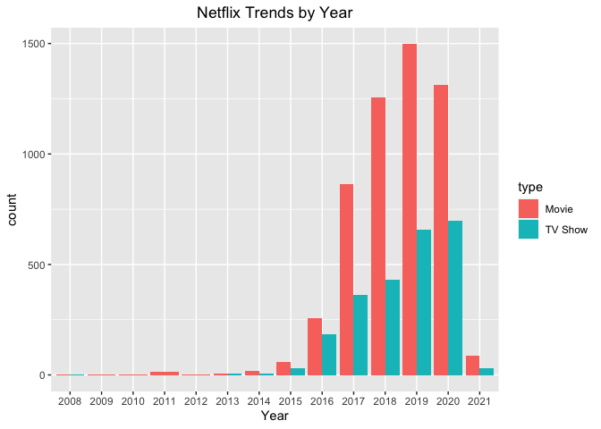

## Data Science Portfolio

This [GitHub Repository](https://github.com/hheejuice/Heeju_Portfolio) includes data science projects completed by Heeju Son who received a bachelor's degree in Economics from University of Washington. Projects are written in R using R Studio.

For better portfolio browsing experience, please check out [Portfolio](https://hheejuice.github.io/Heeju_Portfolio/).

### Contents
* #### Data Analysis and Visualization
  * [Netflix Analysis](Netflix-Analysis/Netflix-Analysis.md): dfsdfd    
     
     
  * [HR Analysis](HR-Analysis/HR-Analytics.md): dfsdfd
  * [Credit Card Customer Analysis](Credit-card-customer/Credit-Card-Customers.md): dfsdfd

* #### Machine Learning
  * [project using ML Logistic Regression](https://hheejuice.github.io/Heeju_Portfolio/): ndflnfln
  * [project using ML Classification](url): ndflnfln
  * Cluster Analysis
 
* #### Natural Language Processing
  * Tokenization
  * Stopword Removal
  * Lemmatization & Stemming
  https://monkeylearn.com/blog/nlp-ai/
